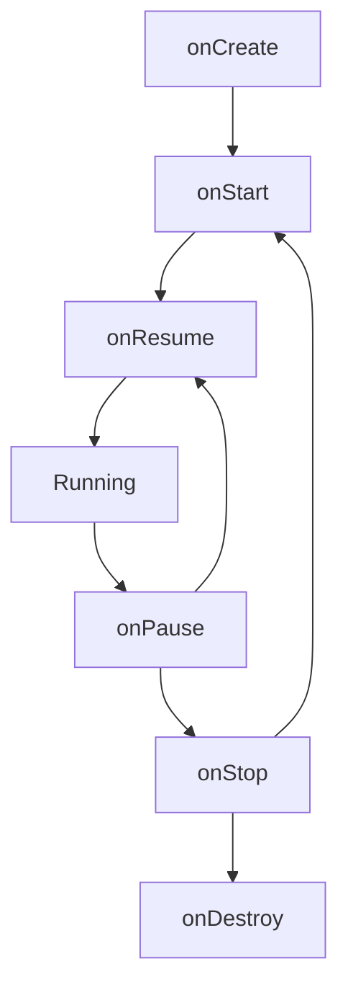

- Activity의 생명주기 개념과 중요성
- 6가지 생명주기 콜백 메서드
- 각 콜백이 호출되는 시점과 용도
- 화면 회전, 홈 버튼 등 상황별 생명주기 흐름
- Activity 간 전환 시 생명주기 호출 순서
- `onSaveInstanceState`와 `onRestoreInstanceState`를 통한 상태 저장
- onSaveInstanceState가 호출되지 않는 경우

---

## 생명주기 개요

Activity는 사용자와 상호작용하는 화면 단위입니다. 시스템은 Activity의 상태 변화에 따라 생명주기 콜백 메서드를 호출합니다. Activity는 [[Android 4대 컴포넌트]]의 핵심이며, [[Intent]]를 통해 다른 컴포넌트와 통신합니다.



## 생명주기 콜백 메서드

### onCreate()

Activity가 생성될 때 **최초 1회** 호출됩니다.

```kotlin
override fun onCreate(savedInstanceState: Bundle?) {
    super.onCreate(savedInstanceState)
    setContentView(R.layout.activity_main)
}
```

- Activity 초기화
- 레이아웃 설정 (`setContentView`)
- 뷰 바인딩 초기화
- [[Jetpack ViewModel|ViewModel]] 연결
- `savedInstanceState`로 이전 상태 복원
- Activity가 소멸되고 재생성되지 않는 한, 한 번만 호출

### onStart()

Activity가 **화면에 보이기 시작**할 때 호출됩니다.

- 포그라운드 진입 준비
- UI 관련 리소스 등록
- 사용자와 아직은 상호작용 불가

### onResume()

Activity가 **포그라운드에서 사용자와 상호작용** 가능한 상태가 됩니다.

- 카메라, 센서 등 리소스 활성화
- UI 업데이트, 애니메이션 시작
- 입력 리스너 재개

### onPause()

Activity가 **포커스를 잃을 때(부분적으로 가려질 때)** 호출됩니다. Activity는 보이지만 포커스 중인 상태는 아닙니다.

- 배터리 소모 리소스 해제
- 진행 중인 작업 일시 중지
- **빠르게 완료되어야 함** (다음 Activity 전환에 영향)

### onStop()

Activity가 **화면에서 완전히 사라질 때** 호출됩니다.

- 불필요한 리소스 해제
- 백그라운드 작업, 데이터베이스 저장 등 무거운 작업 해제

### onDestroy()

Activity가 **종료될 때** 호출됩니다.

- `finish()` 호출 시
- Configuration Change (화면 회전 등)로 재생성 시
- 시스템에 의해 강제 종료 시

## 상황별 생명주기 흐름

| 상황                 | 호출 순서                                                                                                       |
| ------------------ | ----------------------------------------------------------------------------------------------------------- |
| 앱 최초 실행            | onCreate → onStart → onResume                                                                               |
| 홈 버튼               | onPause → onStop                                                                                            |
| 앱 복귀               | onRestart → onStart → onResume                                                                              |
| 화면 회전 ([[Configuration Changes]])  | onPause → onStop → onSaveInstanceState → onDestroy → onCreate → onStart → onRestoreInstanceState → onResume |
| 뒤로가기               | onPause → onStop → onDestroy                                                                                |
| Dialog/투명 Activity | onPause (onStop 호출 안 됨)                                                                                     |

---

## Activity 간 전환 시 생명주기

두 Activity(A, B) 사이에서 화면 전환이 일어날 때, 시스템은 콜백을 특정 순서로 교차 호출합니다.

### Activity A에서 B를 시작할 때

```
A: onPause()
    ↓
B: onCreate() → onStart() → onResume()
    ↓
A: onStop()
```

**중요**: A의 `onPause()`가 완료되어야 B의 `onCreate()`가 시작됩니다. 따라서 `onPause()`에서는 무거운 작업을 피해야 합니다.

### Activity B에서 A로 돌아올 때 (뒤로가기)

```
B: onPause()
    ↓
A: onRestart() → onStart() → onResume()
    ↓
B: onStop() → onDestroy()
```

---

## Dialog나 투명 Activity가 열렸을 때

Activity가 화면에서 **완전히 사라졌는지**, 아니면 **일부가 보이는지**에 따라 호출되는 콜백이 달라집니다.

| 상황 | 호출되는 콜백 | 설명 |
|------|---------------|------|
| 일반 Activity 전환 | onPause → onStop | 완전히 가려짐 |
| Dialog 스타일 Activity | onPause만 | 부분적으로 가려짐 |
| 투명 Activity | onPause만 | 뒤가 보임 |

- `onPause()`: 포커스를 잃지만 화면에 일부 보임
- `onStop()`: 화면에서 **완전히** 사라질 때만 호출

## 상태 저장과 복원

### onSaveInstanceState()

Activity가 종료될 수 있는 상황에서 호출됩니다.

```kotlin
override fun onSaveInstanceState(outState: Bundle) {
    super.onSaveInstanceState(outState)
    outState.putString("key", value)
}
```

### onRestoreInstanceState()

저장된 상태가 있을 때 `onStart()` 이후에 호출됩니다.

```kotlin
override fun onRestoreInstanceState(savedInstanceState: Bundle) {
    super.onRestoreInstanceState(savedInstanceState)
    val value = savedInstanceState.getString("key")
}
```

### onSaveInstanceState가 호출되지 않는 경우

시스템은 사용자가 **의도적으로 Activity를 종료**할 때는 상태를 저장할 필요가 없다고 판단합니다.

| 상황 | onSaveInstanceState 호출 |
|------|--------------------------|
| 홈 버튼 (백그라운드) | O |
| 화면 회전 | O |
| 시스템 메모리 부족 | O |
| 뒤로가기 버튼 | X |
| finish() 호출 | X |

---

## finish() 호출 시 동작

`finish()`를 호출하면 Activity는 소멸 주기로 진입합니다.

```
finish() 호출
    ↓
onPause() → onStop() → onDestroy()
```

### 메모리 누수 주의

Activity가 `finish()`되어 소멸되었더라도, 싱글톤 객체나 정적(Static) 변수가 해당 Activity의 [[Context]]를 참조하고 있다면 **가비지 컬렉터가 메모리를 회수할 수 없어 메모리 누수**가 발생합니다.

```kotlin
// 잘못된 예 - 메모리 누수
object Singleton {
    var activityContext: Context? = null  // Activity 종료 후에도 참조 유지
}

// 올바른 예 - Application Context 사용
object Singleton {
    lateinit var appContext: Context

    fun init(context: Context) {
        appContext = context.applicationContext
    }
}
```

---

## 정리

- Activity 생명주기: 6가지 콜백 메서드로 상태 변화 관리
- onCreate: 최초 1회, 초기화 작업
- onStart/onStop: 화면 가시성 변화
- onResume/onPause: 포커스 획득/상실
- onDestroy: Activity 종료
- 화면 전환: A의 onPause → B의 onCreate → A의 onStop 순서
- Dialog/투명 Activity: onPause만 호출, onStop 호출 안 됨
- 상태 저장: onSaveInstanceState로 임시 데이터 보존 (뒤로가기/finish 시 호출 안 됨)
- 메모리 누수: Activity Context를 Static 변수에 저장 금지

---

## QnA

