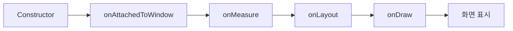

- Android View의 렌더링 파이프라인 (Measure → Layout → Draw)
- onMeasure, onLayout, onDraw 각 단계의 역할과 동작 원리
- MeasureSpec의 개념과 측정 모드
- Custom View 구현 시 주의사항
- invalidate()와 requestLayout()의 차이
- Canvas와 Paint를 활용한 드로잉

---

## 개요

Android의 View 시스템은 화면에 UI를 표시하기 위해 3단계의 렌더링 파이프라인을 거칩니다. [[RecyclerView]]나 Custom View 등 모든 View 기반 UI에 적용됩니다. XML 레이아웃이 인플레이트된 후 각 View는 **측정(Measure) → 배치(Layout) → 그리기(Draw)** 순서로 처리됩니다.



---

## onMeasure - 측정 단계

뷰의 **크기를 결정**하는 단계입니다. 부모 뷰가 제공한 제약 조건(MeasureSpec)과 뷰 자체의 레이아웃 매개변수를 기반으로 너비와 높이를 계산합니다.

```kotlin
override fun onMeasure(widthMeasureSpec: Int, heightMeasureSpec: Int) {
    val desiredWidth = 200
    val desiredHeight = 100

    val width = resolveSize(desiredWidth, widthMeasureSpec)
    val height = resolveSize(desiredHeight, heightMeasureSpec)

    // 반드시 호출하여 측정 크기 확정
    setMeasuredDimension(width, height)
}
```

### MeasureSpec

부모가 자식 뷰에게 전달하는 제약 조건으로, **모드(mode)**와 **크기(size)** 정보를 포함합니다.

| 모드 | 설명 | XML 대응 |
|------|------|----------|
| `EXACTLY` | 정확한 크기로 설정 | `match_parent`, 고정값 (100dp) |
| `AT_MOST` | 지정된 크기를 초과할 수 없음 | `wrap_content` |
| `UNSPECIFIED` | 제한 없음 | ScrollView 내부 등 |

```kotlin
val mode = MeasureSpec.getMode(widthMeasureSpec)
val size = MeasureSpec.getSize(widthMeasureSpec)

val measuredWidth = when (mode) {
    MeasureSpec.EXACTLY -> size
    MeasureSpec.AT_MOST -> minOf(desiredWidth, size)
    MeasureSpec.UNSPECIFIED -> desiredWidth
    else -> size
}
```

---

## onLayout - 배치 단계

측정된 크기를 바탕으로 뷰를 부모 내의 **특정 위치에 배치**하는 단계입니다. ViewGroup을 상속한 커스텀 레이아웃에서 주로 오버라이드합니다.

```kotlin
override fun onLayout(changed: Boolean, left: Int, top: Int, right: Int, bottom: Int) {
    // 자식 뷰 배치
    children.forEach { child ->
        child.layout(
            childLeft,
            childTop,
            childLeft + child.measuredWidth,
            childTop + child.measuredHeight
        )
    }
}
```

### 파라미터

| 파라미터 | 설명 |
|---------|------|
| `changed` | 뷰의 크기나 위치가 변경되었는지 여부 |
| `left, top` | 부모 기준 좌상단 좌표 |
| `right, bottom` | 부모 기준 우하단 좌표 |

---

## onDraw - 그리기 단계

뷰의 **실제 내용을 렌더링**하는 단계입니다. Canvas 객체를 사용하여 도형, 텍스트, 이미지 등을 그립니다.

```kotlin
private val paint = Paint().apply {
    color = Color.BLUE
    style = Paint.Style.FILL
    isAntiAlias = true
}

override fun onDraw(canvas: Canvas) {
    super.onDraw(canvas)

    // 원 그리기
    canvas.drawCircle(
        width / 2f,
        height / 2f,
        100f,
        paint
    )

    // 텍스트 그리기
    canvas.drawText("Hello", 50f, 50f, paint)
}
```

### Canvas 주요 메서드

| 메서드 | 설명 |
|--------|------|
| `drawRect()` | 사각형 그리기 |
| `drawCircle()` | 원 그리기 |
| `drawLine()` | 선 그리기 |
| `drawText()` | 텍스트 그리기 |
| `drawBitmap()` | 이미지 그리기 |
| `drawPath()` | 경로 기반 도형 그리기 |

### Paint 주요 속성

| 속성 | 설명 |
|------|------|
| `color` | 색상 |
| `style` | FILL, STROKE, FILL_AND_STROKE |
| `strokeWidth` | 선 두께 |
| `textSize` | 텍스트 크기 |
| `isAntiAlias` | 안티앨리어싱 적용 |

---

## 무효화: invalidate()와 requestLayout()

뷰의 속성이 변경되었을 때 시스템에 다시 그려달라고 요청하는 메서드입니다.

| 메서드 | 트리거 단계 | 사용 시점 |
|--------|------------|-----------|
| `invalidate()` | onDraw만 재호출 | 색상, 텍스트 등 모양만 변경 |
| `requestLayout()` | onMeasure → onLayout → onDraw 재호출 | 크기나 위치 변경 |

```kotlin
// 색상만 변경 - invalidate()
fun setColor(color: Int) {
    paint.color = color
    invalidate()  // onDraw만 다시 호출
}

// 크기 변경 - requestLayout()
fun setCustomSize(newSize: Int) {
    this.customSize = newSize
    requestLayout()  // 측정부터 다시 시작
}
```

---

## Custom View 구현 시 주의사항

### 1. onDraw에서 객체 생성 금지

`onDraw()`는 매우 빈번하게 호출됩니다. 내부에서 Paint, Path 등의 객체를 생성하면 GC 부하가 발생합니다.

```kotlin
// 잘못된 예
override fun onDraw(canvas: Canvas) {
    val paint = Paint()  // 매번 새 객체 생성 → 성능 저하
    canvas.drawCircle(0f, 0f, 10f, paint)
}

// 올바른 예
private val paint = Paint()  // 클래스 레벨에서 생성

override fun onDraw(canvas: Canvas) {
    canvas.drawCircle(0f, 0f, 10f, paint)
}
```

### 2. setMeasuredDimension() 호출 필수

`onMeasure()` 오버라이드 시 반드시 `setMeasuredDimension()`을 호출해야 합니다. 누락 시 `IllegalStateException`이 발생합니다.

### 3. @JvmOverloads 사용 주의

Kotlin에서 `@JvmOverloads`를 생성자에 사용할 때 `defStyleAttr` 값이 0으로 설정되면 Button, EditText 같은 기본 뷰의 스타일을 잃어버릴 수 있습니다.

```kotlin
// 주의가 필요한 패턴
class CustomButton @JvmOverloads constructor(
    context: Context,
    attrs: AttributeSet? = null,
    defStyleAttr: Int = 0  // Button 기본 스타일 손실!
) : AppCompatButton(context, attrs, defStyleAttr)

// 올바른 패턴
class CustomButton @JvmOverloads constructor(
    context: Context,
    attrs: AttributeSet? = null,
    defStyleAttr: Int = com.google.android.material.R.attr.buttonStyle
) : AppCompatButton(context, attrs, defStyleAttr)
```

### 4. 적절한 무효화 메서드 선택

모양만 바뀔 때는 `invalidate()`, 크기/위치까지 바뀔 때는 `requestLayout()`을 호출하여 불필요한 측정을 방지합니다.

---

## Custom View 예제

```kotlin
class ProgressCircleView @JvmOverloads constructor(
    context: Context,
    attrs: AttributeSet? = null,
    defStyleAttr: Int = 0
) : View(context, attrs, defStyleAttr) {

    private var progress = 0f
    private val backgroundPaint = Paint(Paint.ANTI_ALIAS_FLAG).apply {
        color = Color.LTGRAY
        style = Paint.Style.STROKE
        strokeWidth = 20f
    }
    private val progressPaint = Paint(Paint.ANTI_ALIAS_FLAG).apply {
        color = Color.BLUE
        style = Paint.Style.STROKE
        strokeWidth = 20f
        strokeCap = Paint.Cap.ROUND
    }
    private val rect = RectF()

    override fun onMeasure(widthMeasureSpec: Int, heightMeasureSpec: Int) {
        val size = resolveSize(200, widthMeasureSpec)
        setMeasuredDimension(size, size)
    }

    override fun onDraw(canvas: Canvas) {
        val padding = 20f
        rect.set(padding, padding, width - padding, height - padding)

        // 배경 원
        canvas.drawOval(rect, backgroundPaint)

        // 진행률 호
        val sweepAngle = 360f * progress / 100f
        canvas.drawArc(rect, -90f, sweepAngle, false, progressPaint)
    }

    fun setProgress(value: Float) {
        progress = value.coerceIn(0f, 100f)
        invalidate()
    }
}
```

---

## 정리

- View 렌더링 파이프라인: onMeasure → onLayout → onDraw
- onMeasure: 뷰 크기 결정, MeasureSpec으로 제약 조건 전달, setMeasuredDimension() 필수
- onLayout: 뷰 위치 배치, ViewGroup에서 자식 뷰 배치 시 사용
- onDraw: Canvas와 Paint로 실제 콘텐츠 렌더링
- invalidate(): 모양만 변경 시 onDraw 재호출
- requestLayout(): 크기/위치 변경 시 측정부터 재시작
- 성능 주의: onDraw 내 객체 생성 금지, 적절한 무효화 메서드 선택

---

## QnA

