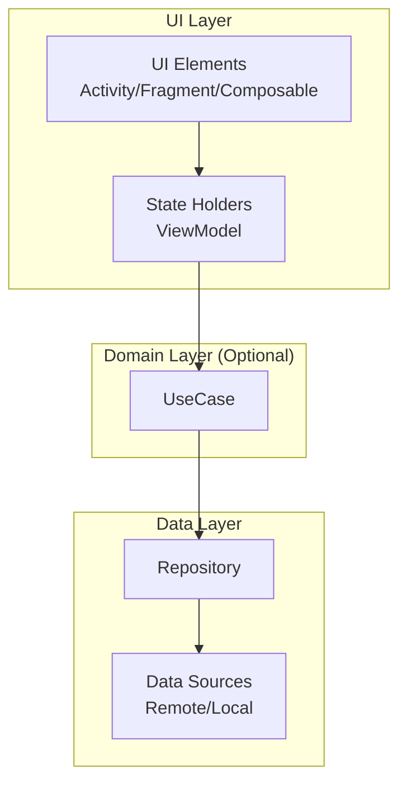
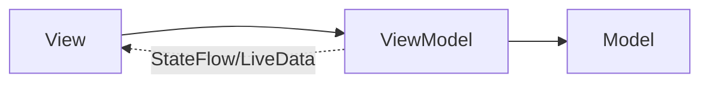
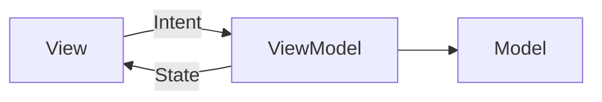
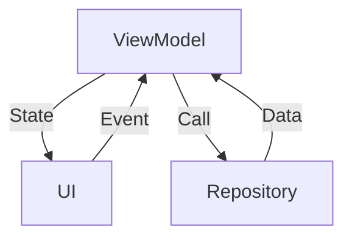

- Android 권장 앱 아키텍처의 개념과 원칙
- UI Layer, Domain Layer, Data Layer의 역할과 책임
- MVVM, MVI, Clean Architecture 패턴
- 단방향 데이터 흐름(UDF)의 개념과 이점
- Repository 패턴과 UseCase의 역할
- 관심사 분리와 테스트 용이성을 고려한 설계

---

## 개요

Android 앱 아키텍처는 코드의 유지보수성, 확장성, 테스트 용이성을 높이기 위해 **관심사 분리(Separation of Concerns)** 원칙을 기반으로 설계됩니다. [[Jetpack ViewModel]], [[Kotlin Coroutines|코루틴]], [[StateFlow, SharedFlow, Channel|StateFlow]] 등이 핵심 구성 요소입니다. Google이 권장하는 계층화된 아키텍처와 **단방향 데이터 흐름(UDF)**을 채택하는 것이 일반적입니다.

---

## 아키텍처 계층 구조



---

## UI Layer

화면에 데이터를 표시하고 사용자의 상호작용을 처리합니다.

### 구성 요소

| 구성 요소 | 역할 |
|-----------|------|
| UI Elements | 화면 렌더링 (Activity, Fragment, Composable) |
| State Holders | 상태 관리 및 비즈니스 로직 호출 (ViewModel) |

### ViewModel의 역할

```kotlin
class MainViewModel(
    private val getUserUseCase: GetUserUseCase
) : ViewModel() {

    private val _uiState = MutableStateFlow<UiState>(UiState.Loading)
    val uiState: StateFlow<UiState> = _uiState.asStateFlow()

    fun loadUser(userId: String) {
        viewModelScope.launch {
            _uiState.value = UiState.Loading
            getUserUseCase(userId)
                .onSuccess { user -> _uiState.value = UiState.Success(user) }
                .onFailure { error -> _uiState.value = UiState.Error(error.message) }
        }
    }
}
```

### UI State

```kotlin
sealed interface UiState {
    object Loading : UiState
    data class Success(val user: User) : UiState
    data class Error(val message: String?) : UiState
}
```

---

## Domain Layer (선택)

복잡한 비즈니스 로직을 캡슐화하며, UI Layer와 Data Layer 사이의 중개자 역할을 합니다.

### UseCase

개별적인 비즈니스 로직 단위로, 여러 Repository를 결합하여 특정 사용자 작업을 수행합니다.

```kotlin
class GetUserWithPostsUseCase(
    private val userRepository: UserRepository,
    private val postRepository: PostRepository
) {
    suspend operator fun invoke(userId: String): Result<UserWithPosts> {
        return runCatching {
            val user = userRepository.getUser(userId)
            val posts = postRepository.getPostsByUser(userId)
            UserWithPosts(user, posts)
        }
    }
}
```

### UseCase 작성 규칙

- 단일 책임: 하나의 기능만 수행
- `operator fun invoke()` 사용으로 호출 간소화
- 상태를 갖지 않음 (Stateless)
- 재사용 가능하도록 설계

---

## Data Layer

애플리케이션의 데이터를 가져오고 저장하며, 비즈니스 규칙에 따라 데이터를 처리합니다.

### Repository

데이터 소스를 추상화하여 UI나 Domain Layer에서 데이터가 어디서 오는지 알 필요 없게 만듭니다.

```kotlin
interface UserRepository {
    suspend fun getUser(userId: String): User
    fun observeUser(userId: String): Flow<User>
}

class UserRepositoryImpl(
    private val remoteDataSource: UserRemoteDataSource,
    private val localDataSource: UserLocalDataSource
) : UserRepository {

    override suspend fun getUser(userId: String): User {
        return try {
            val user = remoteDataSource.getUser(userId)
            localDataSource.saveUser(user)
            user
        } catch (e: Exception) {
            localDataSource.getUser(userId)
        }
    }

    override fun observeUser(userId: String): Flow<User> {
        return localDataSource.observeUser(userId)
    }
}
```

### Data Source

실제 데이터를 제공하는 계층입니다.

```kotlin
// Remote Data Source
class UserRemoteDataSource(private val api: UserApi) {
    suspend fun getUser(userId: String): User = api.getUser(userId)
}

// Local Data Source
class UserLocalDataSource(private val dao: UserDao) {
    suspend fun getUser(userId: String): User = dao.getUser(userId)
    suspend fun saveUser(user: User) = dao.insert(user)
    fun observeUser(userId: String): Flow<User> = dao.observeUser(userId)
}
```

---

## 아키텍처 패턴

### MVVM (Model-View-ViewModel)

ViewModel이 View와 Model 사이의 다리 역할을 하며, 관찰 가능한 상태를 통해 UI를 업데이트합니다.



**특징:**
- 데이터 바인딩 또는 관찰 가능한 상태 사용
- Configuration Change에 강함 (Jetpack ViewModel)
- Android에 최적화

### MVI (Model-View-Intent)

상태의 불변성을 강조하며, 사용자의 의도(Intent)를 하나의 스트림으로 처리합니다.



**특징:**
- 단일 불변 상태 (Single Source of Truth)
- 상태 전이가 명확
- 디버깅 용이

```kotlin
// MVI Intent (사용자 의도)
sealed interface MainIntent {
    data class LoadUser(val userId: String) : MainIntent
    object Refresh : MainIntent
}

// MVI State (단일 불변 상태)
data class MainState(
    val isLoading: Boolean = false,
    val user: User? = null,
    val error: String? = null
)
```

### MVI 상세 구현

```kotlin
// ViewModel - Intent를 받아 State를 생성
class MainViewModel(
    private val getUserUseCase: GetUserUseCase
) : ViewModel() {

    private val _uiState = MutableStateFlow(MainState())
    val uiState: StateFlow<MainState> = _uiState.asStateFlow()

    fun handleIntent(intent: MainIntent) {
        when (intent) {
            is MainIntent.LoadUser -> loadUser(intent.userId)
            is MainIntent.Refresh -> refresh()
        }
    }

    private fun loadUser(userId: String) {
        viewModelScope.launch {
            _uiState.update { it.copy(isLoading = true, error = null) }
            getUserUseCase(userId)
                .onSuccess { user ->
                    _uiState.update { it.copy(isLoading = false, user = user) }
                }
                .onFailure { error ->
                    _uiState.update { it.copy(isLoading = false, error = error.message) }
                }
        }
    }

    private fun refresh() {
        _uiState.value.user?.let { user ->
            loadUser(user.id)
        }
    }
}
```

```kotlin
// Composable - State를 관찰하고 Intent를 전달
@Composable
fun MainScreen(viewModel: MainViewModel = viewModel()) {
    val uiState by viewModel.uiState.collectAsStateWithLifecycle()

    MainContent(
        state = uiState,
        onLoadUser = { viewModel.handleIntent(MainIntent.LoadUser(it)) },
        onRefresh = { viewModel.handleIntent(MainIntent.Refresh) }
    )
}
```

### Clean Architecture

계층을 분리하여 의존성이 내부(Domain)로만 향하게 합니다.

```
[UI Layer] → [Domain Layer] → [Data Layer]
        ↑ 의존성 방향 ↓
```

**원칙:**
- 외부 계층이 내부 계층에 의존
- Domain Layer는 프레임워크에 독립적
- 테스트 용이성 극대화

### 구글 권장 아키텍처 vs 클린 아키텍처

| 구분 | 구글 권장 아키텍처 | 클린 아키텍처 |
|------|-----------------|-------------|
| 중심 | Android 프레임워크(AAC)와 통합 | 비즈니스 로직(Domain)의 독립성 |
| Domain Layer | 선택적 (복잡할 때만) | 필수 (핵심 계층) |
| 의존성 방향 | UI → Data (Domain 선택적) | 외부 → 내부 (엄격하게 분리) |
| Entity | Data Layer에 포함 | Domain Layer에 독립적으로 존재 |
| 프레임워크 의존 | ViewModel, LiveData 등 AAC 사용 권장 | Domain은 프레임워크에 독립 |
| 적합한 프로젝트 | 대부분의 Android 앱 | 대규모, 멀티 플랫폼, 엄격한 테스트 필요 |

**구글 권장 아키텍처**는 실용적 접근으로 Android 개발에 최적화되어 있으며, **클린 아키텍처**는 비즈니스 로직의 완전한 분리를 통해 테스트 용이성과 유지보수성을 극대화합니다.

---

## 단방향 데이터 흐름 (UDF)

상태는 위에서 아래로, 이벤트는 아래에서 위로 흐르는 구조입니다.



### 이점

- **예측 가능성**: 상태 변경 경로가 명확
- **버그 추적 용이**: 단일 진실 공급원 (Single Source of Truth)
- **테스트 용이**: 특정 입력에 대한 결과 예측 가능

### 구현 예시

```kotlin
@Composable
fun UserScreen(viewModel: UserViewModel = viewModel()) {
    val uiState by viewModel.uiState.collectAsStateWithLifecycle()

    UserContent(
        uiState = uiState,                    // State flows down
        onRefresh = { viewModel.refresh() }   // Events flow up
    )
}

@Composable
fun UserContent(
    uiState: UiState,
    onRefresh: () -> Unit
) {
    // Stateless Composable
}
```

---

## 관심사 분리 (Separation of Concerns)

각 컴포넌트가 하나의 책임만 갖도록 분리합니다.

| 계층 | 책임 |
|------|------|
| UI Elements | 화면 렌더링 |
| ViewModel | 상태 관리, UI 로직 |
| UseCase | 비즈니스 로직 |
| Repository | 데이터 중재 |
| DataSource | 데이터 접근 |

---

## 테스트 용이성을 고려한 설계

### 의존성 주입 (Dependency Injection)

Hilt를 사용하여 테스트 시 Mock 객체를 쉽게 주입합니다.

```kotlin
@HiltViewModel
class MainViewModel @Inject constructor(
    private val getUserUseCase: GetUserUseCase
) : ViewModel() {
    // ...
}
```

```kotlin
// 테스트
@Test
fun `loadUser success`() = runTest {
    val mockUseCase = mockk<GetUserUseCase>()
    coEvery { mockUseCase(any()) } returns Result.success(testUser)

    val viewModel = MainViewModel(mockUseCase)
    viewModel.loadUser("1")

    assertEquals(UiState.Success(testUser), viewModel.uiState.value)
}
```

### Stateless Composable

상태 호이스팅을 통해 테스트가 용이한 구조를 만듭니다.

```kotlin
// Stateless - 테스트 용이
@Composable
fun UserCard(
    user: User,
    onEdit: () -> Unit
) {
    // 상태 없음, 입력에 따른 결과만 표시
}
```

### 계층 분리의 이점

비즈니스 로직이 UI와 분리되어 있으므로, Android 프레임워크 없이도 순수 Kotlin 테스트가 가능합니다.

```kotlin
// UseCase 테스트 - Android 의존성 없음
@Test
fun `getUserWithPosts returns combined data`() = runTest {
    val useCase = GetUserWithPostsUseCase(mockUserRepo, mockPostRepo)
    val result = useCase("1")
    assertTrue(result.isSuccess)
}
```

---

## 정리

- 관심사 분리: 각 컴포넌트가 단일 책임만 갖도록 설계
- UI Layer: 화면 표시 및 상호작용 처리 (ViewModel + UI Elements)
- Domain Layer: 복잡한 비즈니스 로직 캡슐화 (UseCase)
- Data Layer: 데이터 접근 추상화 (Repository + DataSource)
- MVVM: 관찰 가능한 상태로 UI 업데이트, Android에 최적화
- MVI: 단일 불변 상태(UiState), Intent로 사용자 의도 전달, 상태 전이 명확
- 구글 권장 vs 클린: 구글은 AAC 통합 최적화, 클린은 Domain 독립성 강조
- UDF: 상태는 아래로, 이벤트는 위로 흐름
- 테스트 용이성: DI, Stateless 컴포넌트, 계층 분리

---

## QnA

