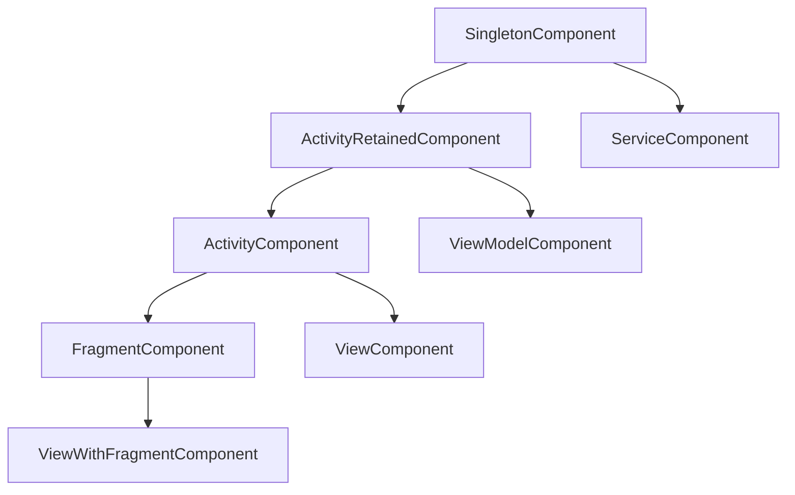

- Hilt의 기본 구조와 필수 어노테이션
- @HiltAndroidApp, @AndroidEntryPoint, @HiltViewModel
- 모듈 선언: @Module, @InstallIn, @Provides, @Binds
- Hilt 컴포넌트 계층 구조
- 컴포넌트 스코프: @Singleton, @ActivityScoped, @ViewModelScoped
- @Qualifier를 이용한 같은 타입의 다른 인스턴스 구분
- @ApplicationContext, @ActivityContext

---

## Hilt 기본 구조

Hilt는 Dagger 2를 기반으로 한 Android 전용 [[Dependency Injection|의존성 주입]] 라이브러리입니다. 보일러플레이트 코드를 줄이고, Android 컴포넌트의 생명주기에 맞춘 스코프를 자동 제공합니다.

### 필수 설정

[[Gradle|build.gradle.kts]]에 다음과 같이 설정합니다.

```kotlin
// build.gradle.kts (Project)
plugins {
    id("com.google.dagger.hilt.android") version "2.48" apply false
}

// build.gradle.kts (App)
plugins {
    id("com.google.dagger.hilt.android")
    id("com.google.devtools.ksp")
}

dependencies {
    implementation("com.google.dagger:hilt-android:2.48")
    ksp("com.google.dagger:hilt-compiler:2.48")
}
```

---

## 필수 어노테이션

### @HiltAndroidApp

Application 클래스에 선언하여 **Hilt의 코드 생성을 트리거**하고, 앱 전체의 의존성 그래프(DI 컨테이너)를 생성합니다.

```kotlin
@HiltAndroidApp
class MyApplication : Application()
```

### @AndroidEntryPoint

의존성을 주입받을 Android 컴포넌트에 표시합니다. 해당 클래스에서 `@Inject` 필드 주입이 가능해집니다.

```kotlin
@AndroidEntryPoint
class MainActivity : AppCompatActivity() {

    @Inject
    lateinit var analytics: AnalyticsService  // 필드 주입

    override fun onCreate(savedInstanceState: Bundle?) {
        super.onCreate(savedInstanceState)
        analytics.logEvent("screen_open")  // 주입된 객체 사용
    }
}

@AndroidEntryPoint
class MyFragment : Fragment() {

    @Inject
    lateinit var logger: Logger
}
```

지원 대상: [[Activity Lifecycle|Activity]], [[Fragment 생명주기|Fragment]], [[Android View 생명주기|View]], [[Service]], [[BroadcastReceiver]]

### @HiltViewModel

[[Jetpack ViewModel|ViewModel]]에서 생성자 주입을 사용할 수 있도록 합니다.

```kotlin
@HiltViewModel
class UserViewModel @Inject constructor(
    private val userRepository: UserRepository,
    private val savedStateHandle: SavedStateHandle
) : ViewModel() {

    val uiState = userRepository.observeUsers()
        .stateIn(viewModelScope, SharingStarted.WhileSubscribed(5_000), emptyList())
}
```

```kotlin
// Activity/Fragment에서 ViewModel 사용
@AndroidEntryPoint
class UserFragment : Fragment() {
    private val viewModel: UserViewModel by viewModels()
}
```

### @Inject

**생성자 주입**: 클래스의 생성자에 표시하면 Hilt가 해당 클래스의 인스턴스 생성 방법을 알게 됩니다.

```kotlin
class UserRepository @Inject constructor(
    private val api: UserApi,
    private val dao: UserDao
) {
    // Hilt가 UserApi와 UserDao를 찾아서 자동 주입
}
```

---

## 모듈 선언

생성자에 `@Inject`를 직접 붙일 수 없는 경우(인터페이스, 외부 라이브러리 등) 모듈을 통해 객체 생성 방법을 정의합니다.

### @Module + @InstallIn

```kotlin
@Module
@InstallIn(SingletonComponent::class)  // 어떤 컴포넌트에 설치할지 지정
object NetworkModule {

    @Provides
    @Singleton
    fun provideOkHttpClient(): OkHttpClient {
        return OkHttpClient.Builder()
            .connectTimeout(30, TimeUnit.SECONDS)
            .build()
    }

    @Provides
    @Singleton
    fun provideRetrofit(okHttpClient: OkHttpClient): Retrofit {
        return Retrofit.Builder()
            .baseUrl("https://api.example.com/")
            .client(okHttpClient)  // Hilt가 provideOkHttpClient()의 결과를 자동 주입
            .addConverterFactory(GsonConverterFactory.create())
            .build()
    }

    @Provides
    @Singleton
    fun provideUserApi(retrofit: Retrofit): UserApi {
        return retrofit.create(UserApi::class.java)
    }
}
```

### @Provides vs @Binds

| 어노테이션 | 용도 | 사용 위치 |
|-----------|------|----------|
| `@Provides` | 객체 생성 로직 정의 | `object` 클래스의 함수 |
| `@Binds` | 인터페이스와 구현체 연결 | `abstract` 클래스의 추상 함수 |

```kotlin
// @Binds: 인터페이스 바인딩 (더 효율적)
@Module
@InstallIn(SingletonComponent::class)
abstract class RepositoryModule {

    @Binds
    @Singleton
    abstract fun bindUserRepository(
        impl: UserRepositoryImpl  // 구현체 (@Inject 생성자 필요)
    ): UserRepository             // 인터페이스
}

// 구현체
class UserRepositoryImpl @Inject constructor(
    private val api: UserApi,
    private val dao: UserDao
) : UserRepository {
    override fun getUsers() = api.getUsers()
}
```

> `@Binds`는 구현체를 인터페이스에 매핑만 하므로 `@Provides`보다 **코드 생성이 적고 효율적**입니다. 인터페이스-구현체 연결에는 `@Binds`를 우선 사용합니다.

---

## Hilt 컴포넌트 계층 구조

Hilt는 Android 컴포넌트의 생명주기에 맞는 **컴포넌트 계층**을 가지고 있습니다.



| 컴포넌트 | 생성 시점 | 소멸 시점 | 스코프 |
|---------|----------|----------|--------|
| `SingletonComponent` | Application.onCreate() | Application 소멸 | `@Singleton` |
| `ActivityRetainedComponent` | Activity.onCreate() | Activity.onDestroy() ([[Configuration Changes|Configuration Change]]에서 유지) | `@ActivityRetainedScoped` |
| `ViewModelComponent` | ViewModel 생성 | ViewModel.onCleared() | `@ViewModelScoped` |
| `ActivityComponent` | Activity.onCreate() | Activity.onDestroy() | `@ActivityScoped` |
| `FragmentComponent` | Fragment.onAttach() | Fragment.onDestroy() | `@FragmentScoped` |
| `ServiceComponent` | Service.onCreate() | Service.onDestroy() | `@ServiceScoped` |

### @InstallIn 선택 가이드

| 대상 | @InstallIn |
|------|-----------|
| 앱 전체 공유 (Retrofit, DB) | `SingletonComponent::class` |
| ViewModel에서만 사용 | `ViewModelComponent::class` |
| Activity에서만 사용 | `ActivityComponent::class` |
| Fragment에서만 사용 | `FragmentComponent::class` |

---

## 컴포넌트 스코프

스코프 어노테이션은 해당 컴포넌트 내에서 **같은 인스턴스를 재사용**할지를 결정합니다.

### 스코프가 없는 경우 (기본)

```kotlin
@Provides
fun provideLogger(): Logger {
    return Logger()  // 주입할 때마다 새 인스턴스 생성
}
```

### 스코프가 있는 경우

```kotlin
@Provides
@Singleton
fun provideDatabase(@ApplicationContext context: Context): AppDatabase {
    return Room.databaseBuilder(context, AppDatabase::class.java, "app.db").build()
    // 앱 전체에서 하나의 인스턴스
}

@Provides
@ViewModelScoped
fun provideUseCase(repository: UserRepository): GetUserUseCase {
    return GetUserUseCase(repository)
    // 같은 ViewModel 내에서 하나의 인스턴스
}
```

### 스코프 적용 전략

| 스코프 | 사용 시점 |
|--------|---------|
| `@Singleton` | 앱 전체에서 하나만 필요 (DB, Retrofit, SharedPreferences) |
| `@ViewModelScoped` | ViewModel 내 여러 곳에서 같은 인스턴스 공유 |
| `@ActivityScoped` | Activity 내 여러 Fragment에서 공유 |
| 스코프 없음 | 매번 새 인스턴스가 필요한 경우 (대부분의 경우) |

> 불필요한 스코프 지정은 메모리 낭비를 유발합니다. **꼭 필요한 경우에만** 스코프를 지정합니다.

---

## @Qualifier

같은 타입의 서로 다른 인스턴스를 구분할 때 사용합니다.

```kotlin
@Qualifier
@Retention(AnnotationRetention.BINARY)
annotation class AuthInterceptorOkHttpClient

@Qualifier
@Retention(AnnotationRetention.BINARY)
annotation class OtherInterceptorOkHttpClient

@Module
@InstallIn(SingletonComponent::class)
object NetworkModule {

    @AuthInterceptorOkHttpClient
    @Provides
    @Singleton
    fun provideAuthClient(): OkHttpClient {
        return OkHttpClient.Builder()
            .addInterceptor(AuthInterceptor())
            .build()
    }

    @OtherInterceptorOkHttpClient
    @Provides
    @Singleton
    fun provideOtherClient(): OkHttpClient {
        return OkHttpClient.Builder()
            .addInterceptor(LoggingInterceptor())
            .build()
    }
}

// 사용
class UserRepository @Inject constructor(
    @AuthInterceptorOkHttpClient private val client: OkHttpClient
)
```

---

## Context 주입

[[Context|@ApplicationContext와 @ActivityContext]]를 사용하여 적절한 Context를 주입받을 수 있습니다.

```kotlin
@HiltViewModel
class MyViewModel @Inject constructor(
    @ApplicationContext private val context: Context  // Application Context
) : ViewModel()

@AndroidEntryPoint
class MyFragment : Fragment() {
    @Inject
    @ActivityContext
    lateinit var activityContext: Context  // Activity Context
}
```

---

## 정리

- @HiltAndroidApp: Application에 선언, 전체 DI 그래프 생성 트리거
- @AndroidEntryPoint: DI를 받을 Android 컴포넌트에 선언
- @HiltViewModel: ViewModel 생성자 주입 활성화
- @Module + @InstallIn: 의존성 제공 방법 정의, 설치할 컴포넌트 지정
- @Provides: 객체 생성 로직 정의, @Binds: 인터페이스-구현체 매핑 (더 효율적)
- 컴포넌트 계층: SingletonComponent → ActivityRetainedComponent → ActivityComponent → FragmentComponent
- 스코프: @Singleton(앱 전체), @ViewModelScoped(ViewModel), @ActivityScoped(Activity)
- @Qualifier: 같은 타입의 다른 인스턴스 구분

---

## QnA

