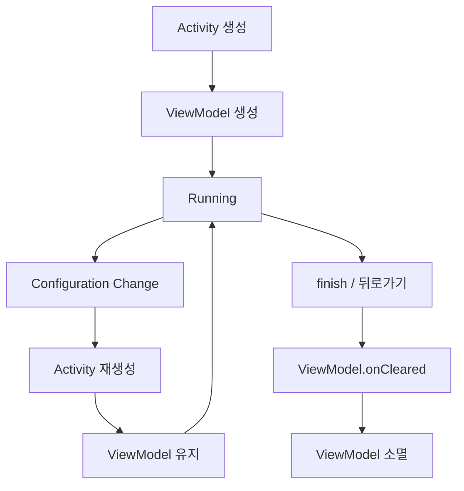
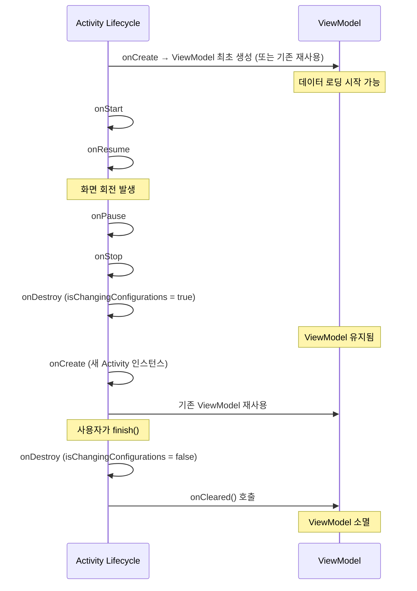
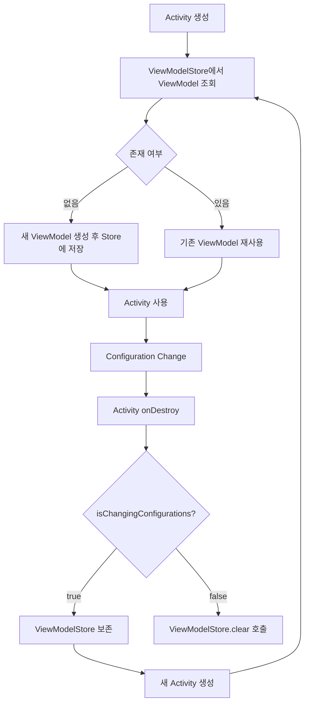

- Jetpack ViewModel의 개념과 역할
- ViewModel의 생명주기와 Activity/Fragment와의 관계
- Activity/Fragment 라이프사이클 각 단계에서 ViewModel의 상태
- ViewModelStore와 ViewModelStoreOwner의 내부 동작 원리
- Configuration Change에서 ViewModel이 상태를 유지하는 메커니즘
- LifecycleOwner와 ViewModelStoreOwner의 차이
- ViewModel에서 Context를 참조하면 안 되는 이유와 AndroidViewModel

---

## 개요

ViewModel은 UI 관련 데이터를 생명주기에 맞게 저장하고 관리하는 Jetpack 컴포넌트입니다. [[Configuration Changes|Configuration Change]](화면 회전 등)에도 데이터를 유지하며, UI 로직과 비즈니스 로직을 분리하는 역할을 수행합니다.

---

## ViewModel의 생명주기

ViewModel은 자신을 소유한 Activity나 Fragment가 **영구적으로 소멸**될 때까지 메모리에 유지됩니다. Configuration Change로 인한 재생성에서는 파괴되지 않습니다.



### Activity 라이프사이클과 ViewModel



#### 핵심 포인트

- **ViewModel은 Activity보다 오래 살 수 있습니다.** Configuration Change 시 Activity는 소멸/재생성되지만, ViewModel은 유지됩니다.
- ViewModel에서 비동기 작업을 시작하면, Activity가 재생성되어도 작업이 중단되지 않습니다. `viewModelScope`이 `onCleared()`까지 유지되기 때문입니다.
- `onCleared()`는 Activity가 **영구적으로** 소멸될 때(뒤로가기, `finish()`)만 호출됩니다.

### Fragment 라이프사이클과 ViewModel

Fragment에서 ViewModel을 사용할 때는 스코프에 따라 동작이 달라집니다.

| 생성 방식 | 스코프 | 생존 범위 |
|-----------|--------|-----------|
| `by viewModels()` | Fragment | Fragment `onDestroy()`까지 |
| `by activityViewModels()` | Activity | Activity `onDestroy()`까지 |

```kotlin
class ListFragment : Fragment() {
    // Fragment 스코프 - 이 Fragment가 소멸되면 함께 소멸
    private val listViewModel: ListViewModel by viewModels()

    // Activity 스코프 - Fragment 간 데이터 공유, Activity 소멸 시 함께 소멸
    private val sharedViewModel: SharedViewModel by activityViewModels()
}
```

Fragment가 백스택에 들어가면 `onDestroyView()`까지만 호출되고 `onDestroy()`는 호출되지 않으므로, `by viewModels()`로 생성한 ViewModel도 유지됩니다. 뒤로 가기로 복원 시 기존 데이터를 그대로 사용할 수 있습니다.

---

## ViewModelStore와 ViewModelStoreOwner

### ViewModelStore

ViewModel 인스턴스를 관리하는 컨테이너입니다. 내부적으로 `Map<String, ViewModel>` 형태로 ViewModel들을 저장합니다.

```kotlin
// ViewModelStore 내부 구조 (간략화)
class ViewModelStore {
    private val map = mutableMapOf<String, ViewModel>()

    fun put(key: String, viewModel: ViewModel) {
        map[key] = viewModel
    }

    fun get(key: String): ViewModel? = map[key]

    fun clear() {
        map.values.forEach { it.clear() }
        map.clear()
    }
}
```

### ViewModelStoreOwner

ViewModelStore를 소유하고 관리하는 인터페이스입니다. `ComponentActivity`와 `Fragment`가 이를 구현합니다.

```kotlin
interface ViewModelStoreOwner {
    val viewModelStore: ViewModelStore
}
```

### Configuration Change에서의 동작



핵심은 `ComponentActivity`의 `onDestroy()` 내부 구현입니다. `isChangingConfigurations()`가 `true`이면 ViewModelStore를 보존하고, `false`(실제 종료)일 때만 `ViewModelStore.clear()`를 호출합니다.

---

## LifecycleOwner와 ViewModelStoreOwner

| 인터페이스 | 역할 | 핵심 관심사 |
|-----------|------|------------|
| LifecycleOwner | 생명주기 상태(STARTED, RESUMED 등)를 제공 | 상태 변화에 따른 동작 |
| ViewModelStoreOwner | ViewModelStore를 소유하여 ViewModel 관리 | 상태를 유지하는 저장소 관리 |

### LifecycleOwner

Activity나 Fragment의 생명주기 상태를 나타내는 `Lifecycle` 인스턴스를 보유합니다. LiveData, [[Kotlin Coroutines|Flow]] 수집 등이 이를 관찰하여 생명주기에 맞게 동작합니다.

```kotlin
interface LifecycleOwner {
    val lifecycle: Lifecycle
}
```

### 두 인터페이스의 관계

Activity와 Fragment는 두 인터페이스를 모두 구현합니다.

```kotlin
class ComponentActivity : Activity(),
    LifecycleOwner,         // 생명주기 관리
    ViewModelStoreOwner {   // ViewModel 저장소 관리
    // ...
}
```

---

## ViewModel 생성 방법

### by viewModels() 위임

```kotlin
class MainActivity : AppCompatActivity() {

    // Activity 스코프의 ViewModel
    private val viewModel: MainViewModel by viewModels()

    override fun onCreate(savedInstanceState: Bundle?) {
        super.onCreate(savedInstanceState)
        viewModel.uiState.observe(this) { state ->
            // UI 업데이트
        }
    }
}
```

### Fragment에서 생성

```kotlin
class MyFragment : Fragment() {

    // Fragment 스코프의 ViewModel
    private val viewModel: MyViewModel by viewModels()

    // Activity 스코프의 ViewModel (Fragment 간 데이터 공유)
    private val sharedViewModel: SharedViewModel by activityViewModels()
}
```

### ViewModelProvider 사용

```kotlin
val viewModel = ViewModelProvider(this)[MainViewModel::class.java]
```

---

## ViewModel에서 Context를 참조하면 안 되는 이유

ViewModel은 Configuration Change에서도 유지되지만, Activity는 소멸되고 재생성됩니다. ViewModel이 Activity Context를 참조하면 소멸된 Activity를 계속 참조하게 되어 **메모리 누수**가 발생합니다.

```kotlin
// 잘못된 예 - 메모리 누수 발생
class BadViewModel(
    private val context: Context  // Activity Context 참조!
) : ViewModel() {
    // Activity가 재생성되어도 이전 Activity를 계속 참조
}
```

### AndroidViewModel

[[Context]]가 반드시 필요한 경우 `AndroidViewModel`을 사용합니다. Application Context를 포함하고 있어 메모리 누수 위험이 없습니다.

```kotlin
class MyViewModel(application: Application) : AndroidViewModel(application) {

    fun loadData() {
        val context = getApplication<Application>()
        // Application Context로 안전하게 사용
        val prefs = context.getSharedPreferences("prefs", Context.MODE_PRIVATE)
    }
}
```

### 권장 방식

| 접근 방식 | 설명 |
|-----------|------|
| AndroidViewModel | Application Context 필요 시 |
| Hilt @ApplicationContext | DI를 통한 Context 주입 |
| Repository 패턴 | Context 의존성을 Data Layer로 이동 |

```kotlin
// Hilt를 통한 안전한 Context 주입
@HiltViewModel
class MyViewModel @Inject constructor(
    @ApplicationContext private val context: Context
) : ViewModel()
```

---

## ViewModel vs onSaveInstanceState

| 구분 | ViewModel | onSaveInstanceState |
|------|-----------|---------------------|
| 용도 | 대규모 데이터, 비즈니스 로직 | 소량의 UI 상태 |
| 생존 범위 | Configuration Change | Configuration Change + 프로세스 종료 |
| 데이터 크기 | 제한 없음 | 50KB 미만 권장 |
| 저장 위치 | 메모리 (ViewModelStore) | Bundle (직렬화) |
| 예시 | API 응답 데이터, 리스트 | 스크롤 위치, 입력 텍스트 |

---

## 정리

- ViewModel: UI 상태 관리 및 비즈니스 로직 처리, Activity보다 오래 생존 가능
- Activity와 ViewModel: Configuration Change 시 Activity 소멸/재생성, ViewModel 유지, finish() 시 onCleared()
- Fragment와 ViewModel: viewModels()는 Fragment 스코프, activityViewModels()는 Activity 스코프, 백스택 시 ViewModel 유지
- ViewModelStore: `Map<String, ViewModel>` 형태의 ViewModel 컨테이너
- ViewModelStoreOwner: ViewModelStore를 소유하는 인터페이스 (Activity, Fragment)
- 상태 유지 메커니즘: `isChangingConfigurations()` 체크로 Configuration Change 시 ViewModelStore 보존
- LifecycleOwner: 생명주기 상태 제공, 생명주기에 따른 동작 관리
- Context 참조 금지: Activity Context → 메모리 누수, AndroidViewModel 또는 Hilt 사용 권장
- by viewModels(): Kotlin 위임을 통한 ViewModel 생성, Fragment에서 activityViewModels()로 공유

---

## QnA

