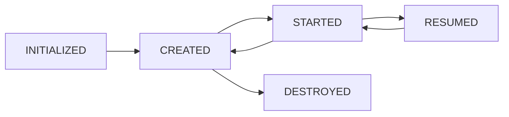
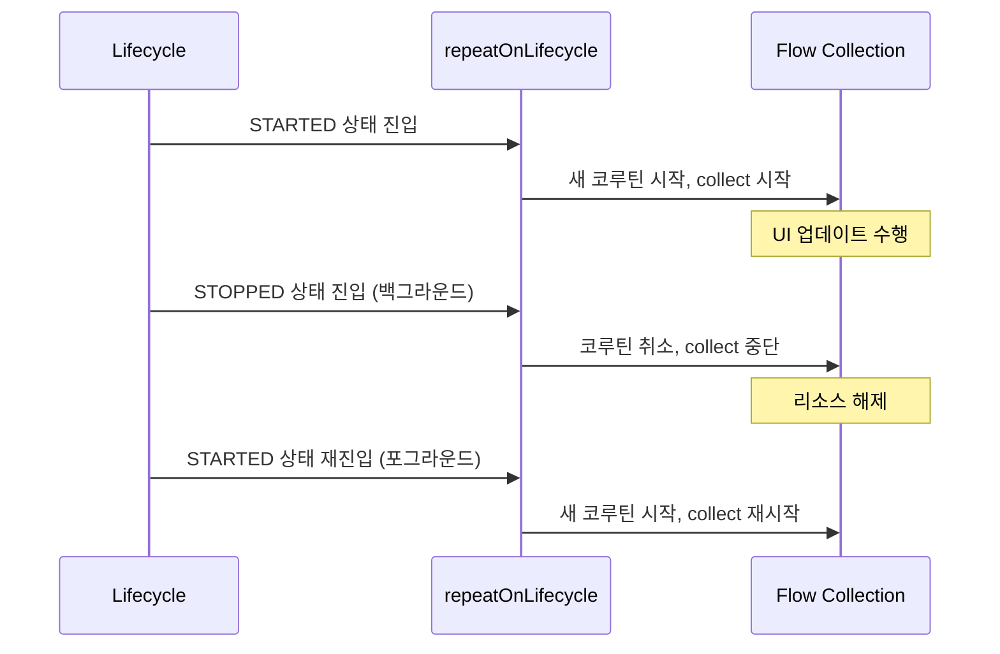

- LifecycleOwner와 LifecycleObserver의 개념과 역할
- LifecycleOwner가 필요한 이유 (생명주기 관리 문제와 해결)
- Lifecycle.State와 Lifecycle.Event의 차이
- DefaultLifecycleObserver를 활용한 생명주기 관찰
- Fragment에서 ViewLifecycleOwner가 별도로 존재하는 이유
- Activity, Fragment에서 Flow를 수집하는 올바른 방법
- repeatOnLifecycle vs lifecycleScope.launch의 차이

---

## LifecycleOwner가 필요한 이유

LifecycleOwner가 없던 시절에는 생명주기 관련 리소스 관리를 모두 **Activity/Fragment의 콜백에서 수동으로** 처리해야 했습니다.

```kotlin
// LifecycleOwner 없이 직접 관리하는 경우
class MainActivity : AppCompatActivity() {
    private lateinit var locationTracker: LocationTracker
    private lateinit var analyticsTracker: AnalyticsTracker
    private lateinit var videoPlayer: VideoPlayer

    override fun onStart() {
        super.onStart()
        locationTracker.start()    // 직접 시작
        analyticsTracker.start()   // 직접 시작
        videoPlayer.start()        // 직접 시작
    }

    override fun onStop() {
        super.onStop()
        locationTracker.stop()     // 직접 중지
        analyticsTracker.stop()    // 직접 중지
        videoPlayer.stop()         // 직접 중지
        // 하나라도 빠뜨리면 메모리 누수!
    }
}
```

이 방식의 문제점:

- **Activity/Fragment 코드가 비대해짐**: 여러 컴포넌트의 시작/중지를 모두 관리
- **실수로 누락 가능**: stop()을 빠뜨리면 메모리 누수, start()를 빠뜨리면 기능 미동작
- **결합도 높음**: 컴포넌트가 항상 Activity/Fragment에 의존
- **재사용 어려움**: 생명주기 로직이 Activity에 묶여 있어 다른 곳에서 재사용 불가

LifecycleOwner는 **생명주기 상태를 외부에 노출**하여, 각 컴포넌트가 스스로 생명주기에 반응할 수 있게 합니다.

## LifecycleOwner

[[Activity Lifecycle|Activity]]나 [[Fragment 생명주기|Fragment]]처럼 **생명주기를 가진 객체**를 나타내는 인터페이스입니다. `Lifecycle` 인스턴스를 보유하며, 다른 컴포넌트가 해당 객체의 생명주기 변화를 관찰할 수 있는 통로를 제공합니다.

```kotlin
interface LifecycleOwner {
    val lifecycle: Lifecycle
}
```

- `ComponentActivity`와 `Fragment`가 기본적으로 구현
- Fragment에는 `viewLifecycleOwner`도 존재 (뷰의 생명주기)

---

## LifecycleObserver

LifecycleOwner의 생명주기 이벤트를 **관찰하고 반응**하는 인터페이스입니다.

### DefaultLifecycleObserver (권장)

```kotlin
class LocationTracker : DefaultLifecycleObserver {

    override fun onStart(owner: LifecycleOwner) {
        // Activity/Fragment가 STARTED 상태일 때 위치 추적 시작
        startTracking()
    }

    override fun onStop(owner: LifecycleOwner) {
        // STOPPED 상태일 때 위치 추적 중지
        stopTracking()
    }
}

// Activity에서 등록
class MainActivity : AppCompatActivity() {
    private val locationTracker = LocationTracker()

    override fun onCreate(savedInstanceState: Bundle?) {
        super.onCreate(savedInstanceState)
        lifecycle.addObserver(locationTracker)  // 관찰자 등록
    }
}
```

### 장점

- 생명주기 관찰 로직을 **클래스 외부로 분리** → 단일 책임 원칙
- Activity/Fragment의 코드가 간결해짐
- **메모리 누수 방지**: 생명주기에 맞춰 자동으로 콜백 호출

---

## Lifecycle.State와 Lifecycle.Event

### State (상태)



| State | 의미 |
|-------|------|
| `INITIALIZED` | 생성 전 |
| `CREATED` | onCreate 완료, onDestroy 전 |
| `STARTED` | onStart 완료, onStop 전 |
| `RESUMED` | onResume 완료, onPause 전 |
| `DESTROYED` | onDestroy 호출 |

### Event (이벤트)

| Event | 대응 콜백 |
|-------|----------|
| `ON_CREATE` | onCreate |
| `ON_START` | onStart |
| `ON_RESUME` | onResume |
| `ON_PAUSE` | onPause |
| `ON_STOP` | onStop |
| `ON_DESTROY` | onDestroy |

### State와 Event의 관계

Event가 발생하면 State가 전환됩니다. `ON_START` 이벤트가 발생하면 `STARTED` 상태로 전환됩니다.

---

## Fragment의 ViewLifecycleOwner

Fragment에는 두 가지 LifecycleOwner가 존재합니다.

| LifecycleOwner | 범위 | 생명주기 |
|---------------|------|---------|
| `this` (Fragment) | Fragment 자체 | onAttach ~ onDetach |
| `viewLifecycleOwner` | Fragment의 View | onCreateView ~ onDestroyView |

### 왜 별도로 존재하는가?

Fragment와 View의 생명주기가 **일치하지 않기 때문**입니다.

```
Fragment 생명주기:  onAttach ─── onCreate ─── onCreateView ─── ... ─── onDestroyView ─── onCreateView ─── ... ─── onDestroy ─── onDetach
                                                    │                        │                    │
View 생명주기:                                    생성 ──────────────── 파괴                  생성 ──────────────── 파괴
```

백스택에 있는 Fragment는 View가 파괴(`onDestroyView`)되지만 Fragment 자체는 살아있습니다. 이후 백스택에서 복원되면 `onCreateView()`부터 다시 시작하여 **새로운 View**가 생성됩니다.

### 문제 시나리오

```kotlin
// 잘못된 예: this를 LifecycleOwner로 사용
override fun onViewCreated(view: View, savedInstanceState: Bundle?) {
    viewModel.data.observe(this) { data ->  // Fragment의 생명주기 사용
        binding.textView.text = data         // 파괴된 View 참조 가능!
    }
}
```

1. Fragment A에서 Fragment B로 이동 (`addToBackStack`)
2. Fragment A의 View 파괴 (`onDestroyView`)
3. Fragment A 자체는 살아있으므로 Observer도 살아있음
4. ViewModel에서 데이터가 변경되면 파괴된 View를 업데이트하려고 시도 → **크래시**

```kotlin
// 올바른 예: viewLifecycleOwner 사용
override fun onViewCreated(view: View, savedInstanceState: Bundle?) {
    viewModel.data.observe(viewLifecycleOwner) { data ->  // View의 생명주기 사용
        binding.textView.text = data  // View와 함께 Observer도 정리됨
    }
}
```

### 사용 원칙

| 상황 | 사용할 LifecycleOwner |
|------|---------------------|
| UI 업데이트 (LiveData, Flow 수집) | `viewLifecycleOwner` |
| Fragment Result Listener | `this` 또는 `viewLifecycleOwner` |
| LifecycleObserver 등록 (비-UI) | `this` |

---

## Activity/Fragment에서 Flow를 수집하는 올바른 방법

### 문제: 단순 collect의 위험

```kotlin
// 위험한 방법 - 백그라운드에서도 수집 계속됨
lifecycleScope.launch {
    viewModel.uiState.collect { state ->
        updateUI(state)  // 앱이 백그라운드에 있어도 실행됨!
    }
}
```

[[lifecycleScope, viewModelScope, GlobalScope|lifecycleScope]].launch는 `onDestroy()`까지 취소되지 않으므로, 앱이 백그라운드에 있어도 Flow 수집이 계속됩니다. 이는 불필요한 리소스 소모와 잠재적인 크래시를 유발합니다. [[Kotlin Flow|Flow]]를 안전하게 수집하려면 `repeatOnLifecycle`을 사용해야 합니다.

### 올바른 방법: repeatOnLifecycle

```kotlin
// Activity에서
lifecycleScope.launch {
    repeatOnLifecycle(Lifecycle.State.STARTED) {
        // STARTED 상태일 때만 수집
        // STOPPED되면 수집 중단, 다시 STARTED되면 재개
        viewModel.uiState.collect { state ->
            updateUI(state)
        }
    }
}
```

```kotlin
// Fragment에서 (viewLifecycleOwner 사용)
viewLifecycleOwner.lifecycleScope.launch {
    viewLifecycleOwner.repeatOnLifecycle(Lifecycle.State.STARTED) {
        viewModel.uiState.collect { state ->
            updateUI(state)
        }
    }
}
```

### repeatOnLifecycle 동작 원리



- 지정한 State에 **진입**할 때마다 블록 내의 코루틴을 새로 시작
- 지정한 State **아래로 내려가면** 코루틴을 취소
- `DESTROYED` 시 최종적으로 종료

### 여러 Flow를 동시에 수집

```kotlin
viewLifecycleOwner.lifecycleScope.launch {
    viewLifecycleOwner.repeatOnLifecycle(Lifecycle.State.STARTED) {
        // 각 Flow를 별도 코루틴에서 수집
        launch {
            viewModel.uiState.collect { updateUI(it) }
        }
        launch {
            viewModel.events.collect { handleEvent(it) }
        }
    }
}
```

### flowWithLifecycle (단일 Flow 수집 시)

```kotlin
viewLifecycleOwner.lifecycleScope.launch {
    viewModel.uiState
        .flowWithLifecycle(viewLifecycleOwner.lifecycle, Lifecycle.State.STARTED)
        .collect { state ->
            updateUI(state)
        }
}
```

---

## 수집 방법 비교

| 방법 | 백그라운드 동작 | 적합한 곳 |
|------|---------------|-----------|
| `lifecycleScope.launch { collect }` | 계속 수집 (위험) | 사용 비권장 |
| `repeatOnLifecycle(STARTED)` | 중단/재개 (안전) | Activity, Fragment |
| `flowWithLifecycle` | 중단/재개 (안전) | 단일 Flow 수집 |
| [[collectAsState, collectAsStateWithLifecycle|collectAsStateWithLifecycle]] | 중단/재개 (안전) | Jetpack Compose |

---

## 정리

- LifecycleOwner의 필요성: 컴포넌트가 스스로 생명주기에 반응, Activity/Fragment 코드 간결화, 누수 방지
- LifecycleOwner: 생명주기를 가진 객체 (Activity, Fragment), Lifecycle 인스턴스 보유
- LifecycleObserver: 생명주기 이벤트를 관찰, DefaultLifecycleObserver 구현 권장
- ViewLifecycleOwner: Fragment의 View 생명주기(onCreateView~onDestroyView), 백스택에서 View만 파괴되므로 UI 관찰에 필수
- Lifecycle.State: INITIALIZED → CREATED → STARTED → RESUMED → DESTROYED
- repeatOnLifecycle: 지정 State에서만 수집, State 이탈 시 취소/재진입 시 재시작
- Fragment에서: viewLifecycleOwner.lifecycleScope + viewLifecycleOwner.repeatOnLifecycle 사용
- 단순 lifecycleScope.launch { collect }는 백그라운드에서도 수집 → 비권장
- 여러 Flow: repeatOnLifecycle 내부에서 각각 launch로 병렬 수집

---

## QnA

