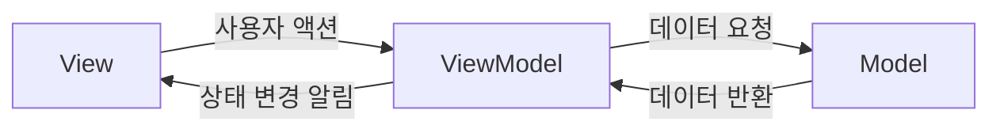
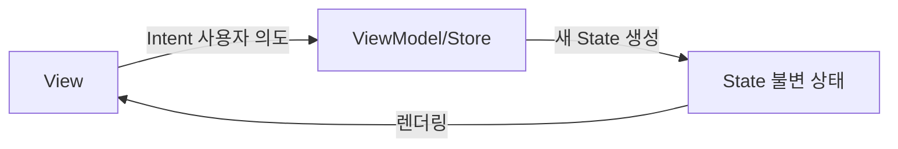

- MVVM 패턴의 구조와 동작 방식
- MVI 패턴의 구조와 동작 방식
- 두 패턴의 핵심 차이점 비교
- 단방향 데이터 흐름(UDF)의 개념
- 각 패턴의 장단점과 적합한 사용 사례
- Jetpack Compose와의 관계

---

## MVVM (Model-View-ViewModel)

### 구조



- **Model**: 데이터 소스 (Repository, API, DB)
- **View**: UI 렌더링 ([[Activity Lifecycle|Activity]], [[Fragment 생명주기|Fragment]], Composable)
- **[[Jetpack ViewModel|ViewModel]]**: UI 상태 관리, View와 Model 사이의 중개자

### 동작 방식

1. View가 사용자 액션을 ViewModel의 메서드로 전달
2. ViewModel이 Model에 데이터 요청
3. Model이 데이터를 반환
4. ViewModel이 `LiveData`/`StateFlow`를 통해 View에 상태 변경 알림
5. View가 변경된 상태를 관찰하여 UI 업데이트

### 코드 예시

```kotlin
// ViewModel
class UserViewModel(
    private val repository: UserRepository
) : ViewModel() {

    private val _users = MutableStateFlow<List<User>>(emptyList())
    val users: StateFlow<List<User>> = _users.asStateFlow()

    private val _isLoading = MutableStateFlow(false)
    val isLoading: StateFlow<Boolean> = _isLoading.asStateFlow()

    private val _error = MutableStateFlow<String?>(null)
    val error: StateFlow<String?> = _error.asStateFlow()

    fun loadUsers() {
        viewModelScope.launch {
            _isLoading.value = true
            try {
                _users.value = repository.getUsers()
            } catch (e: Exception) {
                _error.value = e.message
            } finally {
                _isLoading.value = false
            }
        }
    }
}
```

### 특징

- **여러 상태 변수**로 UI 상태 관리 (`users`, `isLoading`, `error` 각각 분리)
- View가 ViewModel의 함수를 직접 호출
- [[Configuration Changes]]에서도 상태 유지 (Jetpack ViewModel)

---

## MVI (Model-View-Intent)

### 구조



- **Intent**: 사용자의 **의도**(Action) — Android의 Intent와 다름
- **Model/State**: 화면의 **전체 상태**를 나타내는 불변 객체
- **View**: State를 받아 **렌더링**만 수행

### 동작 방식 (단방향 데이터 흐름, UDF)

1. View에서 사용자 액션이 **Intent(의도)**로 변환
2. Intent가 ViewModel(또는 Store)로 전달
3. 현재 State + Intent를 기반으로 **새로운 불변 State** 생성
4. View가 단일 State를 관찰하여 UI 렌더링
5. 반복 (순환 구조)

### 코드 예시

```kotlin
// State - 단일 불변 객체
data class UserUiState(
    val users: List<User> = emptyList(),
    val isLoading: Boolean = false,
    val error: String? = null
)

// Intent (사용자 의도)
sealed interface UserIntent {
    data object LoadUsers : UserIntent
    data class DeleteUser(val userId: Long) : UserIntent
    data object Refresh : UserIntent
}

// ViewModel
class UserViewModel(
    private val repository: UserRepository
) : ViewModel() {

    private val _state = MutableStateFlow(UserUiState())
    val state: StateFlow<UserUiState> = _state.asStateFlow()

    fun handleIntent(intent: UserIntent) {
        when (intent) {
            is UserIntent.LoadUsers -> loadUsers()
            is UserIntent.DeleteUser -> deleteUser(intent.userId)
            is UserIntent.Refresh -> refresh()
        }
    }

    private fun loadUsers() {
        viewModelScope.launch {
            _state.update { it.copy(isLoading = true, error = null) }
            try {
                val users = repository.getUsers()
                _state.update { it.copy(users = users, isLoading = false) }
            } catch (e: Exception) {
                _state.update { it.copy(error = e.message, isLoading = false) }
            }
        }
    }
}

// View (Compose)
@Composable
fun UserScreen(viewModel: UserViewModel) {
    val state by viewModel.state.collectAsStateWithLifecycle()

    when {
        state.isLoading -> LoadingIndicator()
        state.error != null -> ErrorMessage(state.error!!)
        else -> UserList(
            users = state.users,
            onDelete = { viewModel.handleIntent(UserIntent.DeleteUser(it)) }
        )
    }
}
```

### 특징

- **단일 불변 State 객체**로 화면 전체 상태 관리
- Intent라는 메시지 객체를 통해 사용자 의도 전달
- 엄격한 **단방향 데이터 흐름(UDF)**
- State가 불변이므로 상태 추적과 디버깅 용이

---

## MVVM vs MVI 비교

| 항목 | MVVM | MVI |
|------|------|-----|
| 데이터 흐름 | 관찰 기반 (양방향 가능) | 엄격한 단방향 (UDF) |
| 상태 관리 | 여러 개의 관찰 가능 변수 | 단일 불변 State 객체 |
| 사용자 입력 | ViewModel 함수 직접 호출 | Intent 메시지 객체로 전달 |
| State 변경 | 개별 변수 직접 수정 | `copy()`로 새 State 생성 |
| 디버깅 | 여러 상태 변수 추적 필요 | 단일 State로 추적 용이 |
| 보일러플레이트 | 상대적으로 적음 | State, Intent 클래스 정의 필요 |
| 적합한 앱 | 일반적인 데이터 기반 앱 | 복잡한 상태 변화가 잦은 앱 |

---

## 장단점 정리

### MVVM

| 장점 | 단점 |
|------|------|
| 구현이 직관적 | 상태가 많아지면 관리 복잡 |
| 적은 보일러플레이트 | 상태 불일치 가능성 |
| Jetpack 라이브러리와 자연스러운 통합 | 양방향 바인딩 시 사이드 이펙트 추적 어려움 |

### MVI

| 장점 | 단점 |
|------|------|
| 예측 가능한 상태 관리 | 보일러플레이트 증가 |
| 디버깅 용이 (상태 추적) | 작은 변경에도 새 State 객체 생성 |
| 상태 불일치 방지 | 학습 곡선이 높음 |
| Compose와 궁합이 좋음 | 성능 주의 필요 (대규모 State) |

---

## Jetpack Compose와의 관계

Jetpack Compose는 **선언적 UI**로 State를 받아 UI를 렌더링하는 구조입니다. MVI의 단방향 데이터 흐름과 자연스럽게 호환됩니다.

```
MVI의 흐름:     Intent → State → View(렌더링)
Compose의 흐름: State 변경 → Recomposition → UI 업데이트
```

Google도 공식 문서에서 **단방향 데이터 흐름(UDF)**을 권장하고 있어, 현대 Android 개발에서는 MVI 또는 MVI 스타일의 MVVM을 많이 채택합니다.

---

## 정리

- MVVM: Model-View-ViewModel, 여러 관찰 변수로 상태 관리, 구현 직관적
- MVI: Model-View-Intent, 단일 불변 State + 단방향 흐름, 예측 가능한 상태
- 핵심 차이: 상태 관리 방식 (분산 vs 단일), 데이터 흐름 (양방향 가능 vs 엄격한 UDF)
- MVVM 적합: 일반적인 데이터 기반 앱, 빠른 구현 필요 시
- MVI 적합: 복잡한 상태 변화, 디버깅 중시, Compose 기반 앱
- UDF: Google 공식 권장 패턴, MVI와 자연스럽게 호환

---

## QnA

