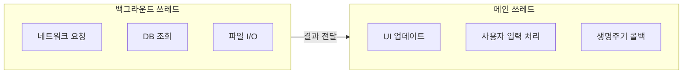

- 메인 쓰레드(UI 쓰레드)의 개념과 역할
- 왜 메인 쓰레드는 하나인지 그 이유
- 왜 UI 조작은 반드시 메인 쓰레드에서 수행해야 하는지
- 메인 쓰레드와 백그라운드 쓰레드의 역할 분리
- Thread-safe하지 않은 UI 툴킷의 설계 이유

---

## 메인 쓰레드란

Android 애플리케이션이 시작되면 시스템은 **메인 쓰레드(Main Thread)**라고 불리는 단일 실행 쓰레드를 생성합니다. 이 쓰레드는 **UI 쓰레드**라고도 불리며, 화면 그리기, 사용자 입력 처리, 생명주기 콜백 등을 담당합니다.

---

## 왜 메인 쓰레드는 하나인가

### 동기화 문제 방지

여러 쓰레드가 동시에 동일한 UI 요소에 접근하여 수정하면 **경쟁 조건(Race Condition)**이나 **교착 상태(Deadlock)**가 발생할 수 있습니다.

```
[쓰레드 A] TextView 텍스트 변경 → "Hello"
[쓰레드 B] 같은 TextView 텍스트 변경 → "World"
                ↓
결과가 예측 불가능 (Race Condition)
```

단일 쓰레드 모델을 채택하면 UI 업데이트가 **순차적이고 예측 가능하게** 처리됩니다.

### 시스템 단순성

- 각 앱은 자체 프로세스에서 단일 실행 쓰레드로 작동
- 시스템 보안, 메모리 관리, 내결함성 보장
- 복잡한 동기화 메커니즘(Lock, Mutex) 없이도 안전한 UI 업데이트 가능

### 일관된 렌더링

Android는 **16ms(60fps)** 간격으로 화면을 갱신합니다. 이 시간 내에 처리하지 못하면 [[ANR]]이 발생할 수 있습니다. 단일 쓰레드에서 순서대로 처리해야 프레임 드롭 없이 일관된 렌더링이 가능합니다.

---

## 왜 UI 조작은 메인 쓰레드에서만 해야 하는가

### UI 툴킷이 Thread-safe하지 않음

Android 프레임워크의 UI 툴킷(`View`, `ViewGroup` 등)은 **Thread-safe하게 설계되지 않았습니다**. 이는 의도적인 설계 결정입니다.

Thread-safe하게 만들려면 모든 UI 연산에 Lock을 걸어야 하는데, 이는:

1. **성능 저하**: 매번 Lock 획득/해제 오버헤드 발생
2. **복잡성 증가**: 데드락 방지를 위한 복잡한 동기화 코드 필요
3. **UI 응답성 감소**: Lock 대기로 인한 프레임 드롭 가능

따라서 Android는 "UI는 메인 쓰레드에서만 조작"이라는 단순한 규칙으로 이 문제를 해결합니다.

### 백그라운드에서 UI 접근 시

```kotlin
// 잘못된 코드 - 크래시 발생
Thread {
    val data = fetchDataFromNetwork()
    textView.text = data  // CalledFromWrongThreadException!
}.start()

// 올바른 코드 - 메인 쓰레드에서 UI 업데이트
Thread {
    val data = fetchDataFromNetwork()
    runOnUiThread {
        textView.text = data
    }
}.start()
```

백그라운드 쓰레드에서 UI를 직접 수정하면 `CalledFromWrongThreadException`이 발생합니다.

### 메인 쓰레드로 전환하는 방법

| 방법 | 설명 |
|------|------|
| `runOnUiThread { }` | Activity에서 제공하는 간편한 메서드 |
| `Handler(Looper.getMainLooper())` | [[Handler와 Looper|Handler]]를 통한 메인 쓰레드 전환 |
| `view.post { }` | View에 Runnable 전달 |
| `withContext(Dispatchers.Main)` | [[Kotlin Coroutines]]에서의 전환 |
| `LiveData.postValue()` | LiveData를 통한 안전한 UI 업데이트 |

---

## 메인 쓰레드 vs 백그라운드 쓰레드



| 작업 유형 | 실행 쓰레드 |
|-----------|------------|
| UI 렌더링, 뷰 업데이트 | 메인 쓰레드 |
| 사용자 입력 이벤트 | 메인 쓰레드 |
| 생명주기 콜백 | 메인 쓰레드 |
| 네트워크 요청 | 백그라운드 쓰레드 |
| 데이터베이스 I/O | 백그라운드 쓰레드 |
| 파일 읽기/쓰기 | 백그라운드 쓰레드 |
| 복잡한 계산 | 백그라운드 쓰레드 |

---

## 정리

- 메인 쓰레드: 앱 시작 시 생성되는 단일 쓰레드, UI 렌더링과 사용자 입력 담당
- 단일 쓰레드 이유: Race Condition/Deadlock 방지, 시스템 단순성, 일관된 렌더링
- UI 조작 제한 이유: UI 툴킷이 Thread-safe하지 않은 의도적 설계 (성능 우선)
- 메인 쓰레드 전환: `runOnUiThread`, `Handler`, `Dispatchers.Main` 등 활용
- 역할 분리: UI 작업 → 메인 쓰레드, I/O/계산 작업 → 백그라운드 쓰레드

---

## QnA

