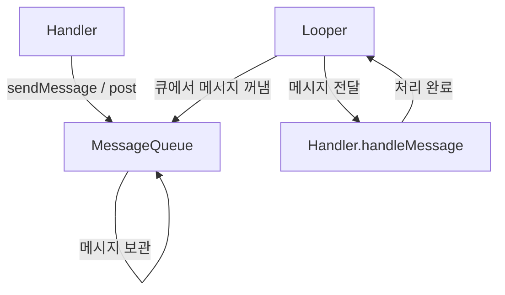

- Handler, Looper, MessageQueue의 개념
- 세 컴포넌트의 동작 원리와 관계
- 메인 쓰레드에서의 메시지 루프 구조
- UI 쓰레드의 모든 작업이 Handler/Looper를 통해 처리되는 원리
- Handler를 이용한 쓰레드 간 통신 방법
- HandlerThread의 활용
- Coroutine과의 비교

---

## 개요

Handler, Looper, MessageQueue는 Android에서 **쓰레드 간 비동기 통신**을 처리하는 핵심 컴포넌트입니다. [[Android Main Thread|메인 쓰레드]]의 메시지 루프도 이 구조로 동작합니다. 세 가지가 함께 동작하여 메시지 기반의 작업 처리 시스템을 구성합니다.

---

## 핵심 컴포넌트

### MessageQueue

쓰레드가 처리해야 할 **Message와 Runnable을 순차적으로 보관하는 큐**입니다.

- FIFO(First-In, First-Out) 방식으로 작업 관리
- 시간 기반 스케줄링 지원 (지연 실행)
- 하나의 쓰레드에 하나의 MessageQueue 존재

### Looper

MessageQueue를 **지속적으로 모니터링**하고, 큐에서 메시지를 꺼내 적절한 Handler에게 전달하는 역할입니다.

- 쓰레드를 종료하지 않고 살아있게 유지
- 무한 루프로 MessageQueue를 감시
- 메인 쓰레드에는 시스템이 자동으로 Looper를 설정
- 일반 쓰레드에서는 직접 `Looper.prepare()`, `Looper.loop()` 호출 필요

### Handler

Looper와 상호작용하여 **MessageQueue에 작업을 넣거나, 전달받은 작업을 처리**하는 인터페이스입니다.

- 메시지 전송: `sendMessage()`, `post()`
- 메시지 처리: `handleMessage()` 오버라이드
- 특정 Looper에 바인딩되어 해당 쓰레드에서 작업 실행

---

## 동작 원리



```
1. Handler가 Message 또는 Runnable을 MessageQueue에 추가
2. Looper가 무한 루프로 MessageQueue 감시
3. 큐에서 메시지를 하나 꺼냄
4. 해당 메시지를 보낸 Handler의 handleMessage()로 전달
5. Handler가 메시지 처리
6. 2번으로 돌아감 (반복)
```

---

## 사용 예시

### 백그라운드에서 메인 쓰레드로 전달

```kotlin
// 메인 쓰레드의 Handler 생성
val mainHandler = Handler(Looper.getMainLooper())

// 백그라운드 쓰레드에서 UI 업데이트 요청
Thread {
    val result = performHeavyWork()

    mainHandler.post {
        // 메인 쓰레드에서 실행됨
        textView.text = result
    }
}.start()
```

### 지연 실행

```kotlin
val handler = Handler(Looper.getMainLooper())

// 3초 후 실행
handler.postDelayed({
    showToast("3초 경과")
}, 3000L)

// 예약된 작업 취소
handler.removeCallbacksAndMessages(null)
```

### Message 객체 사용

```kotlin
val handler = object : Handler(Looper.getMainLooper()) {
    override fun handleMessage(msg: Message) {
        when (msg.what) {
            MSG_UPDATE_UI -> {
                val data = msg.obj as String
                textView.text = data
            }
            MSG_SHOW_ERROR -> {
                showError(msg.obj as String)
            }
        }
    }
}

// 메시지 전송
val msg = Message.obtain().apply {
    what = MSG_UPDATE_UI
    obj = "새로운 데이터"
}
handler.sendMessage(msg)
```

---

## HandlerThread

Looper가 내장된 쓰레드입니다. 일반 쓰레드와 달리 자동으로 Looper를 설정하여 Handler를 사용할 수 있습니다.

```kotlin
val handlerThread = HandlerThread("BackgroundThread")
handlerThread.start()

val backgroundHandler = Handler(handlerThread.looper)

// 백그라운드에서 순차 실행
backgroundHandler.post { task1() }
backgroundHandler.post { task2() }
backgroundHandler.post { task3() }

// 사용 후 정리
handlerThread.quitSafely()
```

---

## 메인 쓰레드의 메시지 루프

메인 쓰레드의 Looper는 앱의 진입점인 `ActivityThread.main()`에서 자동으로 시작됩니다.

```
ActivityThread.main()
    ↓
Looper.prepareMainLooper()
    ↓
Looper.loop()  ← 무한 루프 시작
    ↓
생명주기 콜백, 입력 이벤트, UI 업데이트 등
모든 메인 쓰레드 작업이 이 루프를 통해 처리됨
```

### UI 쓰레드에서 처리되는 작업들

[[Android Main Thread|UI 쓰레드]]에서 발생하는 거의 모든 작업은 Handler/Looper 메커니즘을 통해 MessageQueue에 Message로 전달됩니다.

| 작업 | 내부 동작 |
|------|-----------|
| Activity 생명주기 콜백 | `ActivityThread.H`(Handler)가 `LAUNCH_ACTIVITY`, `PAUSE_ACTIVITY` 등의 Message 처리 |
| 터치/입력 이벤트 | `InputEventReceiver`가 이벤트를 Message로 변환하여 큐에 추가 |
| View 렌더링 | `Choreographer`가 VSYNC 신호를 받아 `doFrame()` Message 전송 |
| `View.post()` | 내부적으로 View가 attach된 Handler에 Runnable 전달 |
| `runOnUiThread()` | 현재 쓰레드가 메인이면 즉시 실행, 아니면 `Handler.post()` 호출 |

즉, **UI 쓰레드의 본질은 Looper가 돌고 있는 쓰레드**입니다. Looper가 MessageQueue에서 메시지를 하나씩 꺼내 처리하기 때문에, 하나의 Message 처리가 오래 걸리면 다음 메시지(UI 렌더링, 입력 이벤트 등)가 지연되어 [[ANR]]이 발생합니다.

---

## Handler vs Coroutine

현대 Android 개발에서는 [[Kotlin Coroutines]]가 Handler를 대체하는 추세입니다.

| 항목 | Handler/Looper | Coroutine |
|------|---------------|-----------|
| 가독성 | 콜백 기반, 복잡 | 순차적 코드 스타일 |
| 에러 처리 | 수동 처리 | try-catch 가능 |
| 취소 | `removeCallbacks` 수동 | 구조화된 동시성으로 자동 |
| 쓰레드 전환 | `Handler(Looper.getMainLooper())` | `withContext(Dispatchers.Main)` |
| 사용 추천 | 레거시 코드, 저수준 제어 | 새 프로젝트 표준 |

---

## 정리

- MessageQueue: 처리할 Message/Runnable을 순차 보관하는 큐
- Looper: MessageQueue를 무한 루프로 감시, 메시지를 Handler에 전달
- Handler: MessageQueue에 작업 추가 및 전달받은 메시지 처리
- 동작 흐름: Handler → MessageQueue → Looper → Handler.handleMessage()
- 메인 쓰레드: ActivityThread.main()에서 자동으로 Looper 시작
- UI 쓰레드의 본질: Looper가 돌고 있는 쓰레드, 생명주기/입력/렌더링 모두 Message로 처리
- HandlerThread: Looper 내장 쓰레드, 백그라운드 순차 작업에 활용
- 현대적 대안: Kotlin Coroutines가 Handler/Looper 역할 대체

---

## QnA

