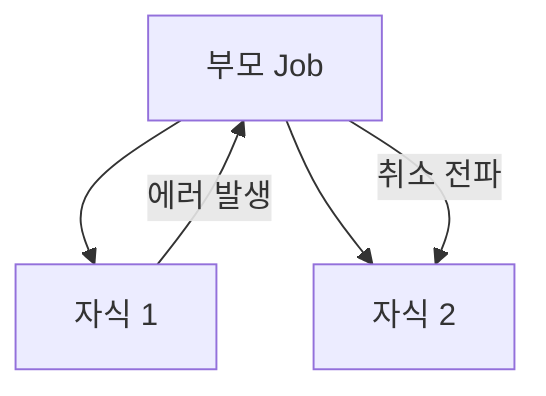

- Kotlin 코루틴의 핵심 개념과 동작 원리
- 코루틴을 경량 쓰레드로 부르는 이유
- suspend 함수의 실제 동작 원리 (CPS 변환, Continuation)
- CoroutineScope와 CoroutineContext의 관계
- Job과 SupervisorJob의 차이, 에러 전파 방식
- Dispatchers의 네 가지 종류와 각각의 특성
- async와 withContext의 차이
- 구조적 동시성(Structured Concurrency)
- Kotlin Flow의 개념과 주요 연산자
- Cold Flow와 Hot Flow의 차이

---

## 개요

코루틴은 비동기 프로그래밍을 단순화하는 Kotlin의 경량 동시성 솔루션입니다. 스레드를 차단(blocking)하지 않고 코드 실행을 일시 중단(suspend)했다가 재개할 수 있어, 콜백 지옥 없이 순차적인 코드 스타일로 비동기 작업을 작성할 수 있습니다.

### 코루틴을 경량 쓰레드로 부르는 이유

코루틴은 OS 스레드 위에서 동작하지만, 스레드와 1:1로 매핑되지 않습니다.

| 구분 | 스레드 | 코루틴 |
|------|--------|--------|
| 관리 주체 | OS 커널 | Kotlin 런타임 |
| 메모리 | 스레드당 약 1MB 스택 | 코루틴당 수십~수백 바이트 |
| 전환 비용 | 컨텍스트 스위칭 (비쌈) | 함수 호출 수준 (저렴) |
| 생성 가능 수 | 수천 개 수준 | 수십만 개 가능 |
| 차단 방식 | 스레드 자체가 블로킹 | 스레드를 양보(suspend)하고 다른 코루틴 실행 |

```kotlin
// 10만 개 코루틴 생성 가능 - 스레드로는 불가능
runBlocking {
    repeat(100_000) {
        launch {
            delay(1000)
            print(".")
        }
    }
}
```

핵심은 **스레드를 점유하지 않는다**는 점입니다. 코루틴이 `delay()`나 네트워크 I/O 등으로 중단되면 해당 스레드는 다른 코루틴을 실행할 수 있습니다. 이로 인해 적은 수의 스레드로 많은 동시 작업을 처리할 수 있습니다.

---

## suspend 함수

`suspend` 키워드가 붙은 함수는 현재 스레드를 차단하지 않고 실행을 일시 중단했다가, 작업이 완료되면 다시 재개합니다.

```kotlin
// suspend 함수 - 코루틴 내부 또는 다른 suspend 함수에서만 호출 가능
suspend fun fetchUser(): User {
    return withContext(Dispatchers.IO) {
        api.getUser()  // 네트워크 작업 중 스레드 차단 없음
    }
}
```

### 일반 함수와의 차이

| 구분 | 일반 함수 | suspend 함수 |
|------|----------|-------------|
| 스레드 | 차단(blocking) | 일시 중단(suspend) |
| 호출 위치 | 어디서든 | 코루틴 또는 다른 suspend 함수 내 |
| 비동기 처리 | 콜백/스레드 필요 | 순차적 코드 스타일 |

### suspend 함수의 실제 동작 원리 (CPS 변환)

Kotlin 컴파일러는 `suspend` 함수를 **CPS(Continuation-Passing Style)**로 변환합니다. 디컴파일하면 함수 시그니처에 `Continuation` 파라미터가 추가되는 것을 확인할 수 있습니다.

```kotlin
// Kotlin 코드
suspend fun fetchUser(): User {
    val token = getToken()      // 중단점 1
    val user = getUser(token)   // 중단점 2
    return user
}
```

```java
// Java 디컴파일 결과 (간략화)
public Object fetchUser(Continuation<? super User> continuation) {
    // 상태 머신으로 변환됨
    int label = continuation.label;

    switch (label) {
        case 0:
            continuation.label = 1;
            Object result = getToken(continuation);  // 중단 가능
            if (result == COROUTINE_SUSPENDED) return COROUTINE_SUSPENDED;
            // fall through

        case 1:
            String token = (String) result;
            continuation.label = 2;
            result = getUser(token, continuation);   // 중단 가능
            if (result == COROUTINE_SUSPENDED) return COROUTINE_SUSPENDED;
            // fall through

        case 2:
            return (User) result;
    }
}
```

#### Continuation 인터페이스

```kotlin
interface Continuation<in T> {
    val context: CoroutineContext
    fun resumeWith(result: Result<T>)
}
```

- `context`: 코루틴의 실행 환경 (Dispatcher, Job 등)
- `resumeWith()`: 중단된 코루틴을 결과값과 함께 재개

#### 동작 흐름

1. 컴파일러가 각 `suspend` 호출 지점을 **중단점(suspension point)**으로 표시
2. 함수 전체를 **상태 머신(state machine)**으로 변환 (label 기반 switch문)
3. 중단 시 현재 상태를 `Continuation` 객체에 저장하고 `COROUTINE_SUSPENDED` 반환
4. 작업 완료 시 `Continuation.resumeWith()`를 호출하여 다음 상태로 진행
5. 하나의 `suspend` 함수에 여러 중단점이 있어도 **하나의 Continuation 객체**가 재사용됨

---

## CoroutineScope와 CoroutineContext

### CoroutineContext

코루틴의 동작을 정의하는 **요소(Element)들의 불변 집합**입니다. `+` 연산자로 여러 요소를 조합할 수 있습니다.

| 요소 | 역할 |
|------|------|
| `Job` | 코루틴의 생명주기 관리, 취소 전파 |
| `CoroutineDispatcher` | 실행 스레드 결정 |
| `CoroutineName` | 디버깅용 이름 |
| `CoroutineExceptionHandler` | 예외 처리 |

```kotlin
// Context 요소 조합
val context = Dispatchers.IO + CoroutineName("fetchUser") + exceptionHandler

// 특정 요소 접근
val job = context[Job]
val dispatcher = context[ContinuationInterceptor]
```

### CoroutineScope

CoroutineScope는 `CoroutineContext`를 하나 가지고 있는 **인터페이스**입니다. 코루틴의 실행 범위를 정의하며, 스코프가 취소되면 내부의 모든 코루틴도 함께 취소됩니다.

```kotlin
// CoroutineScope 인터페이스 정의
interface CoroutineScope {
    val coroutineContext: CoroutineContext
}
```

```kotlin
// launch - 결과를 반환하지 않는 코루틴 시작
viewModelScope.launch {
    val user = fetchUser()
    _uiState.value = UiState.Success(user)
}

// async - 결과를 반환하는 코루틴 시작 (Deferred)
viewModelScope.launch {
    val userDeferred = async { fetchUser() }
    val postsDeferred = async { fetchPosts() }

    // 두 작업 병렬 실행 후 결과 대기
    val user = userDeferred.await()
    val posts = postsDeferred.await()
}
```

### Context와 Scope의 관계

```kotlin
viewModelScope.launch(Dispatchers.IO + CoroutineName("fetch")) {
    // 이 코루틴의 CoroutineContext =
    //   부모 Scope의 Context + 전달된 Context + 새 Job
    // = viewModelScope.coroutineContext + Dispatchers.IO + CoroutineName("fetch") + Job()
}
```

자식 코루틴은 부모의 Context를 **상속**받되, 직접 전달한 요소로 **덮어쓰기**됩니다. 단, `Job`은 항상 새로 생성되어 부모-자식 관계를 형성합니다.

### Android에서의 주요 스코프

| 스코프 | 연결된 생명주기 | 취소 시점 |
|--------|--------------|----------|
| [[lifecycleScope, viewModelScope, GlobalScope\|viewModelScope]] | [[Jetpack ViewModel\|ViewModel]] | `onCleared()` |
| [[lifecycleScope, viewModelScope, GlobalScope\|lifecycleScope]] | Activity/Fragment | `onDestroy()` |
| `rememberCoroutineScope` | Composition | 컴포지션 종료 |
| `GlobalScope` | Application | 앱 프로세스 종료 |

---

## Job, SupervisorJob, Deferred

### Job

코루틴의 생명주기를 관리하는 핸들입니다. 상태 확인, 취소 등이 가능합니다.

```kotlin
val job = viewModelScope.launch {
    delay(5000)
    println("작업 완료")
}

// 코루틴 취소
job.cancel()

// 코루틴 완료 대기
job.join()
```

### Job의 에러 전파 (기본 동작)

일반 `Job`에서는 자식 코루틴이 실패하면 **부모에게 에러가 전파**되고, 부모는 다른 자식 코루틴도 **모두 취소**합니다.

```kotlin
viewModelScope.launch {
    launch {
        throw RuntimeException("실패!")  // 자식 1 실패
    }
    launch {
        delay(1000)
        println("이 코드는 실행되지 않음")  // 자식 2도 취소됨
    }
}
```



### SupervisorJob

`SupervisorJob`은 자식의 실패가 **다른 자식에게 전파되지 않는** Job입니다. 실패한 자식만 취소되고, 나머지 자식은 계속 실행됩니다.

```kotlin
// 방법 1: supervisorScope 사용
viewModelScope.launch {
    supervisorScope {
        launch {
            throw RuntimeException("실패!")  // 자식 1만 실패
        }
        launch {
            delay(1000)
            println("이 코드는 정상 실행됨")  // 자식 2는 영향 없음
        }
    }
}

// 방법 2: SupervisorJob을 직접 사용
val scope = CoroutineScope(SupervisorJob() + Dispatchers.Main)
```

### Job vs SupervisorJob 비교

| 구분 | Job | SupervisorJob |
|------|-----|---------------|
| 자식 실패 시 | 부모에게 전파, 다른 자식 모두 취소 | 실패한 자식만 취소, 다른 자식 영향 없음 |
| 에러 전파 방향 | 양방향 (위아래) | 단방향 (위에서 아래로만) |
| 사용 사례 | 모든 작업이 연관된 경우 | 독립적인 작업들을 병렬 실행할 때 |
| Android 예시 | 연쇄적 API 호출 | 여러 독립 API를 병렬 호출 |

> `viewModelScope`은 내부적으로 `SupervisorJob() + Dispatchers.Main.immediate`으로 구성되어 있어, ViewModel 내 각 코루틴이 독립적으로 동작합니다.

### Deferred

`async`로 시작한 코루틴의 결과를 받기 위한 핸들입니다. `Job`을 상속합니다.

```kotlin
val deferred: Deferred<User> = viewModelScope.async {
    fetchUser()
}

val user: User = deferred.await()  // 결과 대기
```

---

## Dispatchers

코루틴을 실행할 스레드를 지정합니다. 네 가지 종류가 있으며, 각각의 특성이 다릅니다.

### Dispatchers.Main

[[Android Main Thread|메인(UI) 스레드]]에서 코루틴을 실행합니다.

- **용도**: UI 업데이트, 가벼운 작업
- **스레드**: 단일 메인 스레드
- `Dispatchers.Main.immediate`: 이미 메인 스레드에 있으면 재디스패치 없이 즉시 실행

```kotlin
viewModelScope.launch(Dispatchers.Main) {
    _uiState.value = UiState.Success(data)  // UI 업데이트
}
```

### Dispatchers.IO

I/O 작업에 최적화된 스레드 풀에서 실행합니다.

- **용도**: 네트워크 요청, 파일 읽기/쓰기, DB 작업
- **스레드 수**: 기본 64개 또는 CPU 코어 수 중 큰 값
- `Default`와 스레드 풀을 **공유**하되, 필요에 따라 추가 스레드를 생성
- 블로킹 I/O 작업으로 스레드가 차단되어도 다른 코루틴에 영향 없도록 설계

### Dispatchers.Default

CPU 집약적 작업에 최적화된 스레드 풀에서 실행합니다.

- **용도**: 대규모 리스트 정렬, JSON 파싱, 이미지 처리 등 계산 작업
- **스레드 수**: CPU 코어 수와 동일 (최소 2개)
- CPU 바운드 작업을 위한 것이므로 블로킹 I/O를 여기서 수행하면 안 됨

### Dispatchers.Unconfined

특정 스레드에 한정되지 않습니다.

- **첫 중단점까지**: 호출한 스레드에서 실행
- **재개 시**: 중단된 suspend 함수를 재개시킨 스레드에서 실행
- **주의**: 일반적인 코드에서는 사용을 권장하지 않음, 주로 테스트 용도

### Dispatchers 비교

| Dispatcher | 스레드 수 | 용도 | 블로킹 허용 |
|------------|----------|------|------------|
| `Main` | 1 (메인) | UI 업데이트 | X |
| `IO` | 64+ | 네트워크, 파일, DB | O |
| `Default` | CPU 코어 수 | CPU 집약적 계산 | X |
| `Unconfined` | 호출/재개 스레드 | 테스트 | - |

### withContext로 전환

`withContext`는 코루틴의 Dispatcher를 전환하고, 블록 실행이 완료되면 이전 Dispatcher로 돌아옵니다.

```kotlin
viewModelScope.launch {
    // Main에서 시작
    _uiState.value = UiState.Loading

    val data = withContext(Dispatchers.IO) {
        // IO 스레드에서 네트워크 요청
        api.fetchData()
    }

    val processed = withContext(Dispatchers.Default) {
        // CPU 스레드에서 데이터 처리
        processData(data)
    }

    // 다시 Main에서 UI 업데이트
    _uiState.value = UiState.Success(processed)
}
```

### async vs withContext

| 구분 | async | withContext |
|------|-------|------------|
| 반환 | `Deferred<T>` (지연된 결과) | `T` (즉시 결과) |
| 동시성 | 여러 `async`를 병렬 실행 가능 | 순차적, Dispatcher 전환 후 완료 대기 |
| 사용 사례 | 병렬로 여러 작업 실행 | 단일 작업의 스레드 전환 |
| 결과 접근 | `await()` 호출 필요 | 블록의 반환값이 곧 결과 |

```kotlin
// async: 병렬 실행에 적합
val user = async(Dispatchers.IO) { fetchUser() }
val posts = async(Dispatchers.IO) { fetchPosts() }
val result = Pair(user.await(), posts.await())  // 두 작업 동시 실행

// withContext: 순차 실행, Dispatcher 전환에 적합
val user = withContext(Dispatchers.IO) { fetchUser() }    // 완료 후
val posts = withContext(Dispatchers.IO) { fetchPosts() }  // 다음 실행
```

> 단일 작업의 Dispatcher 전환에는 `withContext`가 간결합니다. `async { ... }.await()`를 바로 호출하는 것은 `withContext`와 동일하므로, 병렬 실행이 필요 없다면 `withContext`를 사용합니다.

---

## 구조적 동시성 (Structured Concurrency)

부모 스코프가 취소되면 모든 자식 코루틴도 함께 취소되는 원칙입니다. 리소스 누수를 방지하고 비동기 작업을 안전하게 관리합니다.

```kotlin
viewModelScope.launch {
    // 부모 코루틴

    launch {
        // 자식 1 - 부모 취소 시 함께 취소
        fetchUser()
    }

    launch {
        // 자식 2 - 부모 취소 시 함께 취소
        fetchPosts()
    }
}
// ViewModel.onCleared() 호출 시 모두 취소
```

SupervisorJob을 사용하면 자식의 실패가 다른 자식에게 전파되지 않습니다. 자세한 내용은 위의 Job, SupervisorJob 섹션을 참고합니다.

---

## 예외 처리

### try-catch

```kotlin
viewModelScope.launch {
    try {
        val user = fetchUser()
        _uiState.value = UiState.Success(user)
    } catch (e: Exception) {
        _uiState.value = UiState.Error(e.message)
    }
}
```

### CoroutineExceptionHandler

```kotlin
val handler = CoroutineExceptionHandler { _, exception ->
    _uiState.value = UiState.Error(exception.message)
}

viewModelScope.launch(handler) {
    val user = fetchUser()
    _uiState.value = UiState.Success(user)
}
```

---

## Kotlin Flow

비동기적으로 **여러 개의 값을 순차적으로 방출**할 수 있는 데이터 스트림입니다.

### Flow 생성

```kotlin
fun fetchUsers(): Flow<List<User>> = flow {
    while (true) {
        val users = api.getUsers()
        emit(users)  // 값 방출
        delay(5000)  // 5초 대기
    }
}
```

### 주요 연산자

```kotlin
repository.observeUsers()
    .map { users -> users.filter { it.isActive } }      // 변환
    .filter { it.isNotEmpty() }                          // 필터링
    .distinctUntilChanged()                              // 중복 제거
    .catch { e -> emit(emptyList()) }                    // 에러 처리
    .onEach { users -> log("Users: ${users.size}") }     // 부수 효과
    .flowOn(Dispatchers.IO)                              // 업스트림 Dispatcher 지정
    .collect { users -> updateUI(users) }                // 수집
```

| 연산자 | 역할 |
|--------|------|
| `map` | 값 변환 |
| `filter` | 조건에 맞는 값만 통과 |
| `flatMapLatest` | 새 값 도착 시 이전 Flow 취소 후 새 Flow 생성 |
| `combine` | 여러 Flow의 최신 값 조합 |
| `zip` | 여러 Flow를 쌍으로 결합 |
| `debounce` | 지정 시간 동안 새 값이 없을 때만 방출 |
| `distinctUntilChanged` | 이전 값과 동일하면 무시 |
| `catch` | 업스트림 에러 처리 |
| `flowOn` | 업스트림 실행 Dispatcher 지정 |

### combine vs zip

```kotlin
// combine: 어느 Flow든 새 값이 오면 최신 값 조합
val combined = combine(flow1, flow2) { a, b ->
    "$a - $b"
}

// zip: 두 Flow에서 값이 모두 올 때만 쌍으로 결합
val zipped = flow1.zip(flow2) { a, b ->
    "$a - $b"
}
```

---

## Cold Flow vs Hot Flow

| 구분 | Cold Flow | Hot Flow |
|------|-----------|----------|
| 데이터 생성 | 수집 시작 시 생성 | 수집 여부와 관계없이 생성 |
| 상태 유지 | 유지하지 않음 | 상태 유지 |
| 구독자 | 각 구독자가 독립적 | 구독자 간 데이터 공유 |
| 예시 | `flow { }` | [[StateFlow, SharedFlow, Channel|StateFlow, SharedFlow]] |

```kotlin
// Cold Flow - 수집할 때마다 새로 실행
val coldFlow = flow {
    emit(fetchData())
}

// Hot Flow - 수집 여부와 관계없이 값 유지
val stateFlow = MutableStateFlow(initialValue)
```

---

## 정리

- 경량 쓰레드: 코루틴은 OS 스레드를 점유하지 않고 중단/재개, 적은 메모리로 수십만 개 생성 가능
- suspend 함수: CPS 변환으로 Continuation 파라미터 추가, 상태 머신으로 변환되어 중단/재개
- CoroutineContext: Job, Dispatcher, Name, ExceptionHandler 등 요소의 불변 집합
- CoroutineScope: CoroutineContext를 가지는 인터페이스, 코루틴 실행 범위 정의
- Job vs SupervisorJob: Job은 자식 실패 시 형제 전부 취소, SupervisorJob은 실패한 자식만 취소
- Dispatchers: Main(UI, 1개), IO(I/O, 64+), Default(CPU, 코어 수), Unconfined(테스트)
- async vs withContext: async는 병렬 실행, withContext는 순차적 Dispatcher 전환
- 구조적 동시성: 부모 취소 시 자식도 취소, 리소스 누수 방지
- Flow: 비동기 데이터 스트림, map/filter/flatMapLatest 등 연산자
- Cold vs Hot: Cold Flow는 수집 시 생성, Hot Flow(StateFlow, SharedFlow)는 항상 활성

---

## QnA

