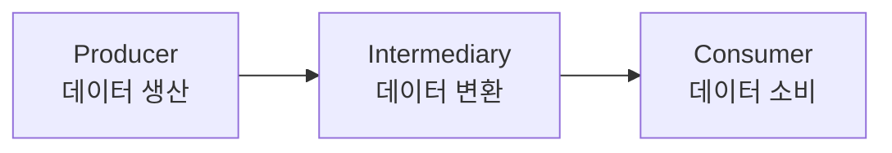
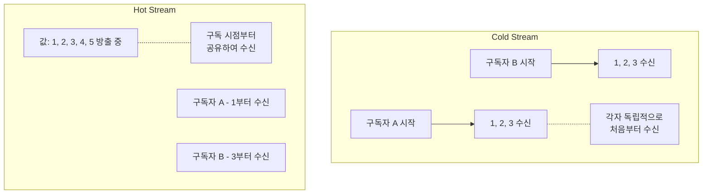
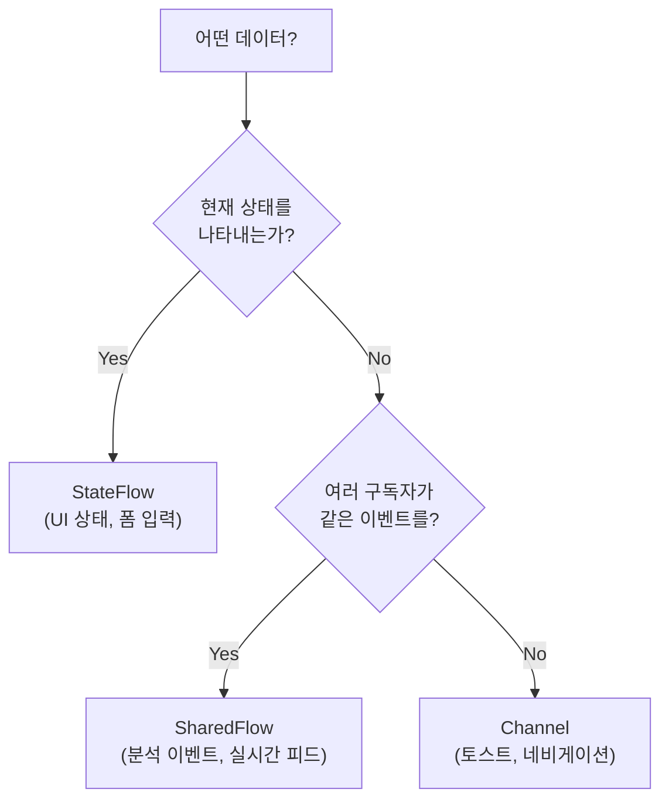
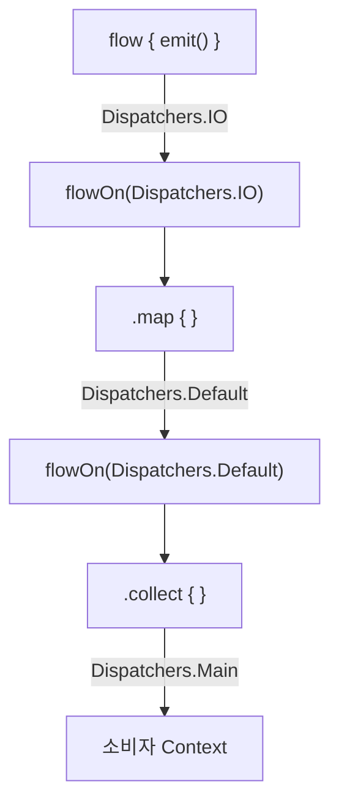
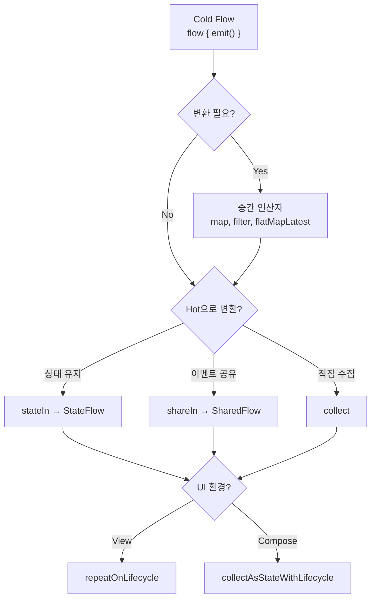

- Kotlin Flow의 개념과 필요성
- Flow의 3가지 구성 요소 (Producer, Intermediary, Consumer)
- Cold Stream과 Hot Stream의 차이점
- Cold Flow의 특성과 동작 원리
- Hot Stream: StateFlow와 SharedFlow
- Cold Flow → Hot Flow 변환 (stateIn, shareIn)
- Flow 연산자 (map, filter, combine, flatMapLatest 등)
- flowOn을 통한 Dispatcher 전환
- 예외 처리 (catch, onCompletion)
- Android에서 안전하게 수집하는 방법

---

## Flow란?

Flow는 [[Kotlin Coroutines|코루틴]] 기반으로 **여러 개의 값을 비동기적으로 순차 방출**할 수 있는 데이터 스트림입니다. `suspend` 함수가 단일 값을 반환하는 것과 달리, Flow는 시간에 걸쳐 여러 값을 내보냅니다.

```kotlin
// suspend 함수 - 단일 값 반환
suspend fun fetchUser(): User

// Flow - 여러 값을 순차적으로 방출
fun observeUsers(): Flow<List<User>>
```

### 왜 Flow가 필요한가?

- 네트워크 응답, DB 변경 등 **연속적인 데이터 업데이트**를 스트림으로 처리
- UI 레이어가 데이터 소스의 변경을 **실시간으로 감지하고 반응**
- 코루틴 기반이라 메인 스레드를 차단하지 않음
- 연산자를 통한 **선언적 데이터 변환** 가능

---

## Flow의 3가지 구성 요소



| 구성 요소 | 역할 | 예시 |
|----------|------|------|
| **Producer** | 스트림에 데이터를 방출 | `flow { emit(value) }` |
| **Intermediary** | 방출된 데이터를 변환/필터링 (선택) | `map`, `filter`, `transform` |
| **Consumer** | 스트림에서 데이터를 수집하여 사용 | `collect { }` |

```kotlin
// Producer: 데이터 생산
val newsFlow: Flow<List<Article>> = flow {
    while (true) {
        val news = newsApi.fetchLatestNews()
        emit(news)                    // 방출
        delay(5000)
    }
}

// Intermediary: 데이터 변환
val favoriteNews = newsFlow
    .map { news -> news.filter { it.isFavorite } }    // 변환
    .filter { it.isNotEmpty() }                        // 필터링

// Consumer: 데이터 소비
favoriteNews.collect { articles ->
    updateUI(articles)                // 소비
}
```

---

## Cold Stream vs Hot Stream

Flow를 이해하는 **가장 중요한 축**입니다. 모든 Flow 타입은 이 두 가지 중 하나에 속합니다.

| 구분 | Cold Stream | Hot Stream |
|------|------------|------------|
| 데이터 생성 시점 | **수집 시작 시** 생성 | 수집 여부와 **관계없이** 생성 |
| 구독자 없을 때 | 비활성 (아무 일도 안 함) | 계속 방출 (데이터 유실 가능) |
| 구독자 관계 | 각 구독자가 **독립적** 스트림 | 여러 구독자가 **공유** |
| 상태 유지 | 유지하지 않음 | 최신 상태 유지 가능 |
| 예시 | `flow { }` | `StateFlow`, `SharedFlow` |
| 비유 | **VOD** (재생 시 처음부터) | **라이브 방송** (지금 하는 걸 봄) |



---

## Cold Flow

`flow { }` 빌더로 생성되는 기본 Flow입니다. **수집(collect)이 시작될 때만** 생산자 코드가 실행됩니다.

### 특성

- **지연 초기화(Lazy)**: 구독자가 없으면 코드가 실행되지 않아 리소스 절약
- **독립적 실행**: 각 수집자마다 생산자 블록이 **새로 실행**
- **순차적**: `emit()` 후 다음 `emit()`까지 suspend 함수를 기다림

```kotlin
val numbersFlow = flow {
    println("Flow started")
    emit(1)
    delay(100)
    emit(2)
    delay(100)
    emit(3)
}

// 수집 시작 전까지 "Flow started"는 출력되지 않음

numbersFlow.collect { println(it) }   // A: 1, 2, 3 (처음부터)
numbersFlow.collect { println(it) }   // B: 1, 2, 3 (다시 처음부터)
```

### 실제 사용 예시: Repository

```kotlin
class NewsRepository(
    private val newsApi: NewsApi,
    private val newsDao: NewsDao
) {
    // Cold Flow - 수집할 때만 API 호출
    val latestNews: Flow<List<Article>> = flow {
        while (true) {
            val news = newsApi.fetchLatestNews()
            emit(news)
            delay(5_000)
        }
    }.flowOn(Dispatchers.IO)  // IO 스레드에서 실행

    // Room에서 반환하는 Flow도 Cold Flow
    fun observeBookmarks(): Flow<List<Article>> = newsDao.getBookmarks()
}
```

### 주의: flow { } 내에서의 제약

`flow { }` 빌더 내에서는 **다른 CoroutineContext에서 `emit()`을 호출할 수 없습니다.** 콜백 기반 API를 Flow로 변환할 때는 `callbackFlow`를 사용합니다.

```kotlin
// callbackFlow - 콜백 기반 API를 Flow로 변환
fun observeLocation(): Flow<Location> = callbackFlow {
    val callback = object : LocationCallback() {
        override fun onLocationResult(result: LocationResult) {
            trySend(result.lastLocation)  // 다른 Context에서 전송 가능
        }
    }

    locationClient.requestLocationUpdates(request, callback, Looper.getMainLooper())

    awaitClose {
        locationClient.removeLocationUpdates(callback)  // 정리
    }
}
```

---

## Hot Stream: StateFlow

현재 **상태를 유지**하고 새로운 상태 업데이트를 수집기에 내보내는 Hot Flow입니다. UI 상태 관리에 가장 적합합니다.

### 특성

| 특성 | 설명 |
|------|------|
| 초기값 | **필수** |
| 최신값 유지 | 항상 마지막 값 보유 (`value`로 접근) |
| 중복 방출 | 동일한 값은 방출하지 않음 (`distinctUntilChanged`) |
| 구독 시 동작 | 즉시 최신값 전달 (replay = 1) |

```kotlin
class UserViewModel : ViewModel() {

    private val _uiState = MutableStateFlow(UiState())         // 초기값 필수
    val uiState: StateFlow<UiState> = _uiState.asStateFlow()   // 읽기 전용 노출

    fun updateName(name: String) {
        _uiState.update { it.copy(userName = name) }           // 원자적 업데이트
    }
}
```

### 언제 사용하는가?

- **UI 상태** (로딩, 에러, 성공)
- **현재 선택된 항목**, 폼 입력값
- 항상 **"지금의 상태"**가 중요한 경우

---

## Hot Stream: SharedFlow

여러 구독자가 동일한 데이터 스트림을 **공유**할 수 있는 이벤트 전달용 Hot Flow입니다.

### 특성

| 특성 | 설명 |
|------|------|
| 초기값 | 필수 아님 |
| replay | 새 구독자에게 전달할 이전 값 개수 설정 가능 |
| 중복 방출 | 동일한 값도 방출 |
| 구독 시 동작 | replay 설정에 따라 다름 |

```kotlin
class EventBus {
    private val _events = MutableSharedFlow<UiEvent>(
        replay = 0,                                // 새 구독자에게 이전 값 안 줌
        extraBufferCapacity = 10,                  // 추가 버퍼
        onBufferOverflow = BufferOverflow.DROP_OLDEST
    )
    val events: SharedFlow<UiEvent> = _events.asSharedFlow()

    suspend fun emit(event: UiEvent) {
        _events.emit(event)
    }
}
```

### 언제 사용하는가?

- **일회성 이벤트** (토스트, 스낵바, 네비게이션)
- 여러 화면에서 수신해야 하는 이벤트
- 분석 이벤트, 실시간 알림

---

## StateFlow vs SharedFlow vs Channel

| 구분 | StateFlow | SharedFlow | Channel |
|------|-----------|------------|---------|
| 목적 | 상태 관리 | 이벤트 스트림 공유 | 일회성 이벤트 |
| 초기값 | 필수 | 선택 | 없음 |
| 최신값 유지 | 항상 (replay=1) | 설정에 따름 | 소비 후 제거 |
| 중복 값 | 무시 | 방출 | 방출 |
| 구독자 수 | 다수 | 다수 | 1명만 소비 |
| `value` 접근 | 가능 | 불가 | 불가 |



더 자세한 내용은 [[StateFlow, SharedFlow, Channel]]을 참고합니다.

---

## Cold Flow → Hot Flow 변환

Cold Flow를 Hot Flow로 변환하여 여러 구독자가 공유하거나 상태를 유지할 수 있습니다.

### stateIn (Cold → StateFlow)

```kotlin
class NewsViewModel(
    private val repository: NewsRepository
) : ViewModel() {

    val news: StateFlow<List<Article>> = repository.latestNews
        .stateIn(
            scope = viewModelScope,
            started = SharingStarted.WhileSubscribed(5_000),
            initialValue = emptyList()
        )
}
```

### shareIn (Cold → SharedFlow)

```kotlin
val sharedEvents: SharedFlow<Event> = repository.observeEvents()
    .shareIn(
        scope = viewModelScope,
        started = SharingStarted.WhileSubscribed(5_000),
        replay = 1
    )
```

### SharingStarted 전략

| 전략 | 동작 | 사용 시점 |
|------|------|----------|
| `Eagerly` | 즉시 시작, scope 종료까지 유지 | 항상 최신 데이터 필요 |
| `Lazily` | 첫 구독자 시 시작, scope 종료까지 유지 | 데이터가 필요할 때만 |
| `WhileSubscribed(timeout)` | 구독자 있을 때만 활성, timeout 후 중지 | **대부분의 경우 권장** |

`WhileSubscribed(5_000)`을 사용하면 화면 회전 시 5초간 upstream을 유지하여 **불필요한 데이터 재로딩을 방지**합니다.

---

## Flow 연산자

### 변환 연산자

```kotlin
// map: 값 변환
usersFlow.map { users -> users.map { it.name } }

// transform: 복잡한 변환 (여러 값 방출 가능)
numbersFlow.transform { value ->
    emit("Processing $value")
    emit("Done $value")
}

// flatMapLatest: 새 값 도착 시 이전 Flow 취소
searchQuery.flatMapLatest { query ->
    repository.search(query)  // 새 검색어 입력 시 이전 검색 취소
}
```

### 필터링 연산자

```kotlin
// filter: 조건에 맞는 값만 통과
usersFlow.filter { it.isActive }

// distinctUntilChanged: 연속 중복 제거
stateFlow.distinctUntilChanged()

// debounce: 지정 시간 동안 새 값이 없을 때만 방출
searchQuery.debounce(300)  // 타이핑 멈춘 후 300ms 뒤에 방출
```

### 결합 연산자

```kotlin
// combine: 어느 Flow든 새 값이 오면 최신 값 조합
val combined = combine(userFlow, settingsFlow) { user, settings ->
    UserWithSettings(user, settings)
}

// zip: 두 Flow에서 값이 모두 올 때 쌍으로 결합
val zipped = namesFlow.zip(agesFlow) { name, age ->
    Person(name, age)
}
```

| 연산자 | combine | zip |
|--------|---------|-----|
| 트리거 | 어느 Flow든 새 값 방출 시 | 모든 Flow에서 값이 올 때 |
| 최신값 | 각 Flow의 최신값 조합 | 순서대로 쌍 결합 |
| 사용 사례 | UI에서 여러 상태 조합 | 1:1 매칭이 필요할 때 |

---

## flowOn: Dispatcher 전환

`flowOn`은 **업스트림**(자신보다 위쪽) 연산의 실행 스레드를 변경합니다. 다운스트림에는 영향을 주지 않습니다.

```kotlin
val favoriteNews: Flow<List<Article>> =
    newsRemoteDataSource.latestNews
        .map { news ->                        // ← Dispatchers.Default에서 실행
            news.filter { it.isFavorite }
        }
        .flowOn(Dispatchers.Default)          // ↑ 위쪽만 영향
        .catch { exception ->                 // ← 소비자의 Context에서 실행
            emit(cachedNews())
        }
```



---

## 예외 처리

### catch 연산자

업스트림에서 발생한 예외를 잡아 처리합니다. 에러 시 대체 값을 방출할 수도 있습니다.

```kotlin
repository.latestNews
    .map { news -> news.filter { it.isFavorite } }
    .catch { exception ->
        // 에러 시 캐시된 데이터를 방출
        emit(lastCachedNews())
    }
    .collect { news ->
        updateUI(news)
    }
```

### onCompletion

Flow가 정상 종료되거나 예외로 중단되었을 때 마지막 정리 작업을 수행합니다.

```kotlin
numbersFlow
    .onCompletion { cause ->
        if (cause == null) {
            println("정상 종료")
        } else {
            println("에러로 종료: $cause")
        }
    }
    .collect { println(it) }
```

### 예외 처리 위치

| 위치 | catch 동작 |
|------|-----------|
| catch **위쪽** (업스트림) | 예외 포착됨 |
| catch **아래쪽** (다운스트림) | 예외 포착 안 됨 |
| collect 내부 | try-catch 사용 |

---

## Android에서 안전하게 수집하기

단순히 `collect`를 호출하면 앱이 백그라운드로 가도 수집이 계속되어 **리소스 낭비**가 발생합니다.

### View 시스템: repeatOnLifecycle

```kotlin
class NewsFragment : Fragment() {

    override fun onViewCreated(view: View, savedInstanceState: Bundle?) {
        super.onViewCreated(view, savedInstanceState)

        viewLifecycleOwner.lifecycleScope.launch {
            viewLifecycleOwner.repeatOnLifecycle(Lifecycle.State.STARTED) {
                // STARTED일 때만 수집, STOPPED 시 자동 중단
                viewModel.uiState.collect { state ->
                    updateUI(state)
                }
            }
        }
    }
}
```

### Compose: collectAsStateWithLifecycle

```kotlin
@Composable
fun NewsScreen(viewModel: NewsViewModel = viewModel()) {
    val uiState by viewModel.uiState.collectAsStateWithLifecycle()

    // uiState로 UI 구성
    NewsList(articles = uiState.articles)
}
```

더 자세한 내용은 [[collectAsState, collectAsStateWithLifecycle]]과 [[lifecycleScope, viewModelScope, GlobalScope]]을 참고합니다.

### 수집 방식 비교

| 방식 | 생명주기 인식 | 사용 환경 |
|------|-------------|----------|
| `collect` | X | 테스트, 생명주기 무관 |
| `repeatOnLifecycle` + `collect` | O | View 시스템 (Fragment/Activity) |
| `collectAsStateWithLifecycle` | O | Jetpack Compose (**권장**) |
| `collectAsState` | X (컴포지션 기반) | Compose Multiplatform |

수집 방식의 차이에 대해서는 [[Flow.collect & Flow.collectLatest]]를 참고합니다.

---

## 전체 흐름 정리



---

## 정리

- Flow: 코루틴 기반 비동기 데이터 스트림, 여러 값을 순차 방출
- 3요소: Producer(emit) → Intermediary(map, filter) → Consumer(collect)
- Cold Stream: 수집 시 실행, 각 구독자 독립, `flow { }` 빌더
- Hot Stream: 구독 여부와 무관하게 활성, 데이터 공유
- StateFlow: 상태 관리용 Hot Flow, 초기값 필수, 최신값 유지, 중복 무시
- SharedFlow: 이벤트 전달용 Hot Flow, replay 설정 가능, 여러 구독자 공유
- stateIn/shareIn: Cold → Hot 변환, `WhileSubscribed(5_000)` 권장
- flowOn: 업스트림 Dispatcher 변경, 다운스트림에는 영향 없음
- catch: 업스트림 예외 처리, 대체 값 방출 가능
- 안전한 수집: View는 `repeatOnLifecycle`, Compose는 `collectAsStateWithLifecycle`

---

## QnA

