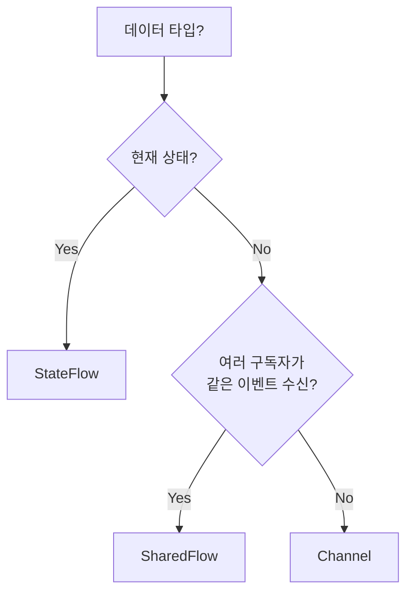

- Cold Flow와 Hot Flow의 차이점
- StateFlow의 개념, 특징, 사용 사례
- StateFlow의 conflation 동작과 equality 기반 중복 필터링
- SharedFlow의 개념, replay/buffer 설정, BufferOverflow 전략
- Channel의 특징과 일회성 이벤트 처리
- Channel의 produce 빌더와 Fan-out/Fan-in 패턴
- 언제 어떤 것을 사용해야 하는지 선택 기준
- stateIn, shareIn을 통한 Flow 변환

---

## Cold Flow vs Hot Flow

| 구분     | Cold Flow  | Hot Flow              |
| ------ | ---------- | --------------------- |
| 데이터 생성 | 수집 시작 시 생성 | 수집 여부와 관계없이 생성        |
| 상태 유지  | 유지하지 않음    | 상태 유지                 |
| 구독자    | 각 구독자가 독립적 | 구독자 간 데이터 공유          |
| 예시     | `flow { }` | StateFlow, SharedFlow |

### Cold Flow

수집기(collector)가 구독을 시작할 때까지 비활성 상태를 유지합니다. Flow에 대한 자세한 내용은 [[Kotlin Coroutines]]를 참고합니다.

```kotlin
val coldFlow = flow {
    println("Flow started")
    emit(1)
    emit(2)
}

// 수집 시작 시 "Flow started" 출력
coldFlow.collect { value -> println(value) }
```

### Hot Flow

활성 수집기가 있는지 여부와 관계없이 값을 방출합니다.

```kotlin
val stateFlow = MutableStateFlow(0)

// 수집 전에도 값이 존재
println(stateFlow.value)  // 0

stateFlow.value = 1  // 수집자 없이도 값 변경 가능
```

---

## StateFlow

현재 상태와 새로운 상태 업데이트를 수집기에 내보내는 **상태 유지용 Hot Flow**입니다.

### 특징

| 특징 | 설명 |
|------|------|
| 초기값 | 필수 |
| 최신값 유지 | 항상 마지막 값 보유 (replay = 1) |
| 중복 방출 | 동일한 값은 방출하지 않음 |
| 구독 시 동작 | 즉시 최신값 전달 |

### 사용법

```kotlin
class UserViewModel : ViewModel() {

    // MutableStateFlow: 내부에서 값 변경
    private val _uiState = MutableStateFlow(UiState())

    // StateFlow: 외부에 읽기 전용으로 노출
    val uiState: StateFlow<UiState> = _uiState.asStateFlow()

    fun updateName(name: String) {
        _uiState.update { it.copy(userName = name) }
    }
}
```

### value 접근

```kotlin
// 현재 값 즉시 접근 (suspend 아님)
val currentState = viewModel.uiState.value
```

### Conflation과 Equality 기반 중복 필터링

StateFlow는 내부적으로 `equals()`를 사용하여 이전 값과 동일한 값의 방출을 차단합니다. 이를 **conflation**이라 합니다.

```kotlin
val stateFlow = MutableStateFlow(User("Kim", 25))

// 같은 값을 다시 할당해도 collector에게 전달되지 않음
stateFlow.value = User("Kim", 25)  // equals()가 true → 무시

// data class가 아닌 경우 참조 비교이므로 주의
class RegularUser(val name: String)
val flow = MutableStateFlow(RegularUser("Kim"))
flow.value = RegularUser("Kim")  // 다른 인스턴스 → 방출됨
```

**주의사항:**
- `data class`를 사용하면 구조적 동등성(structural equality)으로 비교
- 일반 클래스는 참조 동등성(referential equality)으로 비교되어 같은 내용이어도 방출됨
- 리스트나 맵의 내부 요소만 변경하면 같은 참조이므로 변경이 감지되지 않음 → **새 인스턴스를 생성**해야 함

```kotlin
// 잘못된 예 - 변경 감지 안 됨
_uiState.value.items.add(newItem)  // 같은 리스트 참조

// 올바른 예 - 새 리스트 생성
_uiState.update { it.copy(items = it.items + newItem) }
```

### 사용 사례

- UI 상태 관리 (로딩, 에러, 성공)
- 사용자 프로필 정보
- 폼 입력값
- 현재 선택된 항목

---

## SharedFlow

여러 구독자가 동일한 데이터 스트림을 공유할 수 있도록 설계된 **이벤트 전달용 Hot Flow**입니다.

### 특징

| 특징 | 설명 |
|------|------|
| 초기값 | 필수 아님 |
| replay | 새 구독자에게 전달할 이전 값 개수 설정 가능 |
| extraBufferCapacity | 추가 버퍼 크기 설정 |
| onBufferOverflow | 버퍼 초과 시 동작 설정 |

### 생성

```kotlin
// 기본 SharedFlow
private val _events = MutableSharedFlow<Event>()
val events: SharedFlow<Event> = _events.asSharedFlow()

// replay와 buffer 설정
private val _events = MutableSharedFlow<Event>(
    replay = 1,                              // 새 구독자에게 1개 값 전달
    extraBufferCapacity = 10,               // 추가 버퍼 10개
    onBufferOverflow = BufferOverflow.DROP_OLDEST  // 버퍼 초과 시 오래된 값 삭제
)
```

### replay 설정

| replay | 동작 |
|--------|------|
| 0 (기본값) | 구독 시점 이후 값만 수신 |
| 1 | 마지막 1개 값도 수신 (StateFlow와 유사) |
| N | 마지막 N개 값 수신 |

### BufferOverflow 전략

| 전략 | 동작 |
|------|------|
| `SUSPEND` (기본값) | 버퍼가 가득 차면 emit이 일시 중단 |
| `DROP_OLDEST` | 버퍼가 가득 차면 가장 오래된 값 삭제 |
| `DROP_LATEST` | 버퍼가 가득 차면 새로 방출된 값 삭제 |

```kotlin
// DROP_OLDEST 사용 시 emit이 suspend되지 않아 tryEmit도 사용 가능
private val _events = MutableSharedFlow<Event>(
    extraBufferCapacity = 1,
    onBufferOverflow = BufferOverflow.DROP_OLDEST
)

// tryEmit: suspend 함수가 아닌 곳에서도 호출 가능
fun sendEvent(event: Event) {
    _events.tryEmit(event)  // 버퍼가 가득 차도 가장 오래된 값 삭제
}
```

### emit

```kotlin
viewModelScope.launch {
    _events.emit(Event.ShowToast("저장되었습니다"))
}
```

### 사용 사례

- 일회성 이벤트 (토스트, 스낵바)
- 네비게이션 이벤트
- 분석 이벤트
- 실시간 피드 알림

---

## Channel

생산자와 소비자 간의 **1:1 통신**에 최적화된 Hot 스트림입니다. 값이 한 번만 소비됩니다.

### 특징

| 특징 | 설명 |
|------|------|
| 소비 방식 | 값이 소비되면 큐에서 제거 |
| 구독자 | 하나의 소비자만 값 수신 |
| 버퍼 | 다양한 버퍼 전략 지원 |

### Channel 용량

| 용량 | 설명 |
|------|------|
| `UNLIMITED` | 무제한 버퍼 |
| `BUFFERED` | 기본 버퍼 크기 (64) |
| `RENDEZVOUS` | 버퍼 없음 (0) |
| `CONFLATED` | 최신 값만 유지 (1) |

### 사용법

```kotlin
class UserViewModel : ViewModel() {

    private val _navigationEvents = Channel<NavigationEvent>(Channel.BUFFERED)
    val navigationEvents = _navigationEvents.receiveAsFlow()

    fun onItemClick(itemId: String) {
        viewModelScope.launch {
            _navigationEvents.send(NavigationEvent.ToDetail(itemId))
        }
    }
}
```

```kotlin
// Fragment에서 수집
viewLifecycleOwner.lifecycleScope.launch {
    viewLifecycleOwner.repeatOnLifecycle(Lifecycle.State.STARTED) {
        viewModel.navigationEvents.collect { event ->
            when (event) {
                is NavigationEvent.ToDetail -> navigateToDetail(event.itemId)
            }
        }
    }
}
```

### produce 빌더

`produce`는 코루틴 빌더로, Channel을 생성하면서 동시에 값을 보내는 코루틴을 시작합니다.

```kotlin
fun CoroutineScope.produceNumbers(): ReceiveChannel<Int> = produce {
    var x = 1
    while (true) {
        send(x++)
        delay(1000)
    }
}

// 사용
val numbers = produceNumbers()
numbers.consumeEach { println(it) }
```

### Fan-out과 Fan-in

**Fan-out**: 하나의 Channel에서 여러 코루틴이 소비합니다. 각 값은 하나의 소비자만 수신합니다.

```kotlin
val channel = Channel<Int>()

// 여러 소비자가 나누어 처리
repeat(3) { id ->
    launch {
        for (value in channel) {
            println("Worker $id received $value")
        }
    }
}
```

**Fan-in**: 여러 코루틴이 하나의 Channel에 값을 보냅니다.

```kotlin
val channel = Channel<String>()

launch { channel.send("A") }
launch { channel.send("B") }
```

### 사용 사례

- 네비게이션 이벤트
- 토스트/스낵바 표시
- 일회성 작업 트리거

---

## StateFlow vs SharedFlow vs Channel

| 구분 | StateFlow | SharedFlow | Channel |
|------|-----------|------------|---------|
| 목적 | 상태 관리 | 이벤트 스트림 공유 | 일회성 이벤트 |
| 초기값 | 필수 | 선택 | 없음 |
| 최신값 유지 | 항상 (replay=1) | 설정에 따름 | 소비 후 제거 |
| 중복 값 | 무시 | 방출 | 방출 |
| 구독자 수 | 다수 | 다수 | 1명만 소비 |
| value 접근 | 가능 | 불가 | 불가 |

### 선택 기준



**StateFlow 사용:**
- UI 상태 (로딩, 에러, 데이터)
- 현재 선택된 항목
- 폼 입력값

**SharedFlow 사용:**
- 여러 화면에서 수신해야 하는 이벤트
- 분석 이벤트
- 실시간 업데이트

**Channel 사용:**
- 네비게이션
- 토스트/스낵바 표시
- 한 번만 처리해야 하는 이벤트

---

## Flow 변환: stateIn, shareIn

Cold Flow를 Hot Flow로 변환합니다. 수집 방법에 대해서는 [[Flow.collect & Flow.collectLatest]]와 [[collectAsState, collectAsStateWithLifecycle]]을 참고합니다.

### stateIn

Cold Flow → StateFlow

```kotlin
val userFlow: StateFlow<User> = repository.observeUser()
    .stateIn(
        scope = viewModelScope,
        started = SharingStarted.WhileSubscribed(5_000),
        initialValue = User.EMPTY
    )
```

### shareIn

Cold Flow → SharedFlow

```kotlin
val eventsFlow: SharedFlow<Event> = repository.observeEvents()
    .shareIn(
        scope = viewModelScope,
        started = SharingStarted.WhileSubscribed(5_000),
        replay = 1
    )
```

### SharingStarted 전략

| 전략 | 설명 |
|------|------|
| `Eagerly` | 즉시 시작, scope 종료까지 유지 |
| `Lazily` | 첫 구독자 등장 시 시작, scope 종료까지 유지 |
| `WhileSubscribed(timeout)` | 구독자 있을 때만 활성, timeout 후 중지 |

```kotlin
// 화면 회전 시 데이터 재로딩 방지
// 5초 동안 구독자 없으면 upstream 중지
SharingStarted.WhileSubscribed(5_000)
```

---

## 정리

- Cold Flow: 수집 시 데이터 생성, 독립적 스트림
- Hot Flow: 수집 여부와 관계없이 데이터 생성, 공유 스트림
- StateFlow: 상태 관리용, 초기값 필수, 최신값 항상 유지, equals() 기반 중복 무시
- StateFlow conflation: data class 사용 권장, 리스트 변경 시 새 인스턴스 생성 필요
- SharedFlow: 이벤트 스트림 공유, replay/buffer 설정 가능, BufferOverflow 전략 지원
- Channel: 1:1 통신, 값 소비 후 제거, 일회성 이벤트에 적합, produce 빌더로 생성 가능
- stateIn/shareIn: Cold Flow를 Hot Flow로 변환
- WhileSubscribed(5_000): 화면 회전 시 데이터 재로딩 방지

---

## QnA

