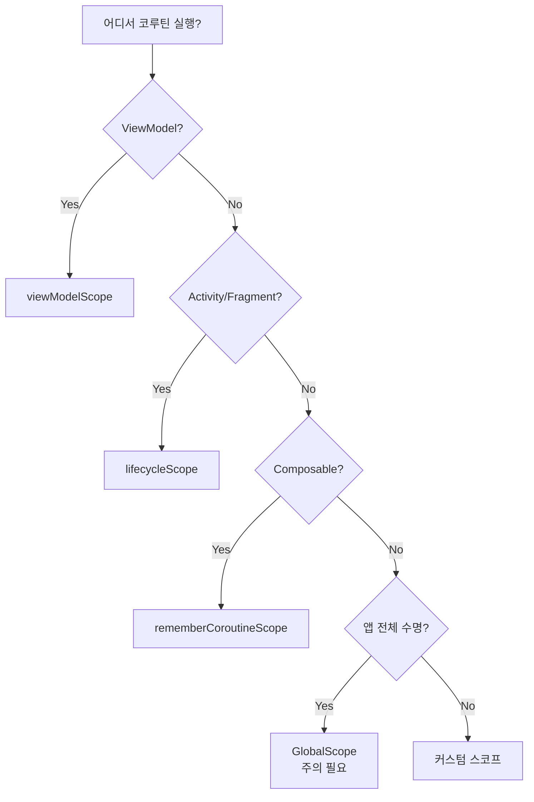

- Android에서 사용하는 주요 CoroutineScope 종류
- viewModelScope, lifecycleScope, GlobalScope의 특징과 차이점
- 각 스코프의 생명주기 연결과 취소 시점
- Dispatchers(Main, IO, Default)와의 조합
- 메모리 누수 방지와 구조적 동시성
- Compose에서의 rememberCoroutineScope

---

## 개요

CoroutineScope는 [[Kotlin Coroutines|코루틴]]의 실행 범위를 정의하고 수명을 관리하는 중요한 도구입니다. Jetpack 라이브러리에서 제공하는 생명주기 인식(Lifecycle-aware) 스코프를 사용하면 코루틴을 안전하게 관리하고 메모리 누수를 방지할 수 있습니다.

---

## CoroutineScope 종류 비교

| 스코프 | 연결된 생명주기 | 취소 시점 | 주요 용도 |
|--------|----------------|-----------|-----------|
| viewModelScope | ViewModel | `onCleared()` | 비즈니스 로직, 데이터 페칭 |
| lifecycleScope | Activity/Fragment | `onDestroy()` | UI 작업, 생명주기 관련 작업 |
| GlobalScope | Application | 앱 프로세스 종료 | 앱 전체 수명 동안 지속될 작업 |
| rememberCoroutineScope | Composition | 컴포지션 종료 | Composable 내부 비동기 작업 |

---

## viewModelScope

[[Jetpack ViewModel]]에 포함된 스코프입니다. **가장 권장되는 스코프**입니다.

### 특징

- ViewModel의 `onCleared()` 호출 시 자동 취소
- Configuration Change(화면 회전)에도 코루틴 유지
- 비즈니스 로직과 데이터 페칭에 적합

### 사용 예제

```kotlin
class UserViewModel(
    private val userRepository: UserRepository
) : ViewModel() {

    private val _uiState = MutableStateFlow<UiState>(UiState.Loading)
    val uiState: StateFlow<UiState> = _uiState.asStateFlow()

    init {
        loadUser()
    }

    private fun loadUser() {
        viewModelScope.launch {
            try {
                val user = userRepository.getUser()
                _uiState.value = UiState.Success(user)
            } catch (e: Exception) {
                _uiState.value = UiState.Error(e.message)
            }
        }
    }

    fun refresh() {
        viewModelScope.launch {
            // IO Dispatcher로 전환하여 네트워크 작업
            withContext(Dispatchers.IO) {
                userRepository.refreshUser()
            }
        }
    }
}
```

### 사용 시점

- 네트워크 요청
- 데이터베이스 쿼리
- UI에 표시할 데이터 로드
- 상태 업데이트

---

## lifecycleScope

Activity나 Fragment의 [[LifecycleOwner와 LifecycleObserver|LifecycleOwner]]에 연결된 스코프입니다.

### 특징

- `onDestroy()` 호출 시 자동 취소
- UI 작업과 생명주기 관련 작업에 적합
- `repeatOnLifecycle`과 함께 사용하여 생명주기 인식 수집

### 기본 사용

```kotlin
class MainActivity : AppCompatActivity() {

    override fun onCreate(savedInstanceState: Bundle?) {
        super.onCreate(savedInstanceState)

        lifecycleScope.launch {
            // onDestroy() 시 자동 취소
            val data = fetchData()
            updateUI(data)
        }
    }
}
```

### repeatOnLifecycle 패턴

UI가 특정 상태일 때만 Flow를 수집하고, 백그라운드로 가면 수집을 중단합니다.

```kotlin
class UserFragment : Fragment() {

    private val viewModel: UserViewModel by viewModels()

    override fun onViewCreated(view: View, savedInstanceState: Bundle?) {
        super.onViewCreated(view, savedInstanceState)

        viewLifecycleOwner.lifecycleScope.launch {
            viewLifecycleOwner.repeatOnLifecycle(Lifecycle.State.STARTED) {
                // STARTED 상태일 때만 수집
                // STOPPED 되면 수집 중지, STARTED 되면 재개
                viewModel.uiState.collect { state ->
                    updateUI(state)
                }
            }
        }
    }
}
```

### 여러 Flow 동시 수집

```kotlin
viewLifecycleOwner.lifecycleScope.launch {
    viewLifecycleOwner.repeatOnLifecycle(Lifecycle.State.STARTED) {
        launch {
            viewModel.userData.collect { updateUserSection(it) }
        }
        launch {
            viewModel.notifications.collect { updateNotifications(it) }
        }
    }
}
```

### 사용 시점

- Flow 수집 (UI 업데이트)
- 일회성 UI 작업
- 생명주기에 맞춘 작업

---

## GlobalScope

앱의 전체 수명 주기 동안 코루틴을 실행하는 싱글톤 스코프입니다.

### 특징

- 앱 프로세스 종료 시에만 취소
- 생명주기를 인지하지 못함
- **일반적인 UI 개발에서는 사용을 지양**

### 주의사항

```kotlin
// 잘못된 사용 - 메모리 누수 위험
class MainActivity : AppCompatActivity() {

    override fun onCreate(savedInstanceState: Bundle?) {
        super.onCreate(savedInstanceState)

        // Activity가 종료되어도 코루틴 계속 실행 → 메모리 누수!
        GlobalScope.launch {
            delay(10000)
            updateUI()  // Activity가 이미 종료되었을 수 있음
        }
    }
}
```

### 적절한 사용 사례

```kotlin
// Application 클래스에서 앱 전체 작업
class MyApplication : Application() {

    override fun onCreate() {
        super.onCreate()

        // 앱 전체 수명 동안 실행되어야 하는 작업
        GlobalScope.launch {
            analyticsManager.initializeAsync()
        }
    }
}
```

### 사용 시점 (제한적)

- 앱 전체 수명 동안 지속되어야 하는 백그라운드 작업
- Application 레벨의 초기화
- **대부분의 경우 다른 스코프로 대체 가능**

---

## rememberCoroutineScope (Compose)

Composable 내부에서 사용하는 스코프입니다.

### 특징

- 컴포지션을 떠날 때 자동 취소
- 이벤트 핸들러에서 코루틴 실행 시 사용

### 사용 예제

```kotlin
@Composable
fun MyScreen(viewModel: MyViewModel) {
    val scope = rememberCoroutineScope()
    val snackbarHostState = remember { SnackbarHostState() }

    Button(
        onClick = {
            // 클릭 이벤트에서 코루틴 실행
            scope.launch {
                snackbarHostState.showSnackbar("저장되었습니다")
            }
        }
    ) {
        Text("저장")
    }
}
```

### 주의사항

```kotlin
@Composable
fun BadExample() {
    // 잘못된 사용 - Composition마다 새 스코프 생성
    val scope = CoroutineScope(Dispatchers.Main)  // ❌

    // 올바른 사용
    val scope = rememberCoroutineScope()  // ✅
}
```

---

## Dispatchers

코루틴을 실행할 스레드를 지정합니다.

| Dispatcher | 용도 | 스레드 |
|------------|------|--------|
| `Main` | UI 업데이트, 가벼운 작업 | 메인 스레드 |
| `IO` | 네트워크, 파일, DB 작업 | IO 스레드 풀 |
| `Default` | CPU 집약적 작업 (계산, 파싱) | CPU 스레드 풀 |

### withContext로 전환

```kotlin
viewModelScope.launch {
    // Main에서 시작

    val data = withContext(Dispatchers.IO) {
        // IO 스레드에서 네트워크 요청
        api.fetchData()
    }

    val processed = withContext(Dispatchers.Default) {
        // CPU 스레드에서 데이터 처리
        processData(data)
    }

    // 다시 Main에서 UI 업데이트
    _uiState.value = UiState.Success(processed)
}
```

### 스코프별 기본 Dispatcher

| 스코프 | 기본 Dispatcher |
|--------|-----------------|
| viewModelScope | `Dispatchers.Main.immediate` |
| lifecycleScope | `Dispatchers.Main.immediate` |
| GlobalScope | 없음 (지정 필요) |

---

## 메모리 누수 방지

### 구조적 동시성

부모 스코프가 취소되면 모든 자식 코루틴도 함께 취소됩니다.

```kotlin
viewModelScope.launch {
    // 부모 코루틴

    launch {
        // 자식 1 - 부모 취소 시 함께 취소
    }

    launch {
        // 자식 2 - 부모 취소 시 함께 취소
    }
}
// ViewModel.onCleared() 시 모두 취소
```

### 자동 취소의 이점

```kotlin
class UserViewModel : ViewModel() {

    init {
        viewModelScope.launch {
            while (true) {
                delay(5000)
                refreshData()  // 5초마다 갱신
            }
        }
        // ViewModel 소멸 시 자동 취소 → 메모리 누수 없음
    }
}
```

### SupervisorJob

자식의 실패가 다른 자식에게 영향을 주지 않습니다.

```kotlin
viewModelScope.launch {
    supervisorScope {
        launch {
            // 이 작업이 실패해도
        }
        launch {
            // 이 작업은 계속 실행
        }
    }
}
```

---

## 선택 가이드



---

## 정리

- viewModelScope: ViewModel에 연결, `onCleared()` 시 취소, 비즈니스 로직에 권장
- lifecycleScope: Activity/Fragment에 연결, `onDestroy()` 시 취소, UI 작업에 사용
- GlobalScope: 앱 전체 수명, 생명주기 미인식, 사용 지양
- rememberCoroutineScope: Composable에서 사용, 컴포지션 종료 시 취소
- Dispatchers: Main(UI), IO(네트워크/DB), Default(CPU 작업)
- 구조적 동시성: 부모 취소 시 자식도 취소, 메모리 누수 방지
- repeatOnLifecycle: 생명주기 인식 Flow 수집

---

## QnA

