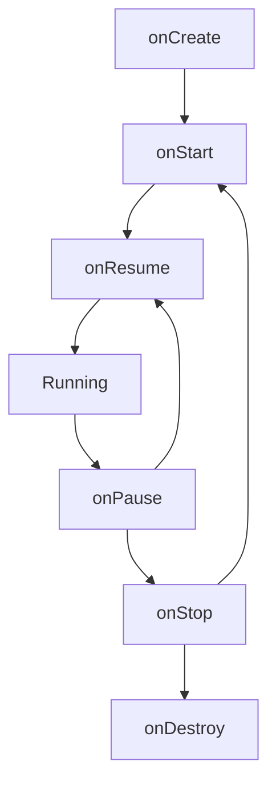

- Android 애플리케이션을 구성하는 4가지 핵심 컴포넌트
- Activity, Service, BroadcastReceiver, ContentProvider의 역할과 특징
- 각 컴포넌트의 생명주기와 사용 사례
- 컴포넌트 간 통신 방식 (Intent)
- AndroidManifest.xml 등록의 중요성

---

## 개요

Android 4대 컴포넌트는 애플리케이션이 시스템 및 다른 앱과 상호 작용할 수 있도록 하는 필수 구성 요소입니다. 각 컴포넌트는 독립된 진입점 역할을 수행하며, 시스템 수준에서 자체 전용 프로세스를 가질 수 있습니다.

| 컴포넌트 | 역할 | UI 여부 |
|----------|------|---------|
| Activity | 사용자와 상호작용하는 화면 | O |
| Service | 백그라운드 작업 수행 | X |
| BroadcastReceiver | 시스템/앱 이벤트 수신 | X |
| ContentProvider | 앱 간 데이터 공유 | X |

---

## Activity

사용자 인터페이스(UI)가 있는 단일 화면을 나타내며, 사용자와 앱이 상호 작용하는 핵심 진입점입니다.

### 특징

- Window를 통해 View를 화면에 렌더링
- 사용자의 터치나 키 입력을 처리
- 앱의 시각적 화면을 담당

### 생명주기



| 콜백 | 호출 시점 |
|------|-----------|
| `onCreate()` | 액티비티 생성 시 단 한 번, UI 설정 및 초기화 |
| `onStart()` | 화면이 사용자에게 보이기 시작할 때 |
| `onResume()` | 포커스를 얻어 상호 작용 가능한 상태 |
| `onPause()` | 다른 액티비티에 가려질 때 |
| `onStop()` | 화면에서 완전히 보이지 않을 때 |
| `onDestroy()` | 액티비티가 완전히 소멸되기 직전 |

### 사용 사례

- 로그인 화면
- 상품 목록 화면
- 상세 페이지

---

## Service

UI 없이 백그라운드에서 장기적인 작업을 수행하는 컴포넌트입니다.

### 유형

| 유형 | 설명 | 시작 방식 |
|------|------|-----------|
| Started Service | 작업 완료 후 스스로 종료되거나 수동 중지 | `startService()` |
| Bound Service | 클라이언트와 상호작용, 바인딩된 동안만 실행 | `bindService()` |
| Foreground Service | 알림 표시, 시스템 종료 가능성 낮음 | `startForegroundService()` |

### 생명주기

**Started Service:**
```
onCreate() → onStartCommand() → onDestroy()
```

**Bound Service:**
```
onCreate() → onBind() → onUnbind() → onDestroy()
```

### 주의사항

Service는 기본적으로 **메인 스레드**에서 동작합니다. 무거운 작업은 별도 스레드나 코루틴으로 처리해야 합니다.

### 사용 사례

- 음악 재생
- 대용량 파일 다운로드
- 데이터 동기화

---

## BroadcastReceiver

시스템 전체에서 발생하는 메시지(브로드캐스트)를 수신하고 응답하는 메커니즘입니다.

### 브로드캐스트 유형

| 유형 | 설명 | 예시 |
|------|------|------|
| 시스템 브로드캐스트 | OS에서 발생하는 이벤트 | 배터리 부족, 비행기 모드 |
| 커스텀 브로드캐스트 | 앱 내부/앱 간 이벤트 전달 | 다운로드 완료 알림 |

### 등록 방식

**정적 등록 (Manifest):**

```xml
<receiver android:name=".MyReceiver">
    <intent-filter>
        <action android:name="android.intent.action.BOOT_COMPLETED"/>
    </intent-filter>
</receiver>
```

**동적 등록 (Code):**

```kotlin
val receiver = MyReceiver()
val filter = IntentFilter(Intent.ACTION_BATTERY_LOW)
registerReceiver(receiver, filter)
```

### 생명주기

별도의 지속적인 수명이 없으며, `onReceive()` 호출 동안만 유효합니다.

### 사용 사례

- 네트워크 연결 상태 변화 감지
- 기기 충전 시작 알림
- 앱 설치/삭제 감지

---

## ContentProvider

애플리케이션 간에 구조화된 데이터를 안전하게 공유하기 위한 **중앙 저장소 및 표준 인터페이스**를 제공합니다. 데이터 접근 로직을 캡슐화하여 내부 구조(SQLite, 파일 등)를 노출하지 않고 데이터를 제공합니다.

### 특징

- 데이터베이스, 파일 시스템 등을 추상화
- URI를 통해 데이터에 접근 (쿼리, 삽입, 수정, 삭제)
- `ContentResolver`를 중개자로 사용
- 앱 간 데이터 공유를 위한 표준 인터페이스

### URI 구조

```
content://com.example.myapp.provider/users/42
  │              │                    │     │
  scheme     authority              path   id
```

| 구성 요소 | 설명 | 예시 |
|----------|------|------|
| scheme | 항상 `content://` | `content://` |
| authority | 공급자 식별자 | `com.example.myapp.provider` |
| path | 데이터 유형 지정 | `users` |
| id | 특정 항목 참조 (선택) | `42` |

### CRUD 메서드

ContentProvider를 구현할 때 오버라이드해야 하는 메서드입니다.

```kotlin
class MyContentProvider : ContentProvider() {

    override fun onCreate(): Boolean {
        // 초기화 (DB 헬퍼 생성 등)
        return true
    }

    override fun query(
        uri: Uri, projection: Array<String>?,
        selection: String?, selectionArgs: Array<String>?,
        sortOrder: String?
    ): Cursor? {
        // 데이터 조회
        return database.query(tableName, projection, selection, selectionArgs, null, null, sortOrder)
    }

    override fun insert(uri: Uri, values: ContentValues?): Uri? {
        // 데이터 삽입
        val id = database.insert(tableName, null, values)
        return ContentUris.withAppendedId(uri, id)
    }

    override fun update(uri: Uri, values: ContentValues?, selection: String?, selectionArgs: Array<String>?): Int {
        // 데이터 수정
        return database.update(tableName, values, selection, selectionArgs)
    }

    override fun delete(uri: Uri, selection: String?, selectionArgs: Array<String>?): Int {
        // 데이터 삭제
        return database.delete(tableName, selection, selectionArgs)
    }

    override fun getType(uri: Uri): String? {
        // MIME 타입 반환
        return "vnd.android.cursor.dir/vnd.com.example.users"
    }
}
```

### ContentResolver와의 관계

외부 앱은 ContentProvider에 직접 접근하지 않고 **ContentResolver를 중개자**로 사용합니다. ContentResolver가 URI를 기반으로 적절한 공급자를 찾아 요청을 전달합니다.

```kotlin
// ContentResolver를 통한 데이터 조회
val cursor = contentResolver.query(
    ContactsContract.Contacts.CONTENT_URI,
    null, null, null, null
)

// ContentResolver를 통한 데이터 삽입
val values = ContentValues().apply {
    put("name", "홍길동")
    put("email", "hong@example.com")
}
contentResolver.insert(MyProvider.CONTENT_URI, values)
```

### 생명주기

`onCreate()` 메서드를 통해 초기화되며, 시스템이 필요할 때까지 유지됩니다. Application의 `onCreate()` 보다 먼저 호출됩니다.

### 사용 사례

- 주소록 데이터 공유
- 미디어 파일(사진, 동영상) 접근 제공
- Firebase SDK의 자동 초기화 (ContentProvider의 onCreate를 활용)
- 앱 간 설정 데이터 공유

---

## 컴포넌트 간 통신: [[Intent]]

Intent는 Activity, Service, BroadcastReceiver 간의 통신을 담당하는 메시징 객체입니다.

| Intent 유형 | 설명 |
|-------------|------|
| 명시적 Intent | 대상 컴포넌트를 직접 지정 |
| 암시적 Intent | 수행할 작업만 지정, 시스템이 적절한 컴포넌트 선택 |

```kotlin
// 명시적 Intent
val intent = Intent(this, DetailActivity::class.java)
startActivity(intent)

// 암시적 Intent
val intent = Intent(Intent.ACTION_VIEW, Uri.parse("https://example.com"))
startActivity(intent)
```

---

## AndroidManifest.xml 등록

모든 컴포넌트는 `AndroidManifest.xml`에 반드시 등록되어야 시스템이 인식할 수 있습니다. (동적 등록 BroadcastReceiver 제외)

```xml
<application>
    <activity android:name=".MainActivity"/>
    <service android:name=".MyService"/>
    <receiver android:name=".MyReceiver"/>
    <provider android:name=".MyProvider"
              android:authorities="com.example.provider"/>
</application>
```

---

## 정리

- Activity: 사용자와 상호작용하는 UI 화면
- Service: UI 없이 백그라운드 작업 수행, 메인 스레드에서 동작
- BroadcastReceiver: 시스템/앱 이벤트 수신 및 응답
- ContentProvider: 앱 간 데이터 공유를 위한 표준 인터페이스, URI 기반 CRUD, ContentResolver가 중개
- Intent: 컴포넌트 간 통신을 담당하는 메시징 객체
- 모든 컴포넌트는 AndroidManifest.xml에 등록 필요

---

## QnA

