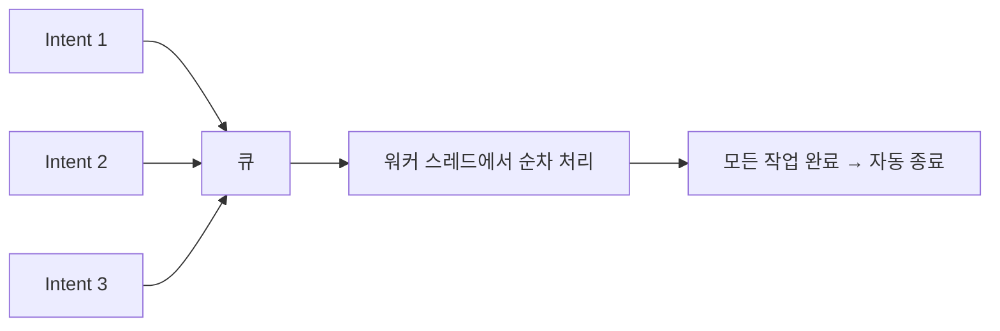

- Service의 개념과 역할
- Started Service, Bound Service, Foreground Service의 차이점
- 각 서비스 유형별 생명주기
- IntentService의 개념과 일반 Service와의 차이
- Service가 메인 스레드에서 실행되는 것의 의미와 주의사항
- WorkManager의 용도, 제약 조건, 사용법
- Service vs WorkManager 선택 기준

---

## 개요

Service는 UI 없이 백그라운드에서 오래 걸리는 작업을 수행하는 [[Android 4대 컴포넌트|핵심 컴포넌트]]입니다. 앱이 포그라운드에 있지 않아도 파일 다운로드, 음악 재생, 데이터 동기화 등의 작업을 지속할 수 있게 해줍니다.

---

## 서비스 유형

| 유형 | 시작 방식 | 종료 조건 | 특징 |
|------|-----------|-----------|------|
| Started Service | `startService()` | `stopSelf()` 또는 `stopService()` | 독립적으로 실행 |
| Bound Service | `bindService()` | 모든 클라이언트 언바인드 시 | 서버-클라이언트 구조 |
| Foreground Service | `startForegroundService()` | 명시적 종료 | 알림 필수, 높은 우선순위 |

---

## Started Service

`startService()`로 시작하며, 작업이 완료되면 스스로 `stopSelf()`를 호출하거나 외부에서 `stopService()`를 호출할 때까지 백그라운드에서 실행됩니다.

### 생명주기

```
onCreate() → onStartCommand() → onDestroy()
```

### onStartCommand() 반환 값

| 반환 값 | 설명 |
|---------|------|
| `START_NOT_STICKY` | 시스템 종료 후 재시작 안 함 |
| `START_STICKY` | 시스템 종료 후 재시작, Intent는 null |
| `START_REDELIVER_INTENT` | 시스템 종료 후 재시작, 마지막 Intent 재전달 |

### 예제

```kotlin
class MyService : Service() {

    override fun onStartCommand(intent: Intent?, flags: Int, startId: Int): Int {
        // 백그라운드 작업 수행
        return START_STICKY
    }

    override fun onBind(intent: Intent?): IBinder? = null
}
```

---

## Bound Service

`bindService()`를 통해 다른 컴포넌트와 상호 작용하며, 서버-클라이언트 구조로 동작합니다. 바인딩된 모든 클라이언트가 연결을 끊으면 자동으로 종료됩니다.

### 생명주기

```
onCreate() → onBind() → onUnbind() → onDestroy()
```

### 예제

```kotlin
class BoundService : Service() {

    private val binder = LocalBinder()

    inner class LocalBinder : Binder() {
        fun getService(): BoundService = this@BoundService
    }

    override fun onBind(intent: Intent?): IBinder = binder

    fun getData(): String = "Hello from Service"
}
```

```kotlin
// Activity에서 바인딩
private var service: BoundService? = null

private val connection = object : ServiceConnection {
    override fun onServiceConnected(name: ComponentName?, binder: IBinder?) {
        service = (binder as BoundService.LocalBinder).getService()
    }

    override fun onServiceDisconnected(name: ComponentName?) {
        service = null
    }
}

// 바인딩
bindService(intent, connection, Context.BIND_AUTO_CREATE)

// 언바인딩
unbindService(connection)
```

---

## Foreground Service

사용자에게 상태 표시줄 알림을 통해 실행 중임을 알리는 특별한 서비스입니다. 시스템 메모리가 부족하더라도 강제 종료될 가능성이 적어 높은 우선순위를 갖습니다.

### 알림이 필수인 이유

- 사용자가 백그라운드에서 시스템 리소스를 소모하는 작업이 있음을 인지
- 앱의 투명성 확보
- Android 8.0 이상에서 필수 요구사항

### 예제

```kotlin
class ForegroundService : Service() {

    override fun onStartCommand(intent: Intent?, flags: Int, startId: Int): Int {
        val notification = createNotification()
        startForeground(NOTIFICATION_ID, notification)

        // 작업 수행
        return START_STICKY
    }

    private fun createNotification(): Notification {
        return NotificationCompat.Builder(this, CHANNEL_ID)
            .setContentTitle("서비스 실행 중")
            .setContentText("백그라운드 작업 진행 중...")
            .setSmallIcon(R.drawable.ic_notification)
            .build()
    }

    override fun onBind(intent: Intent?): IBinder? = null
}
```

### Android 14 이상 변경사항

- Foreground Service 타입 명시 필수
- `android:foregroundServiceType` 속성 지정

```xml
<service
    android:name=".ForegroundService"
    android:foregroundServiceType="location|camera" />
```

---

## IntentService

IntentService는 **워커 스레드에서 작업을 순차적으로 처리**하고, 모든 작업이 완료되면 자동으로 종료되는 Service입니다.

> IntentService는 Android 11(API 30)에서 **deprecated** 되었으며, [[Kotlin Coroutines|코루틴]]이나 WorkManager 사용이 권장됩니다.

### 일반 Service와의 차이

| 구분 | Service | IntentService |
|------|---------|---------------|
| 실행 스레드 | 메인 스레드 | 별도 워커 스레드 |
| 요청 처리 | 동시 처리 가능 | 순차 처리 (큐 방식) |
| 종료 | `stopSelf()` 수동 호출 | 모든 요청 처리 후 자동 종료 |
| 핵심 메서드 | `onStartCommand()` | `onHandleIntent()` |
| 상태 | deprecated 아님 | API 30에서 deprecated |

### 동작 원리



### 대안: 코루틴을 사용한 Service

```kotlin
class MyService : Service() {
    private val scope = CoroutineScope(Dispatchers.IO + SupervisorJob())

    override fun onStartCommand(intent: Intent?, flags: Int, startId: Int): Int {
        scope.launch {
            performWork()
            stopSelf(startId)
        }
        return START_NOT_STICKY
    }

    override fun onDestroy() {
        super.onDestroy()
        scope.cancel()
    }

    override fun onBind(intent: Intent?): IBinder? = null
}
```

---

## 메인 스레드에서 실행

**Service는 기본적으로 메인 스레드(UI 스레드)에서 실행됩니다.**

### 문제점

- 네트워크 요청이나 복잡한 계산을 직접 수행하면 메인 스레드 차단
- ANR(Application Not Responding) 오류 발생 가능

### 해결책

무거운 작업은 반드시 [[Kotlin Coroutines|코루틴]]이나 별도의 워커 스레드에서 처리해야 합니다.

```kotlin
class MyService : Service() {

    private val scope = CoroutineScope(Dispatchers.IO + SupervisorJob())

    override fun onStartCommand(intent: Intent?, flags: Int, startId: Int): Int {
        scope.launch {
            // 백그라운드 작업 (IO 스레드에서 실행)
            performHeavyWork()
            stopSelf()
        }
        return START_NOT_STICKY
    }

    override fun onDestroy() {
        super.onDestroy()
        scope.cancel()
    }

    override fun onBind(intent: Intent?): IBinder? = null
}
```

---

## WorkManager

WorkManager는 **앱이 종료되거나 기기가 재부팅되어도 반드시 실행되어야 하는 영구적인 백그라운드 작업**에 적합한 Jetpack 라이브러리입니다.

### 주요 특징

| 특징 | 설명 |
|------|------|
| 영구성 | 앱 종료, 기기 재부팅 후에도 작업 보장 |
| 제약 조건 | 네트워크, 충전, 저장 공간 등 조건 설정 가능 |
| 재시도 | 실패 시 자동 재시도 (백오프 정책) |
| 체이닝 | 여러 작업을 순차/병렬로 연결 |
| 관찰 가능 | LiveData/Flow로 작업 상태 관찰 |

### Worker 정의

```kotlin
class UploadWorker(
    appContext: Context,
    workerParams: WorkerParameters
) : Worker(appContext, workerParams) {

    override fun doWork(): Result {
        val data = inputData.getString("file_path") ?: return Result.failure()

        return try {
            uploadFile(data)
            Result.success()
        } catch (e: Exception) {
            Result.retry()  // 재시도
        }
    }
}
```

### 작업 Result

| 결과 | 동작 |
|------|------|
| `Result.success()` | 작업 성공, 체인의 다음 작업 실행 |
| `Result.failure()` | 작업 실패, 체인 중단 |
| `Result.retry()` | 백오프 정책에 따라 재시도 |

### 제약 조건 (Constraints)

```kotlin
val constraints = Constraints.Builder()
    .setRequiredNetworkType(NetworkType.CONNECTED)  // 네트워크 필요
    .setRequiresCharging(true)                      // 충전 중일 때만
    .setRequiresStorageNotLow(true)                 // 저장 공간 충분
    .setRequiresBatteryNotLow(true)                 // 배터리 충분
    .build()
```

### 작업 요청 타입

```kotlin
// 일회성 작업
val oneTimeRequest = OneTimeWorkRequestBuilder<UploadWorker>()
    .setConstraints(constraints)
    .setInputData(workDataOf("file_path" to "/path/to/file"))
    .setInitialDelay(10, TimeUnit.MINUTES)  // 10분 후 실행
    .build()

WorkManager.getInstance(context).enqueue(oneTimeRequest)

// 반복 작업 (최소 15분 간격)
val periodicRequest = PeriodicWorkRequestBuilder<SyncWorker>(
    1, TimeUnit.HOURS  // 1시간마다 반복
).setConstraints(constraints)
 .build()

WorkManager.getInstance(context).enqueueUniquePeriodicWork(
    "sync_work",
    ExistingPeriodicWorkPolicy.KEEP,
    periodicRequest
)
```

### 작업 상태 관찰

```kotlin
WorkManager.getInstance(context)
    .getWorkInfoByIdLiveData(workRequest.id)
    .observe(this) { workInfo ->
        when (workInfo.state) {
            WorkInfo.State.ENQUEUED -> { /* 대기 중 */ }
            WorkInfo.State.RUNNING -> { /* 실행 중 */ }
            WorkInfo.State.SUCCEEDED -> { /* 성공 */ }
            WorkInfo.State.FAILED -> { /* 실패 */ }
            WorkInfo.State.CANCELLED -> { /* 취소됨 */ }
            else -> {}
        }
    }
```

### Service vs WorkManager 선택 기준

| 구분 | Foreground Service | WorkManager |
|------|-------------------|-------------|
| 실행 시점 | 즉시, 실시간 | 조건 충족 시 (지연 가능) |
| 재부팅 후 | 별도 처리 필요 | 자동 유지 |
| 사용자 인지 | 알림으로 인지 | 백그라운드에서 조용히 |
| 적합한 작업 | 음악 재생, 위치 추적, 실시간 통신 | 데이터 동기화, 로그 업로드, 이미지 처리 |
| 실행 보장 | 실행 중 높은 우선순위 | 완료를 보장 |

---

## Manifest 등록

```xml
<service
    android:name=".MyService"
    android:enabled="true"
    android:exported="false" />
```

---

## 정리

- Service: UI 없이 백그라운드 작업을 수행하는 컴포넌트
- Started Service: 독립적으로 실행, 명시적 종료 필요
- Bound Service: 클라이언트와 상호작용, 모든 클라이언트 언바인드 시 종료
- Foreground Service: 알림 필수, 시스템 종료 가능성 낮음
- IntentService: 워커 스레드에서 순차 처리, 자동 종료, API 30에서 deprecated
- 메인 스레드 실행: 무거운 작업은 코루틴/별도 스레드 필수
- WorkManager: 앱 종료/재부팅에도 작업 보장, 제약 조건/재시도/체이닝 지원
- 선택 기준: 실시간 → Foreground Service, 지연 가능 → WorkManager

---

## QnA

