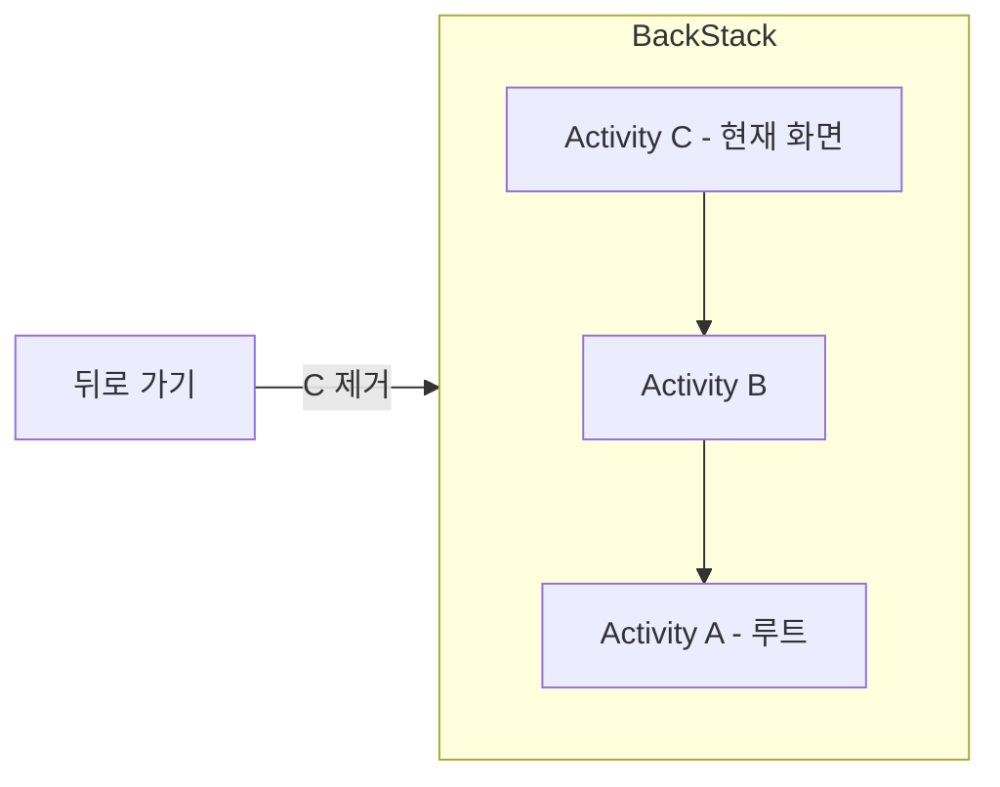

- Task와 BackStack의 개념
- BackStack의 LIFO(후입선출) 구조
- launchMode 4가지 종류와 차이점
- Intent Flag를 이용한 런타임 제어
- launchMode별 사용 사례
- 멀티 태스크 환경에서의 동작

---

## Task란

Task는 사용자가 특정 목표를 달성하기 위해 상호작용하는 **[[Activity Lifecycle|Activity]]들의 집합**입니다. 앱 아이콘을 클릭하면 새로운 Task가 생성되거나 기존 Task가 포그라운드로 이동합니다.

---

## BackStack이란

BackStack은 Task 내 Activity의 기록을 **LIFO(Last-In, First-Out) 구조**로 관리하는 스택입니다.



- 새 Activity 시작 → 스택에 **Push** (맨 위에 추가)
- 뒤로 가기 → 맨 위 Activity **Pop** (제거) → 이전 Activity 표시
- 루트 Activity까지 Pop되면 Task 종료 (홈 화면으로 이동)

### 동작 흐름

```
사용자 동작:           BackStack 상태:
────────              ─────────────
앱 실행               [A]
A에서 B 시작           [A, B]
B에서 C 시작           [A, B, C]
뒤로 가기              [A, B]       ← C 제거
뒤로 가기              [A]          ← B 제거
뒤로 가기              []           ← A 제거, 홈으로
```

---

## launchMode

[[AndroidManifest]]에서 Activity의 `android:launchMode` 속성으로 설정하며, Activity가 인스턴스화되고 스택에서 처리되는 방식을 결정합니다.

### standard (기본값)

호출될 때마다 **새 인스턴스를 생성**합니다.

```xml
<activity android:name=".StandardActivity"
    android:launchMode="standard" />
```

```
A → B → B → B
BackStack: [A, B, B, B]  ← 같은 Activity의 인스턴스가 여러 개
```

- 가장 일반적인 모드
- 동일한 Activity라도 매번 새 인스턴스 생성

### singleTop

호출된 Activity가 이미 **스택 맨 위에 있으면** 새로 생성하지 않고 기존 인스턴스의 `onNewIntent()`를 호출합니다.

```xml
<activity android:name=".SingleTopActivity"
    android:launchMode="singleTop" />
```

```
Case 1: B가 맨 위에 있을 때 B 호출
BackStack: [A, B] → [A, B]  ← B.onNewIntent() 호출

Case 2: B가 맨 위가 아닐 때 B 호출
BackStack: [A, B, C] → [A, B, C, B]  ← 새 인스턴스 생성
```

- **사용 사례**: 검색 결과 화면, 알림 클릭으로 열리는 화면

### singleTask

Task 내에 해당 Activity의 인스턴스가 **단 하나만** 존재하도록 보장합니다.

```xml
<activity android:name=".SingleTaskActivity"
    android:launchMode="singleTask" />
```

```
B가 이미 존재할 때 B 호출:
BackStack: [A, B, C, D] → [A, B]  ← C, D 제거, B.onNewIntent() 호출
```

- 이미 존재하면 그 위의 모든 Activity를 **제거(clearTop)**
- 기존 인스턴스를 앞으로 가져옴
- **사용 사례**: 메인 화면, 브라우저의 메인 탭

### singleInstance

singleTask와 유사하지만, 해당 Activity가 **독자적인 별도 Task**에서 실행됩니다.

```xml
<activity android:name=".SingleInstanceActivity"
    android:launchMode="singleInstance" />
```

```
Task 1: [A, B]
Task 2: [SingleInstanceActivity]  ← 별도 Task, 다른 Activity 포함 불가
```

- 해당 Task에는 이 Activity만 존재
- 다른 Activity를 시작하면 원래 Task에 추가됨
- **사용 사례**: 전화 수신 화면, 알람 화면

---

## launchMode 비교

| 모드 | 인스턴스 | 동작 | onNewIntent |
|------|---------|------|-------------|
| standard | 무제한 | 항상 새 인스턴스 생성 | 호출 안 됨 |
| singleTop | 조건부 | 맨 위에 있으면 재사용 | 맨 위일 때 호출 |
| singleTask | Task 내 1개 | 위의 Activity 모두 제거 | 재사용 시 호출 |
| singleInstance | 전체 1개 | 별도 Task에서 단독 실행 | 재사용 시 호출 |

---

## Intent Flag

launchMode와 유사한 동작을 런타임에 Intent Flag로 제어할 수 있습니다.

```kotlin
val intent = Intent(this, TargetActivity::class.java).apply {
    flags = Intent.FLAG_ACTIVITY_NEW_TASK or Intent.FLAG_ACTIVITY_CLEAR_TOP
}
startActivity(intent)
```

| Flag | 설명 |
|------|------|
| `FLAG_ACTIVITY_NEW_TASK` | 새 Task에서 Activity 시작 |
| `FLAG_ACTIVITY_CLEAR_TOP` | 대상 Activity 위의 모든 Activity 제거 |
| `FLAG_ACTIVITY_SINGLE_TOP` | singleTop과 동일한 동작 |
| `FLAG_ACTIVITY_CLEAR_TASK` | Task 내 모든 Activity 제거 후 시작 |
| `FLAG_ACTIVITY_NO_HISTORY` | BackStack에 기록하지 않음 |

---

## 정리

- Task: Activity들의 집합, 사용자의 작업 흐름 단위
- BackStack: LIFO 구조, 새 Activity는 Push, 뒤로 가기는 Pop
- standard: 매번 새 인스턴스 생성 (기본값)
- singleTop: 맨 위에 있으면 재사용 (onNewIntent 호출)
- singleTask: Task 내 하나만 존재, 위의 Activity 모두 제거
- singleInstance: 별도 Task에서 단독 실행
- Intent Flag: 런타임에 launchMode와 유사한 동작 제어

---

## QnA

