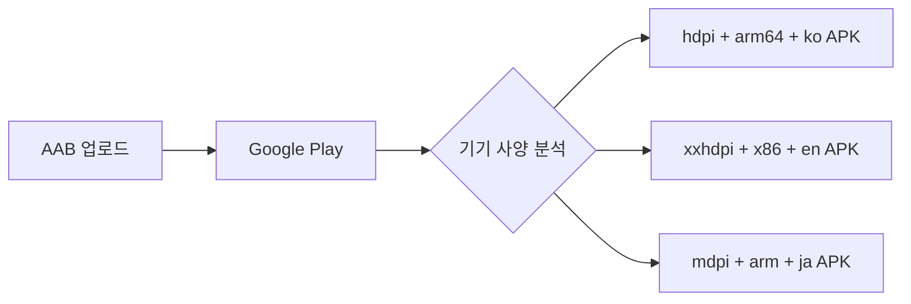

- APK(Android Package)의 구조와 특징
- AAB(Android App Bundle)의 구조와 특징
- APK와 AAB의 핵심 차이점
- Dynamic Delivery와 앱 크기 최적화
- 각각의 사용 시나리오와 장단점
- Google Play의 AAB 요구사항

---

## APK (Android Package)

APK는 Android 기기에 **직접 설치 가능한 완전한 패키지** 파일입니다.

### 구조

```
my-app.apk
├── classes.dex          ← 컴파일된 코드 (DEX)
├── resources.arsc       ← 컴파일된 리소스 테이블
├── res/                 ← 리소스 파일들 (이미지, 레이아웃)
├── lib/                 ← 네이티브 라이브러리 (.so)
│   ├── arm64-v8a/
│   ├── armeabi-v7a/
│   └── x86_64/
├── assets/              ← 앱 에셋 파일
├── AndroidManifest.xml  ← 앱 매니페스트
└── META-INF/            ← 서명 정보
```

### 특징

- 모든 기기 구성(화면 밀도, CPU 아키텍처, 언어)에 필요한 리소스를 **전부 포함**
- 기기에 직접 설치 가능 (사이드로딩)
- 파일 크기가 상대적으로 큼

---

## AAB (Android App Bundle)

AAB는 Google Play에 **업로드하기 위한 게시 형식**입니다. 기기에 직접 설치할 수 없습니다.

### 구조

```
my-app.aab
├── base/
│   ├── dex/              ← DEX 파일
│   ├── manifest/         ← AndroidManifest.xml
│   ├── res/              ← 리소스
│   ├── lib/              ← 네이티브 라이브러리
│   └── assets/           ← 에셋
├── feature-module/        ← 동적 기능 모듈 (선택)
└── BundleConfig.pb       ← 번들 설정
```

### Dynamic Delivery

Google Play가 사용자 기기에 최적화된 APK를 자동 생성하여 제공합니다.



기기의 **화면 밀도, CPU 아키텍처, 언어**에 맞는 리소스만 포함된 APK를 제공하여 다운로드 크기를 줄입니다.

---

## APK vs AAB 비교

| 항목 | APK | AAB |
|------|-----|-----|
| 직접 설치 | 가능 | 불가 (Play Store 경유 필수) |
| 파일 크기 | 큼 (모든 리소스 포함) | 작음 (기기 최적화 APK 생성) |
| 배포 방식 | Play Store, 사이드로딩 등 | Play Store 전용 |
| 최적화 | 수동 (multi-APK 등) | 자동 (Dynamic Delivery) |
| 동적 모듈 | 미지원 | 지원 (on-demand 설치) |
| Google Play 요구 | 선택 | **2021년 8월부터 필수** |

---

## 사용 시나리오

### APK를 사용하는 경우

- Google Play 외부 배포 (기업 내부 앱, 서드파티 스토어)
- QA 테스트 시 직접 설치
- 디버그 빌드 배포
- APK 직접 분석이 필요한 경우

### AAB를 사용하는 경우

- Google Play 배포 (필수)
- 앱 크기 최적화가 중요한 경우
- 동적 기능 모듈이 필요한 경우
- 다양한 기기 구성 지원

---

## 앱 크기 절감 효과

AAB를 사용하면 평균적으로 **15~20% 앱 크기 절감** 효과를 얻을 수 있습니다.

| 리소스 유형 | APK (전체 포함) | AAB (기기별) |
|-------------|----------------|-------------|
| 화면 밀도 | mdpi~xxxhdpi 전부 | 해당 밀도만 |
| CPU 아키텍처 | arm, arm64, x86 전부 | 해당 아키텍처만 |
| 언어 리소스 | 모든 언어 | 기기 설정 언어만 |

---

## 정리

- APK: 직접 설치 가능한 완전한 패키지, 모든 리소스 포함으로 크기가 큼
- AAB: Google Play 업로드 전용, Dynamic Delivery로 기기별 최적화 APK 생성
- Dynamic Delivery: 화면 밀도, CPU, 언어 기반 최적화로 다운로드 크기 절감
- Google Play: 2021년 8월부터 신규 앱은 AAB 형식 필수
- 사용 구분: Play Store 배포 → AAB, 외부 배포/테스트 → APK

---

## QnA

