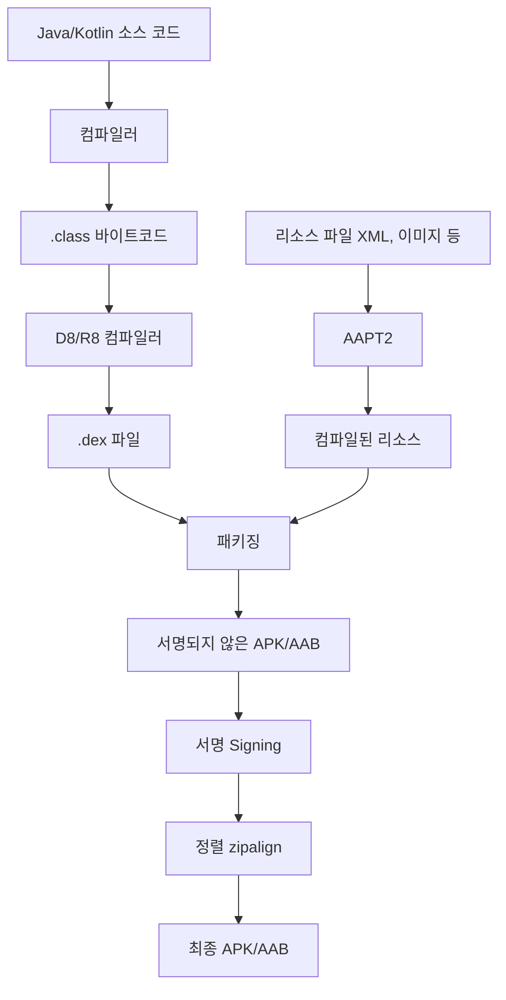

- 안드로이드 프로젝트의 전체 빌드 프로세스
- 소스 코드에서 APK/AAB까지의 변환 과정
- 각 빌드 단계별 역할과 사용 도구
- DEX 파일의 구조와 역할
- Multi-DEX의 필요성과 동작 원리
- 리소스 컴파일과 코드 컴파일의 병합
- 서명과 정렬(zipalign) 과정
- Debug 빌드와 Release 빌드의 차이

---

## 전체 빌드 프로세스 개요

Android 빌드는 소스 코드를 실행 가능한 [[APK vs AAB|APK 또는 AAB]]로 변환하는 과정입니다. [[Gradle]]이 이 전체 과정을 자동화합니다.



---

## 단계별 상세 과정

### 1단계: 소스 코드 컴파일

Java/Kotlin 소스 코드를 JVM 바이트코드(.class)로 변환합니다.

- **Kotlin 컴파일러** (`kotlinc`): `.kt` 파일 → `.class` 파일
- **Java 컴파일러** (`javac`): `.java` 파일 → `.class` 파일
- 어노테이션 프로세서(KAPT/KSP)가 이 단계에서 코드를 생성합니다

### 2단계: DEX 변환

JVM 바이트코드를 Android 런타임([[Dalvik VM|ART]])에 최적화된 DEX 바이트코드로 변환합니다.

```
.class 파일들 → [D8 컴파일러] → classes.dex
```

- **D8**: 기본 DEX 변환 도구
- **R8**: D8 + [[ProGuard|코드 축소 + 난독화]] + 최적화 (Release 빌드 시)
- 메서드 수가 65,536개를 초과하면 **Multi-DEX**로 여러 `.dex` 파일 생성

#### DEX 파일이란

DEX(Dalvik Executable)는 Android 런타임(ART/Dalvik)이 실행할 수 있는 바이트코드 형식입니다. JVM의 `.class` 파일과 달리 모바일 환경에 최적화되어 있습니다.

| 구분 | .class (JVM) | .dex (Android) |
|------|-------------|----------------|
| 실행 환경 | JVM | ART / Dalvik VM |
| 파일 구조 | 클래스당 1개 파일 | 여러 클래스를 1개 파일로 병합 |
| 최적화 | 서버/PC용 | 모바일 메모리/배터리 최적화 |
| 레지스터 | 스택 기반 | 레지스터 기반 (더 빠름) |

#### 65,536 메서드 제한 (64K 제한)

하나의 DEX 파일은 최대 **65,536개의 메서드 참조**만 포함할 수 있습니다. 이는 DEX 파일 내부에서 메서드 인덱스를 16비트 정수(2^16 = 65,536)로 관리하기 때문입니다.

앱 코드 + 라이브러리(AndroidX, Firebase, Retrofit 등)의 메서드 합계가 이 제한을 초과하면 빌드에 실패합니다.

#### Multi-DEX

메서드 수가 64K를 초과하면 여러 개의 DEX 파일로 분할합니다.

```
classes.dex      ← 메인 DEX (앱 시작에 필수적인 클래스)
classes2.dex     ← 추가 DEX
classes3.dex     ← 추가 DEX
...
```

**Android 버전별 동작:**

| Android 버전 | 런타임 | Multi-DEX 지원 |
|-------------|--------|---------------|
| 4.4 이하 (API 20-) | Dalvik | `MultiDex` 라이브러리 필요 |
| 5.0 이상 (API 21+) | ART | 네이티브 지원 (별도 설정 불필요) |

`minSdk`가 21 이상이면 ART가 자동으로 Multi-DEX를 처리합니다. 21 미만을 지원해야 하는 경우에만 별도 설정이 필요합니다.

```kotlin
// build.gradle.kts (minSdk < 21인 경우에만 필요)
android {
    defaultConfig {
        multiDexEnabled = true
    }
}

dependencies {
    implementation("androidx.multidex:multidex:2.0.1")
}
```

### 3단계: 리소스 컴파일

AAPT2(Android Asset Packaging Tool 2)가 리소스를 처리합니다.

```
res/ (XML, 이미지 등)
    ↓ [AAPT2 컴파일]
컴파일된 리소스 (.flat)
    ↓ [AAPT2 링크]
resources.arsc + 컴파일된 XML
```

- XML 레이아웃, 문자열, 스타일 등을 바이너리 형식으로 변환
- `R.java` (리소스 ID 매핑 파일) 생성
- `resources.arsc` (리소스 테이블) 생성

### 4단계: 패키징

DEX 파일, 컴파일된 리소스, 네이티브 라이브러리(.so), 에셋을 하나로 묶습니다.

| 구성 요소 | 출처 |
|-----------|------|
| classes.dex | D8/R8 |
| resources.arsc | AAPT2 |
| res/ | 리소스 파일 |
| lib/ | NDK 네이티브 라이브러리 |
| assets/ | 에셋 파일 |
| [[AndroidManifest|AndroidManifest.xml]] | Manifest 병합 |

### 5단계: 서명 (Signing)

APK/AAB에 디지털 서명을 적용합니다.

- **Debug 빌드**: Android SDK가 자동 생성한 디버그 키 사용
- **Release 빌드**: 개발자가 생성한 릴리스 키로 서명

```kotlin
// build.gradle.kts
android {
    signingConfigs {
        create("release") {
            storeFile = file("my-release-key.jks")
            storePassword = "password"
            keyAlias = "my-key"
            keyPassword = "password"
        }
    }
}
```

서명은 앱의 **출처 인증**과 **무결성 보장**을 위해 필수입니다.

### 6단계: 정렬 (zipalign)

APK 내부 파일들을 4바이트 경계에 맞춰 정렬합니다.

- 메모리 매핑 효율 향상
- 런타임 메모리 사용량 감소
- 앱 설치 및 실행 속도 개선

---

## Debug vs Release 빌드 프로세스 차이

| 단계 | Debug | Release |
|------|-------|---------|
| 컴파일 | 동일 | 동일 |
| DEX 변환 | D8 (변환만) | R8 (변환 + 축소 + 난독화) |
| 리소스 | 전체 포함 | 미사용 리소스 제거 가능 |
| 서명 | 디버그 키 (자동) | 릴리스 키 (수동 설정) |
| 디버깅 | 가능 (debuggable) | 불가 |
| 빌드 속도 | 빠름 | 느림 (최적화 과정) |

---

## 정리

- 빌드 6단계: 소스 컴파일 → DEX 변환 → 리소스 컴파일 → 패키징 → 서명 → 정렬
- 컴파일: Kotlin/Java → .class → .dex 두 단계 변환
- DEX 파일: Android 런타임 전용 바이트코드, 레지스터 기반으로 모바일 최적화
- 64K 제한: DEX당 메서드 참조 65,536개 제한 (16비트 인덱스)
- Multi-DEX: 64K 초과 시 여러 DEX로 분할, API 21+ ART에서 네이티브 지원
- AAPT2: 리소스를 바이너리로 변환하고 R.java 생성
- R8: Release 빌드에서 코드 축소, 최적화, 난독화 수행
- 서명: Debug는 자동 키, Release는 릴리스 키 필수
- zipalign: 4바이트 정렬로 메모리 효율과 실행 속도 향상

---

## QnA

