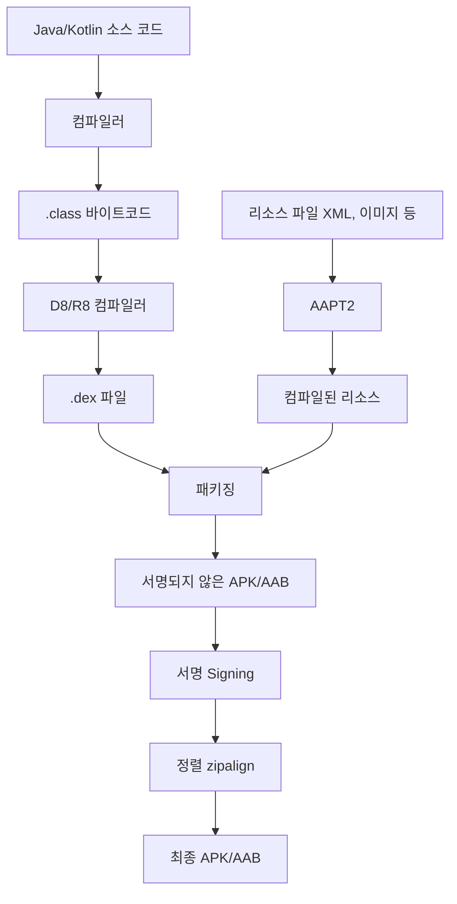

- 안드로이드 프로젝트의 전체 빌드 프로세스
- 소스 코드에서 APK/AAB까지의 변환 과정
- 각 빌드 단계별 역할과 사용 도구
- 리소스 컴파일과 코드 컴파일의 병합
- 서명과 정렬(zipalign) 과정
- Debug 빌드와 Release 빌드의 차이

---

## 전체 빌드 프로세스 개요

Android 빌드는 소스 코드를 실행 가능한 APK 또는 AAB로 변환하는 과정입니다.



---

## 단계별 상세 과정

### 1단계: 소스 코드 컴파일

Java/Kotlin 소스 코드를 JVM 바이트코드(.class)로 변환합니다.

- **Kotlin 컴파일러** (`kotlinc`): `.kt` 파일 → `.class` 파일
- **Java 컴파일러** (`javac`): `.java` 파일 → `.class` 파일
- 어노테이션 프로세서(KAPT/KSP)가 이 단계에서 코드를 생성합니다

### 2단계: DEX 변환

JVM 바이트코드를 Android 런타임(ART)에 최적화된 DEX 바이트코드로 변환합니다.

```
.class 파일들 → [D8 컴파일러] → classes.dex
```

- **D8**: 기본 DEX 변환 도구
- **R8**: D8 + 코드 축소 + 난독화 + 최적화 (Release 빌드 시)
- 메서드 수가 65,536개를 초과하면 **MultiDex**로 여러 `.dex` 파일 생성

### 3단계: 리소스 컴파일

AAPT2(Android Asset Packaging Tool 2)가 리소스를 처리합니다.

```
res/ (XML, 이미지 등)
    ↓ [AAPT2 컴파일]
컴파일된 리소스 (.flat)
    ↓ [AAPT2 링크]
resources.arsc + 컴파일된 XML
```

- XML 레이아웃, 문자열, 스타일 등을 바이너리 형식으로 변환
- `R.java` (리소스 ID 매핑 파일) 생성
- `resources.arsc` (리소스 테이블) 생성

### 4단계: 패키징

DEX 파일, 컴파일된 리소스, 네이티브 라이브러리(.so), 에셋을 하나로 묶습니다.

| 구성 요소 | 출처 |
|-----------|------|
| classes.dex | D8/R8 |
| resources.arsc | AAPT2 |
| res/ | 리소스 파일 |
| lib/ | NDK 네이티브 라이브러리 |
| assets/ | 에셋 파일 |
| AndroidManifest.xml | Manifest 병합 |

### 5단계: 서명 (Signing)

APK/AAB에 디지털 서명을 적용합니다.

- **Debug 빌드**: Android SDK가 자동 생성한 디버그 키 사용
- **Release 빌드**: 개발자가 생성한 릴리스 키로 서명

```kotlin
// build.gradle.kts
android {
    signingConfigs {
        create("release") {
            storeFile = file("my-release-key.jks")
            storePassword = "password"
            keyAlias = "my-key"
            keyPassword = "password"
        }
    }
}
```

서명은 앱의 **출처 인증**과 **무결성 보장**을 위해 필수입니다.

### 6단계: 정렬 (zipalign)

APK 내부 파일들을 4바이트 경계에 맞춰 정렬합니다.

- 메모리 매핑 효율 향상
- 런타임 메모리 사용량 감소
- 앱 설치 및 실행 속도 개선

---

## Debug vs Release 빌드 프로세스 차이

| 단계 | Debug | Release |
|------|-------|---------|
| 컴파일 | 동일 | 동일 |
| DEX 변환 | D8 (변환만) | R8 (변환 + 축소 + 난독화) |
| 리소스 | 전체 포함 | 미사용 리소스 제거 가능 |
| 서명 | 디버그 키 (자동) | 릴리스 키 (수동 설정) |
| 디버깅 | 가능 (debuggable) | 불가 |
| 빌드 속도 | 빠름 | 느림 (최적화 과정) |

---

## 정리

- 빌드 6단계: 소스 컴파일 → DEX 변환 → 리소스 컴파일 → 패키징 → 서명 → 정렬
- 컴파일: Kotlin/Java → .class → .dex 두 단계 변환
- AAPT2: 리소스를 바이너리로 변환하고 R.java 생성
- R8: Release 빌드에서 코드 축소, 최적화, 난독화 수행
- 서명: Debug는 자동 키, Release는 릴리스 키 필수
- zipalign: 4바이트 정렬로 메모리 효율과 실행 속도 향상

---

## QnA

