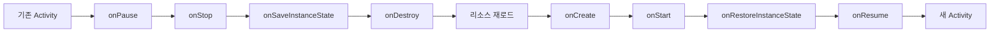
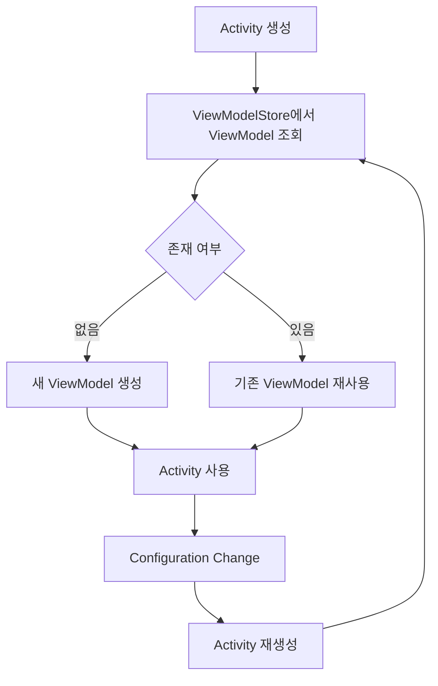

- Configuration Change의 개념과 발생 상황
- Activity 재생성 과정과 생명주기 흐름
- onSaveInstanceState/onRestoreInstanceState로 상태 저장
- ViewModel을 통한 데이터 유지
- android:configChanges 속성으로 재생성 방지
- ViewModel과 onSaveInstanceState의 차이점

---

## 개요

Configuration Change는 기기의 설정이 변경될 때 시스템이 새로운 환경에 맞는 리소스를 적용하기 위해 현재 실행 중인 컴포넌트를 재시작하는 메커니즘입니다. 올바르게 처리하는 것은 데이터 손실을 방지하고 원활한 사용자 경험을 유지하는 데 필수적입니다.

---

## Configuration Change 발생 상황

| 상황 | 설명 |
|------|------|
| 화면 회전 | 가로/세로 방향 전환 |
| 언어 변경 | 시스템 언어 업데이트 |
| 테마 전환 | 다크 모드 ↔ 라이트 모드 |
| 글꼴 조정 | 시스템 글꼴 크기/두께 변경 |
| 키보드 연결 | 물리 키보드 연결/분리 |
| 화면 크기 변경 | 멀티 윈도우, 폴더블 기기 |

---

## Activity 재생성 과정

Configuration Change가 발생하면 시스템은 다음 단계를 거칩니다.



### 과정 설명

1. **기존 Activity 종료**: `onPause()` → `onStop()` → `onSaveInstanceState()` → `onDestroy()`
2. **리소스 재로드**: 새 구성에 맞는 레이아웃, 문자열, 드로어블 로드
3. **새 Activity 생성**: `onCreate()` → `onStart()` → `onRestoreInstanceState()` → `onResume()`

---

## 상태 저장: onSaveInstanceState / onRestoreInstanceState

재생성 과정 중 UI 상태를 보존하고 복원합니다.

### onSaveInstanceState

Activity가 종료될 수 있는 상황에서 `onStop()` 이후에 호출됩니다.

```kotlin
override fun onSaveInstanceState(outState: Bundle) {
    super.onSaveInstanceState(outState)

    // UI 상태 저장
    outState.putString("user_input", editText.text.toString())
    outState.putInt("scroll_position", recyclerView.computeVerticalScrollOffset())
}
```

### onRestoreInstanceState

저장된 상태가 있을 때 `onStart()` 이후에 호출됩니다.

```kotlin
override fun onRestoreInstanceState(savedInstanceState: Bundle) {
    super.onRestoreInstanceState(savedInstanceState)

    // UI 상태 복원
    val userInput = savedInstanceState.getString("user_input")
    editText.setText(userInput)
}
```

### onCreate에서 복원

`onCreate()`의 `savedInstanceState` 파라미터로도 복원 가능합니다.

```kotlin
override fun onCreate(savedInstanceState: Bundle?) {
    super.onCreate(savedInstanceState)
    setContentView(R.layout.activity_main)

    savedInstanceState?.let {
        val userInput = it.getString("user_input")
        // 복원 처리
    }
}
```

### Bundle 제한사항

- **소량의 데이터만 저장**: 직렬화 오버헤드 존재
- **권장 크기**: 50KB 미만
- **저장 가능 타입**: 기본 타입, String, Parcelable, Serializable

---

## 데이터 유지: ViewModel

ViewModel은 Configuration Change에도 파괴되지 않고 UI 관련 데이터를 유지하도록 설계된 컴포넌트입니다.

### 동작 원리



### 사용 예제

```kotlin
class MainViewModel : ViewModel() {
    private val _userData = MutableLiveData<User>()
    val userData: LiveData<User> = _userData

    fun loadUser() {
        // 데이터 로드 (Configuration Change 후에도 유지됨)
    }
}
```

```kotlin
class MainActivity : AppCompatActivity() {

    private val viewModel: MainViewModel by viewModels()

    override fun onCreate(savedInstanceState: Bundle?) {
        super.onCreate(savedInstanceState)
        setContentView(R.layout.activity_main)

        // 화면 회전 후에도 동일한 ViewModel 인스턴스 사용
        viewModel.userData.observe(this) { user ->
            // UI 업데이트
        }
    }
}
```

### ViewModel의 이점

- 대규모 데이터 유지 가능
- 비즈니스 로직 분리
- 리소스 중복 로딩 방지
- 성능 최적화

---

## ViewModel vs onSaveInstanceState

| 구분 | ViewModel | onSaveInstanceState |
|------|-----------|---------------------|
| 용도 | 대규모 데이터, 비즈니스 로직 | 소량의 UI 상태 |
| 생존 범위 | Configuration Change | Configuration Change + 프로세스 종료 |
| 데이터 크기 | 제한 없음 | 50KB 미만 권장 |
| 저장 위치 | 메모리 (ViewModelStore) | Bundle (직렬화) |
| 예시 | API 응답 데이터, 리스트 | 스크롤 위치, 입력 텍스트 |

### 언제 무엇을 사용할까?

```kotlin
class MainViewModel : ViewModel() {
    // 대규모 데이터: ViewModel에 저장
    val userList = MutableLiveData<List<User>>()
}

class MainActivity : AppCompatActivity() {

    override fun onSaveInstanceState(outState: Bundle) {
        super.onSaveInstanceState(outState)
        // 소량의 UI 상태: Bundle에 저장
        outState.putInt("selected_tab", tabLayout.selectedTabPosition)
    }
}
```

---

## 재생성 방지: android:configChanges

특정 상황에서 Activity 재생성을 방지하고 직접 처리할 수 있습니다.

### 설정 방법

```xml
<activity
    android:name=".MainActivity"
    android:configChanges="orientation|screenSize|keyboardHidden">
</activity>
```

### onConfigurationChanged

재생성 대신 `onConfigurationChanged()` 콜백이 호출됩니다.

```kotlin
override fun onConfigurationChanged(newConfig: Configuration) {
    super.onConfigurationChanged(newConfig)

    when (newConfig.orientation) {
        Configuration.ORIENTATION_LANDSCAPE -> {
            // 가로 모드 처리
        }
        Configuration.ORIENTATION_PORTRAIT -> {
            // 세로 모드 처리
        }
    }
}
```

### 주의사항

**시스템 기본 동작(재생성)을 따르는 것이 권장됩니다.**

- 모든 리소스 업데이트를 직접 관리해야 함
- 새 구성에 맞는 리소스가 자동 적용되지 않음
- 유지보수 복잡성 증가

**사용이 적합한 경우:**
- 비디오 플레이어
- 게임
- 카메라 앱

---

## Jetpack Compose에서의 처리

Compose에서는 `rememberSaveable`을 사용하여 상태를 보존합니다.

```kotlin
@Composable
fun MyScreen() {
    // Configuration Change에도 유지됨
    var text by rememberSaveable { mutableStateOf("") }

    TextField(
        value = text,
        onValueChange = { text = it }
    )
}
```

---

## setRetainInstance (Deprecated)

과거에는 Fragment의 `setRetainInstance(true)`를 통해 인스턴스를 유지했으나, 현재는 **ViewModel 사용을 권장**합니다.

```kotlin
// Deprecated - 사용하지 마세요
override fun onCreate(savedInstanceState: Bundle?) {
    super.onCreate(savedInstanceState)
    retainInstance = true  // Deprecated
}

// 권장 - ViewModel 사용
class MyFragment : Fragment() {
    private val viewModel: MyViewModel by viewModels()
}
```

---

## 정리

- Configuration Change: 기기 설정 변경 시 Activity 재생성
- 발생 상황: 화면 회전, 언어 변경, 테마 전환, 글꼴 조정
- 재생성 과정: onDestroy → 리소스 재로드 → onCreate
- onSaveInstanceState: 소량의 UI 상태 저장 (Bundle), 프로세스 종료에도 생존
- ViewModel: 대규모 데이터 유지, Configuration Change에만 생존
- android:configChanges: 재생성 방지, 직접 처리 필요 (권장하지 않음)
- Compose: rememberSaveable로 상태 보존

---

## QnA

