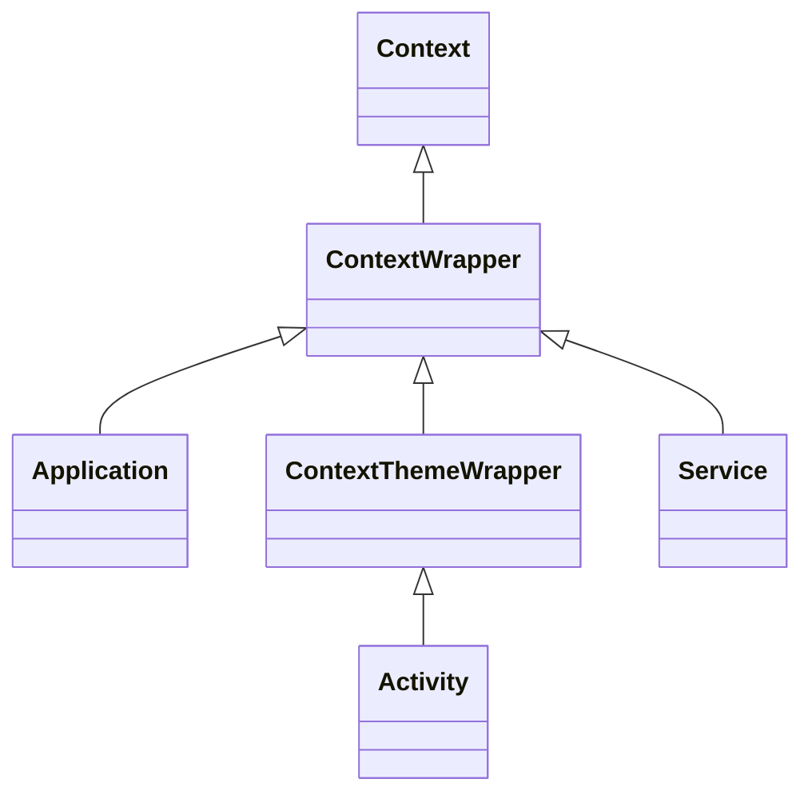

- Context의 개념과 역할
- Application Context와 Activity Context의 차이점
- 상황별 올바른 Context 선택 가이드
- Context 잘못 사용으로 인한 메모리 누수 문제와 해결 방법
- ContextWrapper와 BaseContext의 개념

---

## 개요

Context는 애플리케이션의 현재 상태나 환경을 나타내며, 앱과 시스템 서비스 간의 **브릿지(Bridge)** 역할을 수행하는 핵심 객체입니다. 컴포넌트가 시스템 자원에 접근하거나 시스템 수준의 작업을 수행할 때 필수적으로 요구됩니다.

---

## Context의 역할

| 역할 | 설명 | 예시 |
|------|------|------|
| 리소스 접근 | 앱 리소스 획득 | `getString()`, `getDrawable()` |
| 컴포넌트 실행 | Activity, Service 실행 | `startActivity()`, `startService()` |
| 시스템 서비스 접근 | 시스템 수준 서비스 획득 | `getSystemService()` |
| 데이터 저장소 접근 | DB, SharedPreferences 접근 | `getSharedPreferences()` |
| 레이아웃 인플레이션 | XML → View 변환 | `LayoutInflater` |

```kotlin
// 리소스 접근
val appName = context.getString(R.string.app_name)

// 시스템 서비스 접근
val notificationManager = context.getSystemService(Context.NOTIFICATION_SERVICE) as NotificationManager

// 컴포넌트 실행
context.startActivity(Intent(context, DetailActivity::class.java))
```

---

## Context 유형



### Application Context

애플리케이션 전체 수명과 연결된 Context입니다.

```kotlin
val appContext = applicationContext
// 또는
val appContext = context.applicationContext
```

**특징:**
- 앱 프로세스가 살아있는 동안 유지
- 테마 정보 없음
- 싱글톤, 라이브러리 초기화에 적합

### Activity Context

해당 Activity의 수명과 연결된 Context입니다.

```kotlin
// Activity 내에서
val activityContext = this
```

**특징:**
- Activity가 소멸되면 함께 소멸
- 테마 정보 포함
- UI 관련 작업에 적합

---

## 상황별 Context 선택 가이드

| 상황 | 권장 Context | 이유 |
|------|-------------|------|
| Dialog 표시 | Activity Context | 테마 정보 필요 |
| 레이아웃 인플레이션 | Activity Context | 테마 적용 필요 |
| Toast 표시 | 둘 다 가능 | - |
| Activity 시작 | Activity Context | Task 관리 |
| 싱글톤 초기화 | Application Context | 메모리 누수 방지 |
| SharedPreferences | Application Context | 전역 데이터 |
| Room Database | Application Context | 전역 데이터 |
| Service에서 작업 | Service Context | 생명주기 일치 |

### Activity Context 사용

```kotlin
// Dialog 표시
AlertDialog.Builder(this)  // Activity Context
    .setTitle("제목")
    .setMessage("메시지")
    .show()

// 레이아웃 인플레이션
val view = LayoutInflater.from(this).inflate(R.layout.item, parent, false)
```

### Application Context 사용

```kotlin
// 싱글톤 초기화
object DatabaseManager {
    private lateinit var db: AppDatabase

    fun init(context: Context) {
        // Application Context 사용
        db = Room.databaseBuilder(
            context.applicationContext,
            AppDatabase::class.java,
            "app.db"
        ).build()
    }
}
```

---

## 메모리 누수 문제

### 원인

Activity Context에 대한 참조를 해당 생명주기보다 오래 유지하면 메모리 누수가 발생합니다.

```kotlin
// 잘못된 예: 정적 변수에 Activity Context 저장
object Singleton {
    lateinit var context: Context  // Activity Context 저장 시 누수 발생!
}
```

### 문제 상황

1. **정적 변수에 Activity Context 저장**
2. **싱글톤 객체에 Activity Context 참조**
3. **내부 클래스에서 외부 Activity 참조**
4. **Handler, AsyncTask에서 Activity 참조**

### 해결 방법

```kotlin
// 올바른 예: Application Context 사용
object Singleton {
    lateinit var context: Context

    fun init(context: Context) {
        this.context = context.applicationContext  // Application Context!
    }
}
```

```kotlin
// WeakReference 사용
class MyHandler(activity: Activity) : Handler(Looper.getMainLooper()) {
    private val activityRef = WeakReference(activity)

    override fun handleMessage(msg: Message) {
        val activity = activityRef.get() ?: return
        // 안전하게 Activity 사용
    }
}
```

### 메모리 누수 체크리스트

- 오래 지속되는 객체에 Application Context 사용
- 생명주기에 맞춰 리스너/콜백 등록 해제
- 내부 클래스는 static 또는 WeakReference 사용
- LeakCanary로 누수 감지

---

## ContextWrapper와 BaseContext

### ContextWrapper

Context를 상속받으며 다른 Context를 내부적으로 감싸고(Wrapping), 모든 호출을 래핑된 Context에 위임하는 클래스입니다.

```kotlin
// ContextWrapper 구조
class ContextWrapper(base: Context) : Context() {
    private val mBase: Context = base

    override fun getResources(): Resources {
        return mBase.resources  // 위임
    }
}
```

**사용 사례:**
- 테마 동적 변경
- 언어 설정 변경
- 원본 Context 동작 수정

```kotlin
// 언어 변경을 위한 ContextWrapper 예시
class LocaleContextWrapper(base: Context) : ContextWrapper(base) {

    companion object {
        fun wrap(context: Context, locale: Locale): ContextWrapper {
            val config = context.resources.configuration
            config.setLocale(locale)
            val newContext = context.createConfigurationContext(config)
            return ContextWrapper(newContext)
        }
    }
}
```

### BaseContext

ContextWrapper가 감싸고 있는 실제 구현체인 기본(Base) Context를 의미합니다.

```kotlin
// Activity에서
val base = baseContext  // ContextImpl 인스턴스
```

### this vs baseContext

| 구분 | this | baseContext |
|------|------|-------------|
| 의미 | Activity 자체 | 래핑된 원본 Context |
| 수준 | 고수준 (생명주기, UI 포함) | 저수준 (원초적 Context) |
| 사용 시점 | 일반적인 상황 | 커스텀 ContextWrapper 구현 시 |

```kotlin
class MyActivity : Activity() {
    fun example() {
        // this: MyActivity (Activity Context)
        // baseContext: ContextImpl (원본 Context)

        Log.d("TAG", "this: $this")
        Log.d("TAG", "baseContext: $baseContext")
    }
}
```

---

## 정리

- Context: 앱과 시스템 간의 브릿지, 리소스/서비스/컴포넌트 접근에 필수
- Application Context: 앱 전체 수명, 싱글톤/전역 리소스에 사용
- Activity Context: Activity 수명, UI 관련 작업에 사용
- 메모리 누수: 정적 변수에 Activity Context 저장 금지, Application Context 사용
- ContextWrapper: Context를 감싸서 동작 수정/확장
- BaseContext: ContextWrapper가 래핑한 원본 Context

---

## QnA

