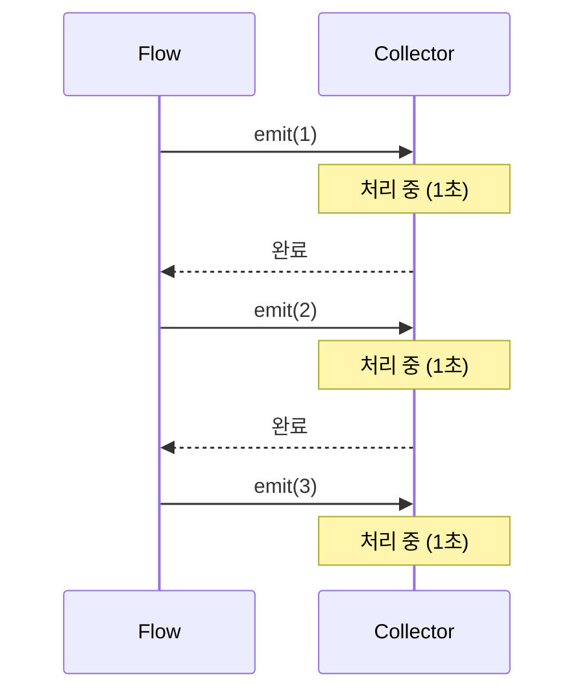
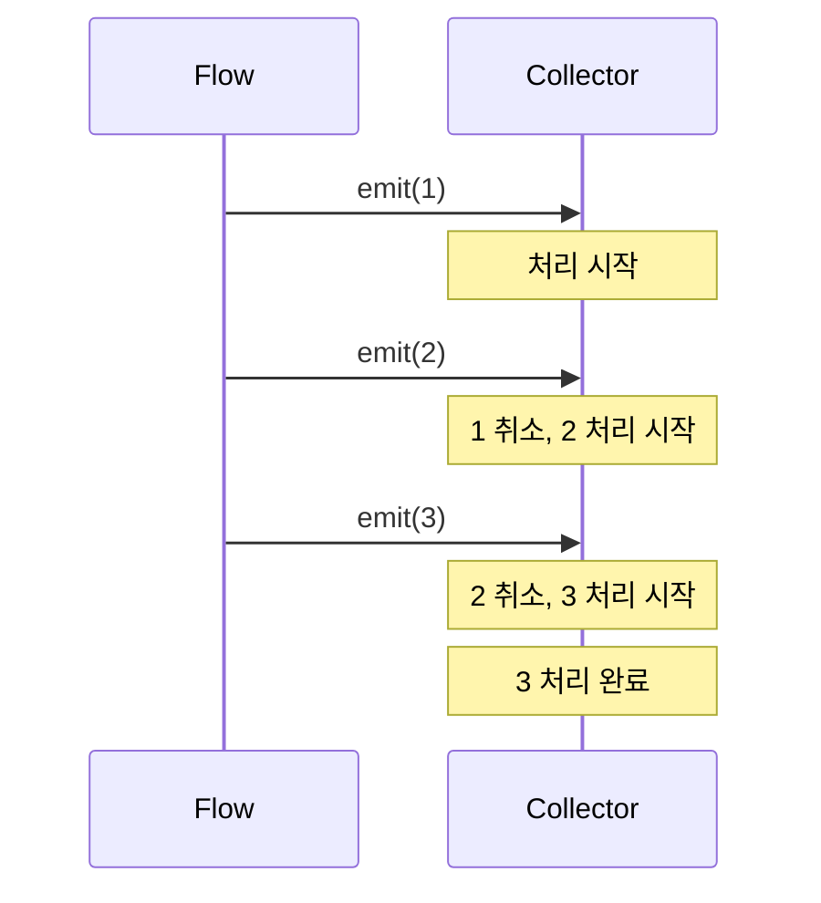

- Flow의 collect와 collectLatest의 차이점
- 각각의 동작 방식과 취소 메커니즘
- 적절한 사용 시점과 실제 사용 사례
- Android 생명주기와 함께 안전하게 수집하는 방법
- repeatOnLifecycle과 함께 사용하는 패턴

---

## 개요

[[Kotlin Coroutines|Kotlin Flow]]에서 데이터를 수집할 때 사용하는 `collect`와 `collectLatest`는 새로운 데이터가 발행되었을 때 기존 작업을 어떻게 처리하느냐에 따라 동작 방식이 달라집니다.

---

## collect vs collectLatest

| 구분 | collect | collectLatest |
|------|---------|---------------|
| 처리 방식 | 순차적 처리 | 최신 데이터 우선 |
| 이전 작업 | 완료될 때까지 대기 | 취소하고 새 작업 시작 |
| 데이터 보장 | 모든 데이터 처리 | 중간 데이터 건너뛸 수 있음 |
| 사용 시점 | 모든 값이 중요할 때 | 최신 값만 중요할 때 |

---

## collect (순차 수집)

Flow에서 내보내는 **모든 값을 순서대로** 처리합니다. 이전 데이터 처리가 끝날 때까지 다음 데이터를 대기시킵니다.

```kotlin
flow {
    emit(1)
    emit(2)
    emit(3)
}.collect { value ->
    delay(1000)  // 1초 걸리는 작업
    println(value)
}
// 출력: 1 (1초 후) → 2 (2초 후) → 3 (3초 후)
// 총 3초 소요
```

### 동작 방식



### 사용 시점

- 모든 발행된 데이터를 하나도 빠짐없이 처리해야 할 때
- 순서가 중요한 작업
- 로그 기록, 데이터베이스 저장 등

---

## collectLatest (최신값 수집)

새로운 값이 방출되는 즉시 **수집기 내부의 코루틴 블록을 취소**하고 새 작업을 시작합니다.

```kotlin
flow {
    emit(1)
    delay(100)
    emit(2)
    delay(100)
    emit(3)
}.collectLatest { value ->
    println("Processing $value")
    delay(1000)  // 1초 걸리는 작업
    println("Done $value")
}
// 출력:
// Processing 1
// Processing 2  (1 취소됨)
// Processing 3  (2 취소됨)
// Done 3        (마지막 값만 완료)
```

### 동작 방식



### 취소 메커니즘

- 새 값이 도착하면 현재 실행 중인 람다 블록이 **취소**됨
- 취소는 `suspend` 지점에서 발생 (`delay`, `emit`, `withContext` 등)
- 취소 후 새 값으로 람다 블록이 **재시작**됨

```kotlin
collectLatest { value ->
    println("Start $value")    // 항상 실행
    delay(1000)                // 취소 지점
    println("End $value")      // 취소 시 실행 안 됨
}
```

### 사용 시점

- 최신 값만 중요하고 중간 값은 건너뛰어도 될 때
- 검색 기능 (타이핑 중 이전 검색 취소)
- UI 상태 업데이트
- 네트워크 요청 (최신 요청만 유효)

---

## 실제 사용 사례

### 검색 기능

사용자가 "A" → "AB" → "ABC"를 빠르게 입력할 때, 이전 검색 결과는 중요하지 않습니다.

```kotlin
class SearchViewModel : ViewModel() {

    private val _query = MutableStateFlow("")

    val searchResults = _query
        .debounce(300)  // 300ms 대기
        .filter { it.isNotBlank() }
        .flatMapLatest { query ->
            // 이전 검색 요청 자동 취소
            repository.search(query)
        }
        .stateIn(viewModelScope, SharingStarted.Lazily, emptyList())

    fun onQueryChanged(query: String) {
        _query.value = query
    }
}
```

```kotlin
// Fragment에서 수집
viewLifecycleOwner.lifecycleScope.launch {
    viewLifecycleOwner.repeatOnLifecycle(Lifecycle.State.STARTED) {
        viewModel.searchResults.collectLatest { results ->
            // 최신 검색 결과로 UI 업데이트
            adapter.submitList(results)
        }
    }
}
```

### UI 상태 업데이트

```kotlin
// ViewModel
private val _uiState = MutableStateFlow(UiState())
val uiState: StateFlow<UiState> = _uiState.asStateFlow()
```

```kotlin
// Fragment
viewLifecycleOwner.lifecycleScope.launch {
    viewLifecycleOwner.repeatOnLifecycle(Lifecycle.State.RESUMED) {
        viewModel.uiState.collectLatest { state ->
            // 이전 UI 업데이트 작업 취소, 최신 상태로 갱신
            binding.nameText.text = state.userName
            binding.progressBar.isVisible = state.isLoading
        }
    }
}
```

---

## Android 생명주기와 안전한 수집

단순히 `collect`나 `collectLatest`를 사용하는 것만으로는 Android 생명주기를 인지하지 못합니다. Compose에서는 [[collectAsState, collectAsStateWithLifecycle]]을 사용합니다. UI가 백그라운드로 갔을 때 불필요한 수집을 막으려면 **`repeatOnLifecycle`** 블록 내부에서 수집해야 합니다.

### repeatOnLifecycle 패턴

```kotlin
viewLifecycleOwner.lifecycleScope.launch {
    viewLifecycleOwner.repeatOnLifecycle(Lifecycle.State.STARTED) {
        // STARTED 상태일 때만 수집
        // STOPPED 되면 자동으로 수집 중지
        // 다시 STARTED 되면 수집 재개
        viewModel.uiState.collectLatest { state ->
            updateUI(state)
        }
    }
}
```

### 여러 Flow 동시 수집

```kotlin
viewLifecycleOwner.lifecycleScope.launch {
    viewLifecycleOwner.repeatOnLifecycle(Lifecycle.State.STARTED) {
        // 병렬로 수집
        launch {
            viewModel.userData.collectLatest { user ->
                binding.nameText.text = user.name
            }
        }
        launch {
            viewModel.notifications.collectLatest { notifications ->
                adapter.submitList(notifications)
            }
        }
    }
}
```

### Compose에서의 수집

```kotlin
@Composable
fun UserScreen(viewModel: UserViewModel = viewModel()) {
    // 생명주기 인식 수집
    val uiState by viewModel.uiState.collectAsStateWithLifecycle()

    // uiState 사용
    Text(text = uiState.userName)
}
```

---

## flatMapLatest와의 비교

`flatMapLatest`는 Flow 변환에서 `collectLatest`와 유사한 동작을 합니다.

```kotlin
// 검색어가 변경될 때마다 이전 검색 취소
searchQuery
    .flatMapLatest { query ->
        repository.search(query)  // 새 Flow 반환
    }
    .collect { results ->
        // 최신 검색 결과만 수신
    }
```

| 구분 | collectLatest | flatMapLatest |
|------|---------------|---------------|
| 위치 | 터미널 연산자 | 중간 연산자 |
| 용도 | 수집 시 이전 작업 취소 | 변환 시 이전 Flow 취소 |
| 반환 | Unit | Flow |

---

## 정리

- collect: 모든 값을 순차적으로 처리, 이전 작업 완료 후 다음 값 처리
- collectLatest: 새 값 도착 시 이전 작업 취소, 최신 값만 완료
- 취소 지점: suspend 함수 호출 시점에서 취소 발생
- 검색 기능: collectLatest/flatMapLatest로 이전 검색 자동 취소
- 생명주기 인식: repeatOnLifecycle 또는 collectAsStateWithLifecycle 사용 필수
- 사용 기준: 모든 값 필요 → collect, 최신 값만 필요 → collectLatest

---

## QnA

