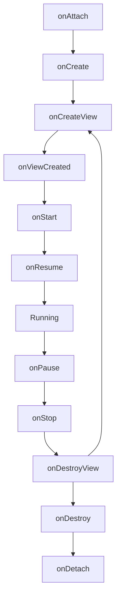

- Fragment의 생명주기와 각 콜백 메서드의 역할
- Activity와 Fragment의 생명주기 관계
- viewLifecycleOwner의 중요성과 메모리 누수 방지
- FragmentManager와 childFragmentManager의 차이
- Fragment 트랜잭션과 백스택 관리

---

## 개요

Fragment는 자체적인 생명주기를 가지면서도 호스팅하는 부모 Activity의 생명주기에 종속되어 동작하는 컴포넌트입니다. Activity와 유사하지만 Fragment만의 고유한 콜백이 존재합니다.

---

## 생명주기 다이어그램



---

## 생명주기 콜백 메서드

### 생성 단계

#### onAttach()

Fragment가 부모 Activity와 연결될 때 호출되는 **첫 번째 콜백**입니다.

```kotlin
override fun onAttach(context: Context) {
    super.onAttach(context)
    // Activity 컨텍스트와 상호작용 가능
}
```

- Activity 컨텍스트 획득
- 콜백 인터페이스 초기화

#### onCreate()

Fragment 자체를 초기화하는 단계입니다. **UI는 아직 생성되지 않았습니다.**

```kotlin
override fun onCreate(savedInstanceState: Bundle?) {
    super.onCreate(savedInstanceState)
    // 필수 컴포넌트 초기화
    // 저장된 상태 복원
}
```

#### onCreateView()

Fragment의 UI가 처음 그려질 때 호출됩니다. 레이아웃을 인플레이션하여 루트 View를 반환합니다.

```kotlin
override fun onCreateView(
    inflater: LayoutInflater,
    container: ViewGroup?,
    savedInstanceState: Bundle?
): View? {
    return inflater.inflate(R.layout.fragment_example, container, false)
}
```

#### onViewCreated()

뷰가 생성된 직후 호출됩니다. **UI 컴포넌트 설정에 가장 적합한 시점**입니다.

```kotlin
override fun onViewCreated(view: View, savedInstanceState: Bundle?) {
    super.onViewCreated(view, savedInstanceState)
    // View 바인딩
    // 클릭 리스너 설정
    // LiveData 관찰
}
```

### 활성 단계

#### onStart()

Fragment가 사용자에게 **보이기 시작**하는 단계입니다.

#### onResume()

Fragment가 활성화되어 사용자와 **완전히 상호작용** 가능한 상태입니다.

### 비활성 단계

#### onPause()

Fragment가 포커스를 잃기 직전이나 다른 컴포넌트에 의해 가려질 때 호출됩니다.

- 지속되지 않아야 할 작업 일시 중지

#### onStop()

Fragment가 더 이상 사용자에게 **보이지 않을 때** 호출됩니다.

### 소멸 단계

#### onDestroyView()

Fragment의 뷰 계층 구조가 제거될 때 호출됩니다. **메모리 누수 방지를 위해 뷰 관련 리소스를 정리해야 하는 중요한 단계입니다.**

```kotlin
override fun onDestroyView() {
    super.onDestroyView()
    _binding = null  // ViewBinding 정리
}
```

#### onDestroy()

Fragment 자체가 소멸될 때 호출되며, 모든 리소스를 최종 정리합니다.

#### onDetach()

부모 Activity와의 연결이 완전히 끊기며 생명주기가 종료됩니다.

---

## Activity와의 관계

Fragment는 호스팅 Activity에 연결되어 있어 Activity의 생명주기 변화에 영향을 받습니다.

| Activity 상태 | Fragment 영향 |
|---------------|---------------|
| onCreate | Fragment 추가 가능 |
| onStart | Fragment도 onStart |
| onResume | Fragment도 onResume |
| onPause | Fragment도 onPause |
| onStop | Fragment도 onStop |
| onDestroy | 모든 Fragment 소멸 |

---

## viewLifecycleOwner

`viewLifecycleOwner`는 Fragment 자체의 생명주기보다 짧은 **뷰의 생명주기**(onCreateView ~ onDestroyView)를 나타냅니다.

```kotlin
override fun onViewCreated(view: View, savedInstanceState: Bundle?) {
    super.onViewCreated(view, savedInstanceState)

    // viewLifecycleOwner 사용 (권장)
    viewModel.data.observe(viewLifecycleOwner) { data ->
        // UI 업데이트
    }
}
```

### 왜 viewLifecycleOwner를 사용해야 하는가?

- Fragment는 살아있지만 View가 소멸된 상태가 존재
- `this`를 사용하면 View가 없는 상태에서 UI 업데이트 시도 → **크래시**
- `viewLifecycleOwner` 사용 시 View 소멸과 함께 관찰 자동 중지 → **메모리 누수 방지**

---

## FragmentManager

FragmentManager는 Fragment의 추가, 제거, 교체 등의 작업을 관리하는 시스템입니다.

| 유형 | 용도 | 접근 방법 |
|------|------|-----------|
| fragmentManager | Activity에 직접 연결된 Fragment 관리 | `parentFragmentManager` |
| childFragmentManager | Fragment 내부의 자식 Fragment 관리 | `childFragmentManager` |

```kotlin
// Activity에서 Fragment 추가
supportFragmentManager.beginTransaction()
    .add(R.id.container, MyFragment())
    .commit()

// Fragment 내부에서 자식 Fragment 추가
childFragmentManager.beginTransaction()
    .add(R.id.child_container, ChildFragment())
    .commit()
```

---

## Fragment 트랜잭션

Fragment의 변경 사항은 트랜잭션(Transaction) 단위로 수행됩니다.

### 기본 사용법

```kotlin
supportFragmentManager.beginTransaction()
    .replace(R.id.container, NewFragment())
    .addToBackStack(null)  // 백스택에 추가
    .commit()
```

### 트랜잭션 메서드

| 메서드 | 설명 |
|--------|------|
| `add()` | Fragment 추가 |
| `replace()` | 기존 Fragment를 새 Fragment로 교체 |
| `remove()` | Fragment 제거 |
| `hide()` | Fragment 숨김 (View만 숨김) |
| `show()` | 숨겨진 Fragment 표시 |

### Commit 종류

| 메서드 | 특징 |
|--------|------|
| `commit()` | 비동기 실행, 메인 스레드 예약 |
| `commitNow()` | 즉시 동기 실행 |
| `commitAllowingStateLoss()` | 상태 손실 허용 (주의 필요) |

---

## 백스택 관리

`addToBackStack()`을 호출하면 사용자가 뒤로 가기 버튼을 눌렀을 때 이전 Fragment 상태로 돌아갈 수 있습니다.

```kotlin
supportFragmentManager.beginTransaction()
    .replace(R.id.container, DetailFragment())
    .addToBackStack("detail")  // 태그 지정 가능
    .commit()
```

### 백스택 동작

- 백스택에 추가된 Fragment: `onDestroyView()` 호출, `onDestroy()` 호출 안 됨
- 뒤로 가기 시: `onCreateView()` 부터 다시 시작
- 백스택에 없는 Fragment: `replace()` 시 완전히 소멸

---

## 정리

- Fragment 생명주기: onAttach → onCreate → onCreateView → onViewCreated → onStart → onResume → onPause → onStop → onDestroyView → onDestroy → onDetach
- Activity 종속성: Fragment는 호스팅 Activity의 생명주기에 영향을 받음
- viewLifecycleOwner: 뷰의 생명주기를 나타내며, LiveData 관찰 시 필수 사용
- onDestroyView: ViewBinding 등 뷰 관련 리소스 정리 필수
- FragmentManager: Fragment 트랜잭션 관리, childFragmentManager는 중첩 Fragment용
- 백스택: addToBackStack()으로 이전 상태 복원 가능

---

## QnA

