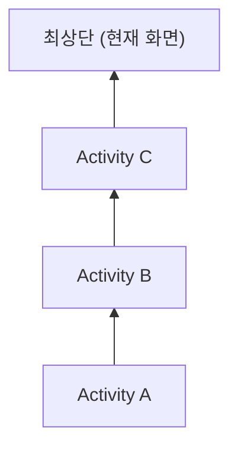

- 명시적 인텐트와 암시적 인텐트의 차이점
- Intent Filter의 구성과 동작 원리
- Activity 결과를 받는 방법 (ActivityResultLauncher)
- Launch Mode의 종류와 동작 (standard, singleTop, singleTask, singleInstance)
- Intent Flag를 통한 Launch Mode 설정
- Task와 Back Stack의 개념

---

## 개요

Intent는 [[Android 4대 컴포넌트]] 간의 통신을 담당하는 메시징 객체입니다. [[Activity Lifecycle|Activity]] 시작, [[Service]] 실행, [[BroadcastReceiver]]에 메시지 전달 등에 사용됩니다.

---

## 명시적 인텐트와 암시적 인텐트

### 명시적 인텐트 (Explicit Intent)

호출할 대상 컴포넌트의 **클래스 이름을 직접 지정**합니다. 주로 앱 내부 화면 전환에 사용됩니다.

```kotlin
// 대상 Activity 직접 지정
val intent = Intent(this, DetailActivity::class.java).apply {
    putExtra("user_id", userId)
}
startActivity(intent)
```

### 암시적 인텐트 (Implicit Intent)

수행할 **액션(Action)**을 선언하며, 시스템이 Intent Filter를 통해 적절한 앱을 찾아 처리합니다.

```kotlin
// 웹 브라우저 열기
val intent = Intent(Intent.ACTION_VIEW, Uri.parse("https://example.com"))
startActivity(intent)

// 전화 걸기
val intent = Intent(Intent.ACTION_DIAL, Uri.parse("tel:010-1234-5678"))
startActivity(intent)

// 이미지 공유
val intent = Intent(Intent.ACTION_SEND).apply {
    type = "image/*"
    putExtra(Intent.EXTRA_STREAM, imageUri)
}
startActivity(Intent.createChooser(intent, "공유하기"))
```

### 비교

| 구분 | 명시적 인텐트 | 암시적 인텐트 |
|------|-------------|-------------|
| 대상 지정 | 클래스 이름 직접 지정 | 액션/데이터로 간접 지정 |
| 사용 범위 | 앱 내부 | 앱 내부 + 외부 앱 |
| 사용 사례 | 화면 전환 | 브라우저, 전화, 공유 |

---

## Intent Filter

AndroidManifest.xml에 정의하며, 컴포넌트가 수신할 수 있는 **액션, 카테고리, 데이터 유형**을 명시합니다.

```xml
<activity android:name=".ShareActivity"
    android:exported="true">
    <intent-filter>
        <action android:name="android.intent.action.SEND"/>
        <category android:name="android.intent.category.DEFAULT"/>
        <data android:mimeType="text/plain"/>
    </intent-filter>
</activity>
```

### 구성 요소

| 요소 | 설명 | 예시 |
|------|------|------|
| `<action>` | 수행할 동작 | `ACTION_VIEW`, `ACTION_SEND` |
| `<category>` | 인텐트의 추가 분류 | `CATEGORY_DEFAULT`, `CATEGORY_LAUNCHER` |
| `<data>` | 처리할 데이터 유형 | `mimeType`, `scheme`, `host` |

### 메인 화면 설정

```xml
<activity android:name=".MainActivity">
    <intent-filter>
        <action android:name="android.intent.action.MAIN"/>
        <category android:name="android.intent.category.LAUNCHER"/>
    </intent-filter>
</activity>
```

---

## Activity 결과 받기

### ActivityResultLauncher (권장)

`registerForActivityResult()`를 사용하여 타입 안전하게 결과를 처리합니다.

```kotlin
class MainActivity : AppCompatActivity() {

    // 결과 처리 콜백 등록
    private val launcher = registerForActivityResult(
        ActivityResultContracts.StartActivityForResult()
    ) { result ->
        if (result.resultCode == RESULT_OK) {
            val data = result.data?.getStringExtra("result_key")
            // 결과 처리
        }
    }

    fun openSecondActivity() {
        val intent = Intent(this, SecondActivity::class.java)
        launcher.launch(intent)
    }
}
```

```kotlin
// 결과를 반환하는 Activity
class SecondActivity : AppCompatActivity() {

    fun returnResult() {
        val resultIntent = Intent().apply {
            putExtra("result_key", "결과 데이터")
        }
        setResult(RESULT_OK, resultIntent)
        finish()
    }
}
```

### 권한 요청

```kotlin
private val permissionLauncher = registerForActivityResult(
    ActivityResultContracts.RequestPermission()
) { isGranted ->
    if (isGranted) {
        // 권한 승인됨
    } else {
        // 권한 거부됨
    }
}

fun requestCameraPermission() {
    permissionLauncher.launch(Manifest.permission.CAMERA)
}
```

### 주요 ActivityResultContracts

| Contract | 용도 |
|----------|------|
| `StartActivityForResult` | 일반적인 Activity 결과 수신 |
| `RequestPermission` | 단일 권한 요청 |
| `RequestMultiplePermissions` | 여러 권한 동시 요청 |
| `TakePicture` | 카메라로 사진 촬영 |
| `GetContent` | 파일 선택 |

---

## Launch Mode

Activity의 인스턴스 생성 방식과 Task 내 동작을 제어합니다.

### Manifest에서 설정

```xml
<activity
    android:name=".MainActivity"
    android:launchMode="singleTop"/>
```

### 종류

#### standard (기본값)

호출될 때마다 **새 인스턴스를 생성**하여 Task 스택에 추가합니다.

```
Task: [A] → [A, B] → [A, B, B] (B를 다시 호출해도 새 인스턴스 생성)
```

#### singleTop

인스턴스가 **스택 맨 위에 있다면** 새로 만들지 않고 `onNewIntent()`를 통해 기존 인스턴스를 재사용합니다.

```
Task: [A, B] → B 호출 → [A, B] (B가 맨 위이므로 onNewIntent 호출)
Task: [A, B] → A 호출 → [A, B, A] (A가 맨 위가 아니므로 새 인스턴스 생성)
```

```kotlin
override fun onNewIntent(intent: Intent) {
    super.onNewIntent(intent)
    // 새 데이터로 업데이트
    handleIntent(intent)
}
```

**사용 사례:** 검색 결과, 알림 클릭

#### singleTask

해당 Activity의 인스턴스가 Task 내에 **하나만 존재**하도록 보장합니다. 이미 존재하면 그 위의 모든 Activity를 제거하고 앞으로 가져옵니다.

```
Task: [A, B, C] → A 호출 (singleTask)
→ B, C 제거 → [A] (A의 onNewIntent 호출)
```

**사용 사례:** 앱의 메인 화면

#### singleInstance

독자적인 Task에서 실행되며, 해당 Task에 **다른 Activity가 추가되지 않습니다.**

```
Task 1: [A, B] → C 호출 (singleInstance)
Task 1: [A, B]
Task 2: [C] (독립 Task)
```

**사용 사례:** 전화 앱, 런처

### Launch Mode 비교

| 모드 | 인스턴스 제한 | 새 Task | onNewIntent |
|------|-------------|---------|-------------|
| standard | 없음 | X | X |
| singleTop | 스택 최상단 1개 | X | O (최상단일 때) |
| singleTask | Task 내 1개 | 가능 | O |
| singleInstance | 전체 1개 | O (독립 Task) | O |

---

## Intent Flag

코드에서 Launch Mode와 유사한 동작을 설정합니다.

```kotlin
val intent = Intent(this, MainActivity::class.java).apply {
    flags = Intent.FLAG_ACTIVITY_CLEAR_TOP or Intent.FLAG_ACTIVITY_SINGLE_TOP
}
startActivity(intent)
```

### 주요 Flag

| Flag | 설명 |
|------|------|
| `FLAG_ACTIVITY_NEW_TASK` | 새 Task에서 Activity 시작 |
| `FLAG_ACTIVITY_CLEAR_TOP` | 대상 Activity 위의 모든 Activity 제거 |
| `FLAG_ACTIVITY_SINGLE_TOP` | singleTop과 동일한 동작 |
| `FLAG_ACTIVITY_CLEAR_TASK` | Task 내 모든 Activity 제거 후 시작 |
| `FLAG_ACTIVITY_NO_HISTORY` | Activity를 백스택에 남기지 않음 |

### 자주 사용하는 Flag 조합

```kotlin
// 로그인 후 메인 화면으로 이동 (이전 스택 모두 제거)
val intent = Intent(this, MainActivity::class.java).apply {
    flags = Intent.FLAG_ACTIVITY_NEW_TASK or Intent.FLAG_ACTIVITY_CLEAR_TASK
}
startActivity(intent)
finish()
```

---

## Task와 Back Stack

### Task

관련된 Activity들의 모음으로, 사용자가 특정 작업을 수행할 때 상호작용하는 Activity 스택입니다.

### Back Stack

Task 내에서 Activity가 열린 순서대로 쌓이는 LIFO(Last In, First Out) 구조입니다. 뒤로가기 버튼을 누르면 스택 최상단의 Activity가 제거됩니다.



---

## 정리

- 명시적 인텐트: 대상 컴포넌트 직접 지정, 앱 내부 화면 전환
- 암시적 인텐트: 액션 선언, 시스템이 적절한 앱 선택
- Intent Filter: 컴포넌트가 처리 가능한 액션/카테고리/데이터 명시
- ActivityResultLauncher: registerForActivityResult()로 타입 안전한 결과 수신
- Launch Mode: standard(기본), singleTop(최상단 재사용), singleTask(Task 내 1개), singleInstance(독립 Task)
- Intent Flag: 코드에서 Launch Mode 동작 설정, FLAG_ACTIVITY_CLEAR_TOP 등
- Task/Back Stack: Activity 스택 관리, LIFO 구조

---

## QnA

