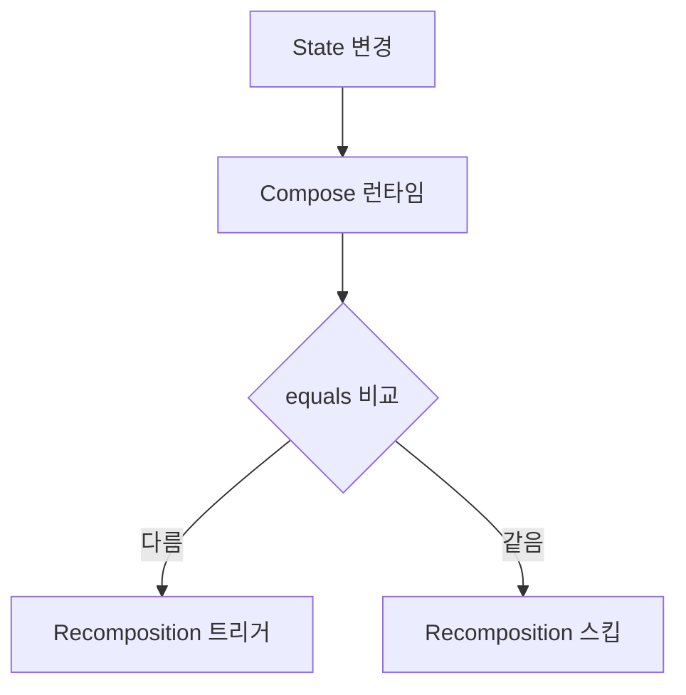

- Recomposition의 개념과 트리거 조건
- Stable과 Unstable 타입의 차이
- @Stable과 @Immutable 어노테이션
- 불필요한 Recomposition을 방지하는 최적화 방법
- remember, derivedStateOf, key 활용법
- 성능 측정과 최적화 팁

---

## Recomposition

상태 변경이 발생했을 때 이미 렌더링된 UI를 업데이트하기 위해 Composable 함수를 다시 실행하고 UI 트리를 업데이트하는 프로세스입니다. [[collectAsState, collectAsStateWithLifecycle]]을 통해 Flow를 Compose State로 변환할 때 Recomposition이 트리거됩니다.

### 트리거 조건

| 조건 | 설명 |
|------|------|
| 입력 매개변수 변경 | Composable에 전달된 매개변수 값 변경 |
| 관찰 중인 상태 변경 | `mutableStateOf` 등의 상태 객체 값 변경 |

### 동작 방식



Compose 런타임은 `equals()`를 사용하여 이전 값과 새 값을 비교하며, 결과가 `false`이면 Recomposition을 트리거합니다.

---

## Stability (안정성)

Compose 컴파일러는 매개변수의 타입을 분석하여 Recomposition을 건너뛸 수 있는지(Skippable) 결정합니다.

### Stable 타입

값이 변경되어도 예측 가능하며, `equals()`를 통해 신뢰할 수 있는 비교가 가능한 타입입니다.

**Stable로 간주되는 타입:**
- 모든 원시 타입 (String, Int, Boolean 등)
- 함수 타입 (람다)
- 모든 프로퍼티가 `val`이며 Stable한 타입인 `data class`

```kotlin
// Stable - 모든 프로퍼티가 val이고 원시 타입
data class User(
    val id: Int,
    val name: String
)
```

### Unstable 타입

내부 값이 언제든지 변할 수 있거나 컴파일 시점에 구조를 확정할 수 없는 타입입니다.

**Unstable로 간주되는 타입:**
- 인터페이스 (List, Map, Set 등)
- 가변 프로퍼티 (`var`)를 포함한 클래스
- 외부 모듈의 클래스

```kotlin
// Unstable - var 프로퍼티 포함
data class MutableUser(
    var name: String  // var이므로 Unstable
)

// Unstable - List는 인터페이스
data class UserList(
    val users: List<User>  // List는 Unstable
)
```

### Unstable의 문제점

매개변수가 Unstable하면 값이 변경되지 않았더라도 **부모가 Recomposition될 때 항상 함께 Recomposition**됩니다.

```kotlin
@Composable
fun ParentScreen() {
    var count by remember { mutableStateOf(0) }

    Column {
        Text("Count: $count")
        Button(onClick = { count++ }) {
            Text("Increment")
        }

        // users가 Unstable(List)이므로 count가 변경될 때마다 Recomposition
        UserList(users = listOf(User(1, "Alice")))
    }
}
```

---

## @Stable과 @Immutable 어노테이션

### @Immutable

클래스의 **모든 속성이 완전히 변경 불가능**함을 보장합니다.

```kotlin
@Immutable
data class User(
    val id: Int,
    val name: String,
    val email: String
)
```

- 컴파일러가 이 객체는 절대 변하지 않는다고 가정
- Recomposition을 안전하게 건너뜀
- **약속**: 생성 후 어떤 프로퍼티도 변경되지 않음

### @Stable

객체가 가변적일 수 있지만, Compose 런타임에 의해 **제어되고 예측 가능한 방식**으로 동작함을 의미합니다.

```kotlin
@Stable
class Counter {
    var count by mutableStateOf(0)
        private set

    fun increment() {
        count++
    }
}
```

- 동일한 입력에 대해 항상 동일한 결과 (멱등성)
- 프로퍼티 변경 시 Compose에 통지됨
- `MutableState`는 내부 값이 변하지만 `@Stable`로 간주

### 사용 가이드

| 어노테이션 | 사용 시점 |
|------------|-----------|
| `@Immutable` | 모든 프로퍼티가 불변이고 절대 변하지 않을 때 |
| `@Stable` | 가변이지만 Compose가 변경을 추적할 수 있을 때 |

---

## 불필요한 Recomposition 방지

### 1. Immutable 컬렉션 사용

일반 `List`는 Unstable하므로 `kotlinx.collections.immutable` 라이브러리를 사용합니다.

```kotlin
// 의존성 추가
implementation("org.jetbrains.kotlinx:kotlinx-collections-immutable:0.3.5")
```

```kotlin
// Unstable
data class UserState(
    val users: List<User>  // List는 Unstable
)

// Stable
data class UserState(
    val users: ImmutableList<User>  // ImmutableList는 Stable
)
```

### 2. 람다 안정화

외부 변수를 캡처하는 람다는 `remember`로 메모이징합니다.

```kotlin
// Unstable - 매번 새 람다 인스턴스 생성
@Composable
fun BadExample(viewModel: MyViewModel) {
    Button(onClick = { viewModel.doSomething() }) {
        Text("Click")
    }
}

// Stable - 람다 메모이징
@Composable
fun GoodExample(viewModel: MyViewModel) {
    val onClick = remember(viewModel) {
        { viewModel.doSomething() }
    }
    Button(onClick = onClick) {
        Text("Click")
    }
}
```

### 3. 래퍼 클래스 사용

수정할 수 없는 서드파티 라이브러리 클래스를 `@Immutable` 클래스로 감쌉니다.

```kotlin
// 서드파티 클래스 (수정 불가)
class ThirdPartyData(val value: String)

// 래퍼 클래스로 Stable하게 만들기
@Immutable
data class StableData(
    val data: ThirdPartyData
)
```

### 4. Strong Skipping Mode

컴파일러 설정을 통해 Unstable한 매개변수가 있더라도 인스턴스 동등성을 비교하여 Recomposition을 건너뛸 수 있게 합니다.

```kotlin
// build.gradle.kts
composeCompiler {
    enableStrongSkippingMode = true
}
```

---

## remember

계산 비용이 큰 객체나 상태를 메모리에 저장하여 Recomposition 시 재계산을 방지합니다.

```kotlin
@Composable
fun ExpensiveCalculation() {
    // Recomposition마다 재계산 방지
    val result = remember {
        performExpensiveCalculation()
    }

    Text("Result: $result")
}
```

### 키와 함께 사용

```kotlin
@Composable
fun UserDetails(userId: String) {
    // userId가 변경될 때만 재계산
    val user = remember(userId) {
        loadUser(userId)
    }
}
```

---

## derivedStateOf

여러 상태를 조합하여 새로운 상태를 만들 때 사용합니다. 종속된 상태들이 자주 변하더라도, **최종 계산된 결과값이 변할 때만** Recomposition을 트리거합니다.

```kotlin
@Composable
fun FilteredList(items: List<Item>) {
    var searchQuery by remember { mutableStateOf("") }

    // searchQuery가 변경될 때마다가 아니라
    // 필터링 결과가 변경될 때만 Recomposition
    val filteredItems by remember {
        derivedStateOf {
            items.filter { it.name.contains(searchQuery, ignoreCase = true) }
        }
    }

    Column {
        TextField(
            value = searchQuery,
            onValueChange = { searchQuery = it }
        )

        LazyColumn {
            items(filteredItems) { item ->
                ItemRow(item)
            }
        }
    }
}
```

### 사용 시점

- 상태 A가 자주 변경되지만 파생된 상태 B는 가끔 변경될 때
- 스크롤 위치에 따른 "맨 위로" 버튼 표시 여부
- 리스트 필터링 결과

```kotlin
val listState = rememberLazyListState()

// 스크롤할 때마다가 아니라 버튼 표시 여부가 변경될 때만 Recomposition
val showButton by remember {
    derivedStateOf {
        listState.firstVisibleItemIndex > 0
    }
}
```

---

## key 사용

LazyColumn 등에서 아이템에 고유한 `key`를 할당하면, 리스트의 순서가 바뀌거나 아이템이 추가되어도 **위치 기반이 아닌 ID 기반**으로 상태를 유지합니다.

```kotlin
LazyColumn {
    items(
        items = users,
        key = { user -> user.id }  // 고유 키 지정
    ) { user ->
        UserItem(user)
    }
}
```

### key의 효과

| 상황 | key 없음 | key 있음 |
|------|----------|----------|
| 아이템 순서 변경 | 모든 아이템 Recomposition | 순서만 변경, Recomposition 없음 |
| 중간에 아이템 추가 | 추가된 위치 이후 모두 Recomposition | 새 아이템만 Composition |
| 아이템 삭제 | 삭제된 위치 이후 모두 Recomposition | 해당 아이템만 제거 |

---

## 성능 최적화 팁

### 1. 릴리스 모드에서 테스트

디버그 모드는 개발 도구 오버헤드로 인해 느리게 동작합니다. 성능 측정은 항상 **R8 최적화와 Baseline Profiles가 적용된 릴리스 빌드**에서 수행합니다.

### 2. Layout Inspector 활용

실시간으로 Recomposition 횟수를 추적하여 성능 병목 현상이 발생하는 Composable을 시각적으로 식별합니다.

### 3. Composable 분리

```kotlin
// 나쁜 예 - 전체가 Recomposition
@Composable
fun BadScreen() {
    var text by remember { mutableStateOf("") }

    Column {
        TextField(value = text, onValueChange = { text = it })
        ExpensiveList()  // text 변경마다 Recomposition
    }
}

// 좋은 예 - 필요한 부분만 Recomposition
@Composable
fun GoodScreen() {
    Column {
        TextFieldSection()  // 분리
        ExpensiveList()     // text 변경에 영향 없음
    }
}

@Composable
fun TextFieldSection() {
    var text by remember { mutableStateOf("") }
    TextField(value = text, onValueChange = { text = it })
}
```

### 4. 상태 읽기 지연

```kotlin
// 나쁜 예 - 즉시 상태 읽기
@Composable
fun BadExample(scrollState: ScrollState) {
    val offset = scrollState.value  // 매 프레임마다 Recomposition
    Box(modifier = Modifier.offset(y = offset.dp))
}

// 좋은 예 - 람다로 상태 읽기 지연
@Composable
fun GoodExample(scrollState: ScrollState) {
    Box(
        modifier = Modifier.offset {
            IntOffset(0, scrollState.value)  // Layout 단계에서 읽음
        }
    )
}
```

---

## 정리

- Recomposition: 상태 변경 시 UI 트리 업데이트, equals()로 비교
- Stable 타입: 원시 타입, 함수 타입, 불변 data class → Recomposition 스킵 가능
- Unstable 타입: List, var 포함 클래스 → 항상 Recomposition
- @Immutable: 모든 속성 불변 보장
- @Stable: 가변이지만 Compose가 변경 추적 가능
- remember: 객체/상태 메모이징
- derivedStateOf: 파생 상태, 결과가 변경될 때만 Recomposition
- key: LazyColumn에서 ID 기반 상태 유지
- 최적화: Immutable 컬렉션, 람다 메모이징, Strong Skipping Mode

---

## QnA

