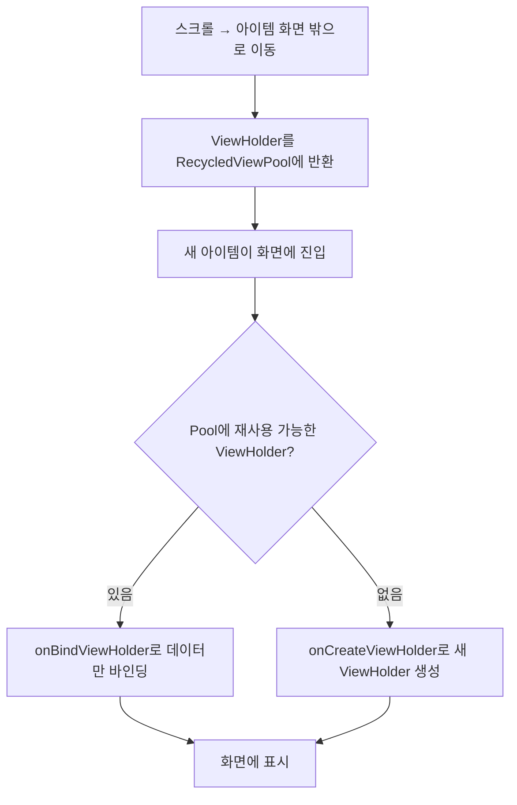

- RecyclerView의 개념과 ListView 대비 장점
- ViewHolder 패턴의 내부 동작 원리
- RecycledViewPool을 통한 뷰 재활용 메커니즘
- LayoutManager의 종류와 역할
- DiffUtil을 활용한 효율적인 리스트 업데이트
- ListAdapter 사용법

---

## 개요

RecyclerView는 대규모 데이터 셋을 효율적으로 표시하기 위한 위젯입니다. [[Android View 생명주기|View의 렌더링 파이프라인]]을 기반으로 동작하며, [[ViewBinding]]과 함께 사용하여 타입 안전한 뷰 접근이 가능합니다. 화면에 보이는 아이템만 뷰를 생성하고, 화면 밖으로 나간 뷰를 재활용하여 메모리와 성능을 최적화합니다.

---

## 핵심 컴포넌트

| 컴포넌트 | 역할 |
|---------|------|
| Adapter | 데이터와 ViewHolder를 연결 |
| ViewHolder | 아이템 뷰 참조를 보유 |
| LayoutManager | 아이템 배치 방식 결정 |
| ItemDecoration | 아이템 간 구분선, 여백 등 장식 |
| ItemAnimator | 아이템 추가/제거/변경 시 애니메이션 |

---

## ViewHolder 패턴

### 동작 원리

ViewHolder는 아이템 레이아웃 내의 뷰 참조를 저장하여, 매번 `findViewById()`를 호출하는 비용을 줄입니다.

```kotlin
class UserViewHolder(
    private val binding: ItemUserBinding
) : RecyclerView.ViewHolder(binding.root) {

    fun bind(user: User) {
        binding.nameText.text = user.name
        binding.emailText.text = user.email
    }
}
```

### 왜 ViewHolder가 필요한가?

| 방식 | 뷰 탐색 | 성능 |
|------|---------|------|
| findViewById 매번 호출 | 레이아웃 트리 매번 순회 | 느림 |
| ViewHolder 패턴 | 최초 1회만 순회, 이후 캐싱 | 빠름 |

---

## 뷰 재활용 메커니즘

### RecycledViewPool

화면 밖으로 나간 ViewHolder를 소멸시키지 않고 풀(Pool)에 저장했다가, 새로운 아이템이 화면에 들어올 때 재사용합니다.



### Adapter 구현

```kotlin
class UserAdapter : RecyclerView.Adapter<UserViewHolder>() {

    private val users = mutableListOf<User>()

    // ViewHolder가 풀에 없을 때만 호출 (뷰 인플레이션)
    override fun onCreateViewHolder(parent: ViewGroup, viewType: Int): UserViewHolder {
        val binding = ItemUserBinding.inflate(
            LayoutInflater.from(parent.context), parent, false
        )
        return UserViewHolder(binding)
    }

    // 재활용된 ViewHolder에 새 데이터를 바인딩
    override fun onBindViewHolder(holder: UserViewHolder, position: Int) {
        holder.bind(users[position])
    }

    override fun getItemCount(): Int = users.size
}
```

---

## LayoutManager

아이템의 배치 방식을 결정합니다.

| LayoutManager | 배치 방식 | 사용 사례 |
|--------------|----------|----------|
| `LinearLayoutManager` | 세로/가로 리스트 | 채팅, 피드 |
| `GridLayoutManager` | 그리드 형태 | 갤러리, 상품 목록 |
| `StaggeredGridLayoutManager` | 불규칙 그리드 | Pinterest 스타일 |

```kotlin
recyclerView.layoutManager = LinearLayoutManager(this)
recyclerView.layoutManager = GridLayoutManager(this, 2)  // 2열 그리드
```

---

## DiffUtil

두 목록 간의 차이점을 계산하여 **변경된 아이템만 업데이트**합니다. `notifyDataSetChanged()`처럼 전체 목록을 다시 그리는 비효율을 방지합니다.

### DiffUtil.ItemCallback

```kotlin
class UserDiffCallback : DiffUtil.ItemCallback<User>() {

    // 같은 아이템인지 판단 (ID 비교)
    override fun areItemsTheSame(oldItem: User, newItem: User): Boolean {
        return oldItem.id == newItem.id
    }

    // 같은 아이템의 내용이 동일한지 판단
    override fun areContentsTheSame(oldItem: User, newItem: User): Boolean {
        return oldItem == newItem
    }
}
```

### DiffUtil의 효과

| 상황 | notifyDataSetChanged() | DiffUtil |
|------|------------------------|---------|
| 아이템 1개 추가 | 전체 리스트 리바인드 | 추가된 아이템만 처리 |
| 아이템 순서 변경 | 전체 리스트 리바인드 | 이동 애니메이션 적용 |
| 아이템 1개 수정 | 전체 리스트 리바인드 | 수정된 아이템만 리바인드 |

---

## ListAdapter

DiffUtil을 내장한 RecyclerView.Adapter입니다. `submitList()`로 새 리스트를 제출하면 자동으로 차이를 계산하고 UI를 업데이트합니다.

```kotlin
class UserListAdapter : ListAdapter<User, UserViewHolder>(UserDiffCallback()) {

    override fun onCreateViewHolder(parent: ViewGroup, viewType: Int): UserViewHolder {
        val binding = ItemUserBinding.inflate(
            LayoutInflater.from(parent.context), parent, false
        )
        return UserViewHolder(binding)
    }

    override fun onBindViewHolder(holder: UserViewHolder, position: Int) {
        holder.bind(getItem(position))
    }
}
```

```kotlin
// 사용
val adapter = UserListAdapter()
recyclerView.adapter = adapter

// 데이터 업데이트 - DiffUtil이 자동으로 차이 계산
adapter.submitList(newUserList)
```

---

## 클릭 이벤트 처리

```kotlin
class UserListAdapter(
    private val onItemClick: (User) -> Unit
) : ListAdapter<User, UserViewHolder>(UserDiffCallback()) {

    override fun onCreateViewHolder(parent: ViewGroup, viewType: Int): UserViewHolder {
        val binding = ItemUserBinding.inflate(
            LayoutInflater.from(parent.context), parent, false
        )
        return UserViewHolder(binding, onItemClick)
    }

    override fun onBindViewHolder(holder: UserViewHolder, position: Int) {
        holder.bind(getItem(position))
    }
}

class UserViewHolder(
    private val binding: ItemUserBinding,
    private val onItemClick: (User) -> Unit
) : RecyclerView.ViewHolder(binding.root) {

    fun bind(user: User) {
        binding.nameText.text = user.name
        binding.root.setOnClickListener { onItemClick(user) }
    }
}
```

---

## 성능 최적화 팁

### 1. setHasFixedSize(true)

아이템 추가/제거로 RecyclerView 크기가 변하지 않을 때 설정합니다. 불필요한 레이아웃 재계산을 방지합니다.

```kotlin
recyclerView.setHasFixedSize(true)
```

### 2. ViewHolder에서 ViewBinding 사용

`findViewById()` 호출을 제거하여 뷰 탐색 비용을 최소화합니다.

### 3. 이미지 로딩 최적화

스크롤 중에는 이미지 로딩을 일시 중단하거나, Glide/Coil의 캐싱을 활용합니다.

### 4. RecycledViewPool 공유

여러 RecyclerView가 같은 ViewType을 사용하면 풀을 공유할 수 있습니다.

```kotlin
val sharedPool = RecyclerView.RecycledViewPool()
recyclerView1.setRecycledViewPool(sharedPool)
recyclerView2.setRecycledViewPool(sharedPool)
```

---

## 정리

- RecyclerView: 뷰 재활용을 통한 효율적 리스트 표시
- ViewHolder 패턴: 뷰 참조 캐싱으로 findViewById 비용 제거
- RecycledViewPool: 화면 밖 ViewHolder 저장 후 재사용, onCreateViewHolder 호출 최소화
- LayoutManager: Linear(리스트), Grid(그리드), StaggeredGrid(불규칙 그리드)
- DiffUtil: 두 목록 비교로 변경된 아이템만 업데이트, 부드러운 애니메이션
- ListAdapter: DiffUtil 내장, submitList()로 자동 차이 계산

---

## QnA

