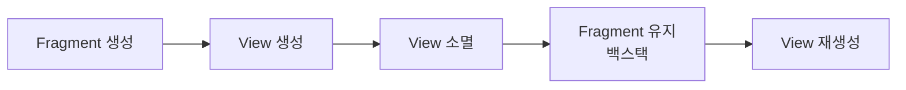

- ViewBinding의 개념과 장점
- findViewById와의 비교
- 설정 방법과 사용법
- Activity와 Fragment에서의 적용
- Fragment에서 binding 해제의 중요성
- DataBinding과의 차이점
- 컴파일타임 코드 생성 원리
- DataBinding의 Two-way Binding
- kapt와 ksp의 차이점

---

## 개요

ViewBinding은 레이아웃 XML 파일에 선언된 뷰와 상호작용하는 코드를 더 쉽게 작성할 수 있게 해주는 기능입니다. 각 XML 레이아웃 파일에 대해 바인딩 클래스를 자동으로 생성하여, 뷰에 직접 접근할 수 있는 **타입 세이프(type-safe)** 한 환경을 제공합니다.

---

## ViewBinding의 장점

| 장점 | 설명 |
|------|------|
| 타입 안전성 | 뷰의 타입을 정확히 알아 ClassCastException 방지 |
| Null 안전성 | 구성별로 없는 뷰는 nullable로 처리하여 NPE 예방 |
| 코드 간결화 | findViewById 보일러플레이트 제거 |
| 빠른 빌드 | DataBinding보다 빌드 속도 빠름 |

---

## findViewById와의 비교

| 구분 | findViewById | ViewBinding |
|------|--------------|-------------|
| 타입 안전성 | 수동 캐스팅 필요, 오류 위험 | 자동 타입 지정, 안전 |
| Null 안전성 | NPE 위험 | 구성별 nullable 처리 |
| 속도 | 런타임에 뷰 탐색 | 바인딩 클래스로 즉시 접근 |
| 코드량 | 모든 뷰 개별 선언 | 하나의 바인딩 객체로 접근 |

```kotlin
// findViewById 방식
val textView = findViewById<TextView>(R.id.textView)  // 캐스팅 필요, NPE 위험
textView.text = "Hello"

// ViewBinding 방식
binding.textView.text = "Hello"  // 타입 안전, Null 안전
```

---

## 설정 방법

`build.gradle (app)` 파일에 설정을 추가합니다.

```groovy
// build.gradle (app 수준)
android {
    buildFeatures {
        viewBinding = true
    }
}
```

### 바인딩 클래스 생성 규칙

| XML 파일 | 바인딩 클래스 |
|----------|---------------|
| `activity_main.xml` | `ActivityMainBinding` |
| `fragment_home.xml` | `FragmentHomeBinding` |
| `item_user.xml` | `ItemUserBinding` |

### 특정 레이아웃 제외

```xml
<LinearLayout
    xmlns:tools="http://schemas.android.com/tools"
    tools:viewBindingIgnore="true">
    ...
</LinearLayout>
```

---

## Activity에서 사용

`onCreate()`에서 바인딩 클래스의 `inflate()`를 호출하고, `setContentView(binding.root)`를 통해 레이아웃을 설정합니다.

```kotlin
class MainActivity : AppCompatActivity() {

    private lateinit var binding: ActivityMainBinding

    override fun onCreate(savedInstanceState: Bundle?) {
        super.onCreate(savedInstanceState)
        binding = ActivityMainBinding.inflate(layoutInflater)
        setContentView(binding.root)

        // ID로 직접 접근
        binding.textView.text = "Hello, ViewBinding!"
        binding.button.setOnClickListener {
            // 클릭 처리
        }
    }
}
```

---

## Fragment에서 사용

[[Fragment 생명주기|Fragment]]는 View의 생명주기가 Fragment 자체보다 짧기 때문에, **`onDestroyView()`에서 반드시 바인딩 참조를 해제**해야 메모리 누수를 방지할 수 있습니다.

```kotlin
class HomeFragment : Fragment() {

    private var _binding: FragmentHomeBinding? = null
    private val binding get() = _binding!!  // Non-null 접근용

    override fun onCreateView(
        inflater: LayoutInflater,
        container: ViewGroup?,
        savedInstanceState: Bundle?
    ): View {
        _binding = FragmentHomeBinding.inflate(inflater, container, false)
        return binding.root
    }

    override fun onViewCreated(view: View, savedInstanceState: Bundle?) {
        super.onViewCreated(view, savedInstanceState)

        binding.textView.text = "Hello, Fragment!"

        // LiveData 관찰 시 viewLifecycleOwner 사용
        viewModel.data.observe(viewLifecycleOwner) { data ->
            binding.textView.text = data
        }
    }

    override fun onDestroyView() {
        super.onDestroyView()
        _binding = null  // 메모리 누수 방지
    }
}
```

### binding 해제가 필요한 이유



- Fragment가 백스택에 있을 때 View는 소멸되지만 Fragment는 유지됨
- binding 참조를 해제하지 않으면 소멸된 View를 계속 참조 → 메모리 누수
- `viewLifecycleOwner` 사용으로 View 소멸 시 관찰 자동 중지

---

## [[RecyclerView]] ViewHolder에서 사용

```kotlin
class UserAdapter : RecyclerView.Adapter<UserAdapter.UserViewHolder>() {

    class UserViewHolder(private val binding: ItemUserBinding) :
        RecyclerView.ViewHolder(binding.root) {

        fun bind(user: User) {
            binding.nameText.text = user.name
            binding.emailText.text = user.email
        }
    }

    override fun onCreateViewHolder(parent: ViewGroup, viewType: Int): UserViewHolder {
        val binding = ItemUserBinding.inflate(
            LayoutInflater.from(parent.context),
            parent,
            false
        )
        return UserViewHolder(binding)
    }

    override fun onBindViewHolder(holder: UserViewHolder, position: Int) {
        holder.bind(userList[position])
    }
}
```

---

## DataBinding과의 차이점

| 특징 | ViewBinding | DataBinding |
|------|-------------|-------------|
| 주 목적 | 뷰 접근 단순화 및 안전성 | UI와 데이터 소스 간 실시간 바인딩 |
| XML 표현식 | 지원 안 함 | `@{viewModel.name}` 지원 |
| 양방향 바인딩 | 지원 안 함 | `@={viewModel.text}` 지원 |
| 빌드 속도 | 빠름 | 상대적으로 느림 |
| 런타임 오버헤드 | 매우 낮음 | 오버헤드 발생 |
| 사용 사례 | 일반적인 뷰 참조 | 복잡한 MVVM UI |

### 언제 무엇을 사용할까?

**ViewBinding 사용:**
- 단순히 findViewById를 대체하고 싶을 때
- 가벼운 뷰 접근이 필요할 때

**DataBinding 사용:**
- XML에서 직접 데이터를 바인딩하고 싶을 때
- 양방향 바인딩이 필요할 때
- 복잡한 MVVM 아키텍처 기반 UI

---

## 컴파일타임 코드 생성 원리

### ViewBinding의 코드 생성

ViewBinding을 활성화하면 빌드 시점에 **모든 XML 레이아웃 파일**에 대해 바인딩 클래스가 자동 생성됩니다.

- 클래스 이름: XML 파일명을 카멜 케이스로 변환 + `Binding` 접미사
- ID가 있는 모든 뷰에 대한 직접 참조 포함
- 별도의 어노테이션 프로세싱 없이 Gradle 플러그인이 처리
- 바인딩 표현식이나 XML 파싱이 없으므로 **런타임 오버헤드 최소화**

### DataBinding의 코드 생성

DataBinding은 `<layout>` 태그를 사용하는 XML에 대해 바인딩 클래스를 생성합니다.

- 뷰 참조 + XML 내 표현식 바인딩 + 데이터 관찰 기능을 포함한 추가 클래스 생성
- **어노테이션 프로세싱(kapt/ksp)**을 통해 컴파일 타임에 코드 생성
- 뷰와 데이터 소스를 실시간 동기화하는 기반 코드 포함

```xml
<!-- DataBinding 필수: <layout> 태그로 감싸기 -->
<layout xmlns:android="http://schemas.android.com/apk/res/android">
    <data>
        <variable name="user" type="com.example.User"/>
    </data>

    <TextView
        android:text="@{user.name}"
        android:layout_width="wrap_content"
        android:layout_height="wrap_content"/>
</layout>
```

---

## DataBinding Two-way Binding

UI 컴포넌트의 값과 데이터 모델 간의 데이터를 **자동으로 양방향 동기화**하는 메커니즘입니다.

### 단방향 vs 양방향

| 구분 | 표현식 | 동작 |
|------|--------|------|
| 단방향 | `@{viewModel.text}` | 데이터 → UI |
| 양방향 | `@={viewModel.text}` | 데이터 ↔ UI |

### 사용 예제

```xml
<EditText
    android:text="@={viewModel.searchQuery}"
    android:layout_width="match_parent"
    android:layout_height="wrap_content"/>
```

```kotlin
class SearchViewModel : ViewModel() {
    val searchQuery = MutableLiveData<String>()
}
```

사용자가 EditText에 텍스트를 입력하면 `searchQuery`가 자동 업데이트되고, 코드에서 `searchQuery`를 변경하면 EditText도 자동 업데이트됩니다.

---

## kapt와 ksp

DataBinding, Hilt, Room 등 어노테이션 기반 코드 생성에 사용되는 도구입니다.

### kapt (Kotlin Annotation Processing Tool)

Java의 APT를 래핑하여 동작합니다. Kotlin 소스에서 **Java 스텁(stub)**을 생성한 뒤 처리하므로 빌드 속도에 영향을 줄 수 있습니다.

```kotlin
// build.gradle.kts
plugins {
    id("kotlin-kapt")
}

dependencies {
    kapt("com.google.dagger:hilt-compiler:2.48")
}
```

### ksp (Kotlin Symbol Processing)

Kotlin에서 **직접 작동**하는 현대적인 기법입니다. Java 스텁 생성 없이 Kotlin 코드를 직접 분석하므로 kapt보다 빠릅니다.

```kotlin
// build.gradle.kts
plugins {
    id("com.google.devtools.ksp")
}

dependencies {
    ksp("androidx.room:room-compiler:2.6.0")
}
```

### 비교

| 구분 | kapt | ksp |
|------|------|-----|
| 동작 방식 | Java 스텁 생성 후 처리 | Kotlin 코드 직접 분석 |
| 빌드 속도 | 상대적으로 느림 | 빠름 (최대 2배) |
| Kotlin 이해 | 제한적 (Java APT 기반) | Kotlin 구조를 더 잘 이해 |
| 지원 라이브러리 | Hilt, Room, DataBinding 등 | Room, Moshi 등 (점차 확대) |

---

## 메모리 누수 방지 체크리스트

1. **Fragment에서 `onDestroyView()`에서 binding = null**
2. **LiveData 관찰 시 `viewLifecycleOwner` 사용**
3. **정적 변수에 binding 저장 금지**
4. **Inner class에서 binding 참조 주의**

```kotlin
// 올바른 패턴
override fun onDestroyView() {
    super.onDestroyView()
    _binding = null
}

// viewLifecycleOwner 사용
viewModel.data.observe(viewLifecycleOwner) { ... }
```

---

## 정리

- ViewBinding: XML 레이아웃에 대한 타입 세이프한 뷰 접근 제공
- 장점: 타입 안전성, Null 안전성, 코드 간결화, 빠른 빌드
- findViewById 대체: 캐스팅 불필요, NPE 방지
- Activity: `inflate()` 후 `setContentView(binding.root)`
- Fragment: `onDestroyView()`에서 binding = null 필수
- viewLifecycleOwner: LiveData 관찰 시 뷰 생명주기에 맞춤
- DataBinding과 차이: ViewBinding은 단순 뷰 접근, DataBinding은 데이터 바인딩
- 코드 생성: ViewBinding은 Gradle 플러그인, DataBinding은 어노테이션 프로세싱(kapt/ksp)
- Two-way Binding: `@={}` 표현식으로 양방향 데이터 동기화
- kapt vs ksp: kapt는 Java 스텁 기반(느림), ksp는 Kotlin 직접 분석(빠름)

---

## QnA

