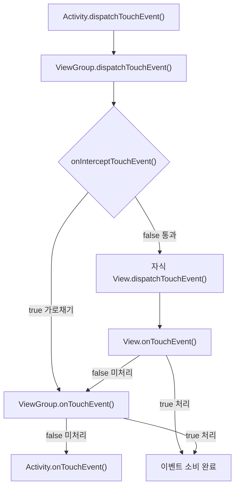

- 터치 이벤트의 전달 흐름 (Activity → ViewGroup → View)
- dispatchTouchEvent, onInterceptTouchEvent, onTouchEvent의 역할
- ViewGroup의 이벤트 가로채기(intercept) 메커니즘
- MotionEvent의 종류 (ACTION_DOWN, MOVE, UP, CANCEL)
- OnTouchListener, GestureDetector 등 추가 터치 API
- 이벤트 처리 우선순위 (OnTouchListener → onTouchEvent → OnClickListener)
- 클릭과 드래그 구현 원리
- 터치 이벤트 충돌 해결 방법

---

## 터치 이벤트 전달 흐름

터치 이벤트는 **[[Activity Lifecycle|Activity]] → [[Android View 생명주기|ViewGroup]] → [[Android View 생명주기|View]]** 순서로 위에서 아래로 전달됩니다. 처리되지 않은 이벤트는 다시 위로 전파됩니다.



---

## 핵심 메서드 3가지

### dispatchTouchEvent()

터치 이벤트를 **분배**하는 메서드입니다. Activity, ViewGroup, View 모두에 존재합니다.

- [[Activity Lifecycle|Activity]]: 최초로 터치 이벤트를 수신하고 Window에 전달
- [[Android View 생명주기|ViewGroup]]: 자식에게 전달할지, 자신이 처리할지 결정
- [[Android View 생명주기|View]]: `onTouchListener` 또는 `onTouchEvent()` 호출

```kotlin
// ViewGroup의 dispatchTouchEvent 내부 로직 (간략화)
override fun dispatchTouchEvent(event: MotionEvent): Boolean {
    val intercepted = onInterceptTouchEvent(event)

    if (!intercepted) {
        // 자식 뷰에게 이벤트 전달
        for (child in children.reversed()) {
            if (child.dispatchTouchEvent(event)) {
                return true  // 자식이 소비
            }
        }
    }

    // 자식이 소비하지 않으면 자신이 처리
    return onTouchEvent(event)
}
```

### onInterceptTouchEvent()

**ViewGroup에만** 존재하는 메서드입니다. 자식에게 가는 이벤트를 **가로챌지** 결정합니다.

| 반환값 | 동작 |
|--------|------|
| `false` (기본값) | 이벤트를 자식에게 전달 |
| `true` | 이벤트를 가로채서 자신의 `onTouchEvent()`에서 처리 |

```kotlin
override fun onInterceptTouchEvent(event: MotionEvent): Boolean {
    // 예: 수평 스크롤 감지 시 가로채기
    return when (event.action) {
        MotionEvent.ACTION_MOVE -> {
            val dx = abs(event.x - lastX)
            val dy = abs(event.y - lastY)
            dx > dy && dx > touchSlop  // 수평 이동이 크면 가로채기
        }
        else -> false
    }
}
```

### onTouchEvent()

실제로 터치 이벤트를 **처리**하는 메서드입니다. View와 ViewGroup 모두에 존재합니다.

| 반환값 | 동작 |
|--------|------|
| `true` | 이벤트를 소비함 (상위로 전파 안 됨) |
| `false` | 이벤트를 소비하지 않음 (상위로 전파) |

```kotlin
override fun onTouchEvent(event: MotionEvent): Boolean {
    when (event.action) {
        MotionEvent.ACTION_DOWN -> {
            // 터치 시작
            return true  // ACTION_DOWN에서 true를 반환해야 이후 이벤트 수신
        }
        MotionEvent.ACTION_MOVE -> {
            // 드래그 중
        }
        MotionEvent.ACTION_UP -> {
            // 터치 종료
        }
    }
    return super.onTouchEvent(event)
}
```

> **중요**: `ACTION_DOWN`에서 `true`를 반환하지 않으면, 이후의 `ACTION_MOVE`, `ACTION_UP` 이벤트를 수신하지 못합니다. `ACTION_DOWN`은 터치 시퀀스의 시작을 의미하며, 이를 소비해야 해당 시퀀스의 소유권을 얻습니다.

---

## MotionEvent

| 액션 | 설명 |
|------|------|
| `ACTION_DOWN` | 손가락이 화면에 닿은 순간 (터치 시작) |
| `ACTION_MOVE` | 손가락이 화면 위에서 이동 중 |
| `ACTION_UP` | 손가락이 화면에서 떨어진 순간 (터치 종료) |
| `ACTION_CANCEL` | 부모가 이벤트를 가로채서 터치가 취소됨 |
| `ACTION_POINTER_DOWN` | 멀티터치: 두 번째 이상의 손가락이 닿음 |
| `ACTION_POINTER_UP` | 멀티터치: 손가락 하나가 떨어짐 |

### 터치 시퀀스

하나의 터치 동작은 항상 `ACTION_DOWN`으로 시작하고 `ACTION_UP` 또는 `ACTION_CANCEL`로 종료됩니다.

```
ACTION_DOWN → ACTION_MOVE → ... → ACTION_MOVE → ACTION_UP
```

---

## ViewGroup의 이벤트 가로채기

부모 ViewGroup이 자식의 터치 이벤트를 가로채는 시나리오입니다.

### 가로채기 흐름

1. `ACTION_DOWN` 발생 → `onInterceptTouchEvent()` 호출 → `false` 반환 → 자식에게 전달
2. `ACTION_MOVE` 발생 → `onInterceptTouchEvent()` 호출 → `true` 반환 (가로채기 시작)
3. 자식에게 `ACTION_CANCEL` 전달 → 자식은 터치 소유권 상실
4. 이후 모든 이벤트는 부모의 `onTouchEvent()`로 전달

### 가로채기 방지

자식 View가 부모의 가로채기를 방지할 수 있습니다.

```kotlin
// 자식 View에서 부모의 가로채기 방지
parent.requestDisallowInterceptTouchEvent(true)
```

이는 ScrollView 내부의 가로 스크롤 뷰 등에서 터치 충돌을 해결할 때 사용합니다.

---

## 클릭과 드래그 구현 원리

### 클릭

클릭은 `ACTION_DOWN` → `ACTION_UP`이 짧은 시간 내에 **같은 위치**에서 발생하는 것입니다. View의 기본 `onTouchEvent()`가 이를 감지하여 `OnClickListener.onClick()`을 호출합니다.

```
ACTION_DOWN (위치 기록, 타이머 시작)
  → 이동 거리 < touchSlop && 시간 < longPressTimeout
ACTION_UP → onClick() 호출
```

- **touchSlop**: 클릭으로 인정하는 최대 이동 거리 (`ViewConfiguration.get(context).scaledTouchSlop`)
- **longPressTimeout**: 이 시간을 초과하면 롱클릭으로 전환

### 드래그

```kotlin
class DraggableView(context: Context, attrs: AttributeSet?) : View(context, attrs) {

    private var lastX = 0f
    private var lastY = 0f

    override fun onTouchEvent(event: MotionEvent): Boolean {
        when (event.action) {
            MotionEvent.ACTION_DOWN -> {
                lastX = event.rawX
                lastY = event.rawY
                return true
            }
            MotionEvent.ACTION_MOVE -> {
                val dx = event.rawX - lastX
                val dy = event.rawY - lastY

                translationX += dx
                translationY += dy

                lastX = event.rawX
                lastY = event.rawY
            }
            MotionEvent.ACTION_UP -> {
                performClick()
            }
        }
        return true
    }
}
```

---

## 터치 관련 추가 API

### OnTouchListener

View 외부에서 터치 이벤트를 처리할 수 있는 리스너입니다. `onTouchEvent()`보다 **먼저** 호출됩니다.

```kotlin
view.setOnTouchListener { v, event ->
    when (event.action) {
        MotionEvent.ACTION_DOWN -> {
            // 처리
            true  // true 반환 시 onTouchEvent()는 호출되지 않음
        }
        else -> false
    }
}
```

### 이벤트 처리 우선순위

```
dispatchTouchEvent()
    → OnTouchListener.onTouch()     ← 1순위
    → onTouchEvent()                ← 2순위 (onTouch가 false일 때)
        → OnClickListener.onClick() ← 3순위 (onTouchEvent 내부에서 호출)
```

`OnTouchListener`가 `true`를 반환하면 `onTouchEvent()`가 호출되지 않으므로, `OnClickListener`도 동작하지 않습니다.

### GestureDetector

스와이프, 더블탭, 스크롤, 플링 등 **복합 제스처**를 감지하는 유틸리티입니다.

```kotlin
private val gestureDetector = GestureDetectorCompat(context,
    object : GestureDetector.SimpleOnGestureListener() {

        override fun onDown(e: MotionEvent) = true  // 필수

        override fun onSingleTapConfirmed(e: MotionEvent): Boolean {
            // 단일 탭 (더블탭 아닌 것이 확정된 후)
            return true
        }

        override fun onDoubleTap(e: MotionEvent): Boolean {
            // 더블 탭
            return true
        }

        override fun onFling(
            e1: MotionEvent?, e2: MotionEvent,
            velocityX: Float, velocityY: Float
        ): Boolean {
            // 빠른 스와이프
            return true
        }

        override fun onScroll(
            e1: MotionEvent?, e2: MotionEvent,
            distanceX: Float, distanceY: Float
        ): Boolean {
            // 스크롤 (드래그)
            return true
        }

        override fun onLongPress(e: MotionEvent) {
            // 롱프레스
        }
    }
)

override fun onTouchEvent(event: MotionEvent): Boolean {
    return gestureDetector.onTouchEvent(event)
}
```

---

## 터치 이벤트 충돌 해결

### 문제: ScrollView 내부의 ViewPager

수직 ScrollView 안에 수평 ViewPager가 있을 때, 어느 방향의 스크롤을 우선해야 할지 충돌이 발생합니다.

### 해결 방법

```kotlin
// 방법 1: 자식에서 부모 가로채기 방지
viewPager.setOnTouchListener { _, event ->
    when (event.action) {
        MotionEvent.ACTION_DOWN ->
            parent.requestDisallowInterceptTouchEvent(true)
        MotionEvent.ACTION_UP, MotionEvent.ACTION_CANCEL ->
            parent.requestDisallowInterceptTouchEvent(false)
    }
    false
}

// 방법 2: 부모에서 방향 판단 후 선택적 가로채기
override fun onInterceptTouchEvent(event: MotionEvent): Boolean {
    return when (event.action) {
        MotionEvent.ACTION_MOVE -> {
            val dx = abs(event.x - startX)
            val dy = abs(event.y - startY)
            dy > dx  // 수직 이동이 크면 부모(ScrollView)가 가로채기
        }
        else -> false
    }
}
```

---

## 정리

- 터치 이벤트 전달 순서: Activity → ViewGroup → View (위에서 아래로)
- dispatchTouchEvent: 이벤트 분배, 모든 View에 존재
- onInterceptTouchEvent: ViewGroup 전용, 자식에게 가는 이벤트 가로채기
- onTouchEvent: 이벤트 처리, true 반환 시 소비
- ACTION_DOWN에서 true 반환 필수: 이후 MOVE/UP 이벤트 수신 조건
- ACTION_CANCEL: 부모가 가로챌 때 자식에게 전달
- 클릭: DOWN → UP이 touchSlop 이내에서 발생
- 드래그: MOVE 이벤트의 dx/dy를 누적하여 위치 이동
- 이벤트 우선순위: OnTouchListener → onTouchEvent → OnClickListener
- GestureDetector: 더블탭, 플링, 롱프레스 등 복합 제스처 감지
- 충돌 해결: requestDisallowInterceptTouchEvent() 또는 방향 판단

---

## QnA

