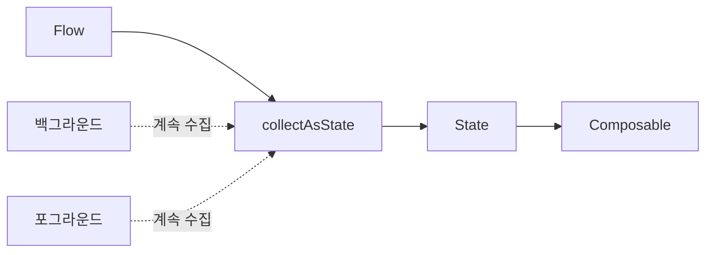
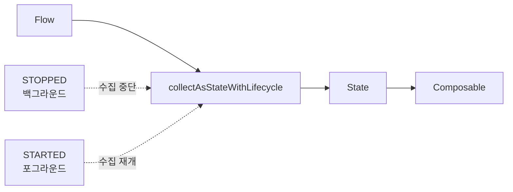
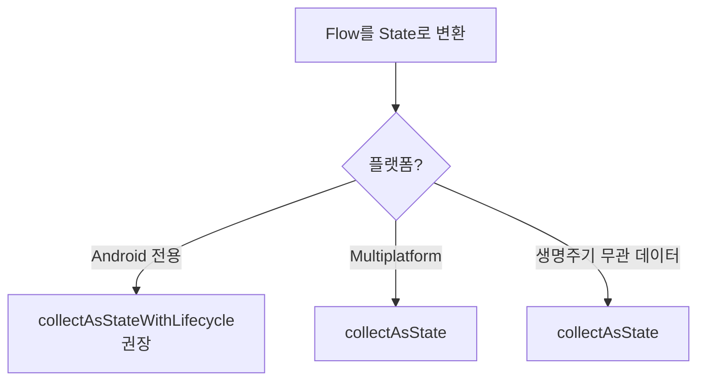

- collectAsState와 collectAsStateWithLifecycle의 차이점
- 각각의 동작 방식과 생명주기 인식 여부
- 언제 어떤 것을 사용해야 하는지
- 메모리 누수와 리소스 낭비 방지
- 실제 사용 예제와 권장 패턴

---

## 개요

Jetpack Compose에서 `collectAsState`와 `collectAsStateWithLifecycle`은 모두 [[Kotlin Coroutines|Kotlin Flow]]를 Compose의 State로 변환하여 UI를 업데이트하는 데 사용됩니다. Flow에서 새 값이 방출되면 [[Recomposition, Stability|Recomposition]]이 트리거됩니다. 가장 큰 차이점은 **Android 생명주기(Lifecycle) 인식 여부**입니다.

---

## 비교

| 구분       | collectAsState                 | collectAsStateWithLifecycle |
| -------- | ------------------------------ | --------------------------- |
| 생명주기 인식  | 컴포지션 기반 (Android 생명주기 미인식)     | Android 생명주기 기반             |
| 백그라운드 동작 | 계속 수집                          | 수집 중단                       |
| 포그라운드 복귀 | 계속 수집 중                        | 수집 재개                       |
| 플랫폼      | Compose Multiplatform (모든 플랫폼) | Android 전용                  |
| 리소스 관리   | 낭비 가능성                         | 최적화됨                        |

---

## collectAsState

Flow를 수집하여 State 객체로 변환하며, Flow에서 새 값이 방출될 때마다 recomposition을 트리거합니다.

### 동작 방식



### 사용법

```kotlin
@Composable
fun UserProfileScreen(viewModel: UserViewModel) {
    // 컴포저블이 컴포지션에 있는 동안 계속 수집
    val userName by viewModel.userNameFlow.collectAsState(initial = "")

    Text(text = "User: $userName")
}
```

### 한계

- **Android 생명주기를 알지 못함**
- 사용자가 다른 화면으로 이동해도 컴포저블이 메모리에 남아있으면 수집 계속
- 백그라운드에서 불필요한 네트워크 호출이나 계산 유발 가능
- 리소스 낭비 및 배터리 소모

### 사용 시점

- Compose Multiplatform (iOS, Desktop 등과 코드 공유)
- Android 생명주기와 무관한 데이터

---

## collectAsStateWithLifecycle

Android 생명주기(Lifecycle)에 따라 Flow 수집을 제어합니다. **Android 앱 개발 시 권장되는 방식**입니다.

### 동작 방식



### 사용법

```kotlin
@Composable
fun UserProfileScreen(viewModel: UserViewModel) {
    // Android 생명주기에 맞춰 안전하게 수집
    val userName by viewModel.userNameFlow.collectAsStateWithLifecycle(initialValue = "")

    Text(text = "User: $userName")
}
```

### 의존성 추가

```groovy
dependencies {
    implementation "androidx.lifecycle:lifecycle-runtime-compose:2.6.0"
}
```

### 장점

- 백그라운드에서 불필요한 연산 방지
- 리소스 최적화 (배터리, 네트워크, CPU)
- 메모리 누수 방지
- Android 공식 권장 방식

### 기본 생명주기 상태

기본적으로 `Lifecycle.State.STARTED` 상태에서 수집을 시작합니다.

```kotlin
// 기본값: STARTED 상태에서 수집
val state by flow.collectAsStateWithLifecycle(initialValue = "")

// 커스텀: RESUMED 상태에서만 수집
val state by flow.collectAsStateWithLifecycle(
    initialValue = "",
    minActiveState = Lifecycle.State.RESUMED
)
```

---

## 생명주기별 동작

| 생명주기 상태 | collectAsState | collectAsStateWithLifecycle |
|---------------|----------------|----------------------------|
| CREATED | 수집 | 수집 안 함 |
| STARTED | 수집 | 수집 |
| RESUMED | 수집 | 수집 |
| STOPPED (백그라운드) | 수집 | 수집 중단 |
| DESTROYED | 수집 중단 | 수집 중단 |

---

## 선택 가이드



### collectAsStateWithLifecycle 사용 (대부분의 경우)

- Android 전용 앱 개발
- 뉴스 피드, 사용자 프로필 등 UI 데이터
- 백그라운드에서 실행 불필요한 데이터

### collectAsState 사용

- Compose Multiplatform (iOS, Desktop 코드 공유)
- 생명주기와 무관하게 계속 수집해야 하는 데이터

---

## 실제 사용 예제

### ViewModel

```kotlin
class NewsViewModel : ViewModel() {

    private val _newsFlow = MutableStateFlow<List<News>>(emptyList())
    val newsFlow: StateFlow<List<News>> = _newsFlow.asStateFlow()

    init {
        viewModelScope.launch {
            repository.observeNews().collect { news ->
                _newsFlow.value = news
            }
        }
    }
}
```

### Composable (권장 패턴)

```kotlin
@Composable
fun NewsScreen(viewModel: NewsViewModel = viewModel()) {
    // 권장: 생명주기 인식 수집
    val news by viewModel.newsFlow.collectAsStateWithLifecycle(initialValue = emptyList())

    LazyColumn {
        items(news) { item ->
            NewsItem(item)
        }
    }
}
```

### 여러 Flow 수집

```kotlin
@Composable
fun DashboardScreen(viewModel: DashboardViewModel = viewModel()) {
    val user by viewModel.userFlow.collectAsStateWithLifecycle(initialValue = null)
    val stats by viewModel.statsFlow.collectAsStateWithLifecycle(initialValue = Stats())
    val notifications by viewModel.notificationsFlow.collectAsStateWithLifecycle(initialValue = emptyList())

    Column {
        user?.let { UserHeader(it) }
        StatsCard(stats)
        NotificationList(notifications)
    }
}
```

---

## 내부 동작 원리

### collectAsState

```kotlin
// 간략화된 내부 구현
@Composable
fun <T> Flow<T>.collectAsState(initial: T): State<T> {
    val state = remember { mutableStateOf(initial) }

    LaunchedEffect(this) {
        collect { value ->
            state.value = value
        }
    }

    return state
}
```

### collectAsStateWithLifecycle

```kotlin
// 간략화된 내부 구현
@Composable
fun <T> Flow<T>.collectAsStateWithLifecycle(
    initialValue: T,
    minActiveState: Lifecycle.State = Lifecycle.State.STARTED
): State<T> {
    val lifecycleOwner = LocalLifecycleOwner.current
    val state = remember { mutableStateOf(initialValue) }

    DisposableEffect(this, lifecycleOwner) {
        val observer = LifecycleEventObserver { _, event ->
            // 생명주기에 따라 수집 시작/중단
        }
        lifecycleOwner.lifecycle.addObserver(observer)
        onDispose {
            lifecycleOwner.lifecycle.removeObserver(observer)
        }
    }

    return state
}
```

---

## 리소스 낭비 시나리오

### collectAsState 사용 시 문제

```kotlin
@Composable
fun BadExample(viewModel: LocationViewModel) {
    // 백그라운드에서도 위치 업데이트 계속 수집
    // → 배터리 소모, GPS 계속 사용
    val location by viewModel.locationFlow.collectAsState(initial = null)
}
```

### collectAsStateWithLifecycle로 해결

```kotlin
@Composable
fun GoodExample(viewModel: LocationViewModel) {
    // 백그라운드에서 위치 수집 중단
    // → 배터리 절약, GPS 중단
    val location by viewModel.locationFlow.collectAsStateWithLifecycle(initialValue = null)
}
```

---

## 정리

- collectAsState: 컴포지션 기반 수집, Android 생명주기 미인식, Multiplatform용
- collectAsStateWithLifecycle: Android 생명주기 인식, 백그라운드 시 수집 중단, 권장
- 리소스 최적화: collectAsStateWithLifecycle로 백그라운드 작업 방지
- 메모리 누수 방지: 생명주기에 맞춰 자동으로 수집 중단
- Android 앱: collectAsStateWithLifecycle 사용 권장
- Multiplatform: collectAsState 사용

---

## QnA

