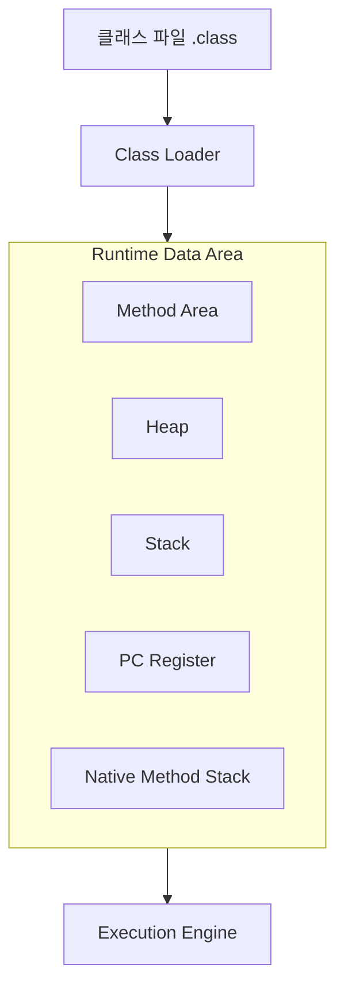

- JVM(Java Virtual Machine)의 역할과 구조
- Runtime Data Area의 5가지 메모리 영역
- Method Area, Heap, Stack, PC Register, Native Method Stack의 역할
- Stack과 Heap의 차이점
- 가비지 컬렉션(GC)의 기본 동작 원리

---

## JVM이란

JVM(Java Virtual Machine)은 Java 바이트코드(.class 파일)를 실행하는 **가상 머신**입니다. 운영체제에 독립적으로 동작하여 "Write Once, Run Anywhere"를 실현합니다. [[Kotlin 이란?|Kotlin]]도 JVM 바이트코드로 컴파일되므로 JVM 위에서 실행됩니다.

```
Java/Kotlin 소스코드
    ↓ (컴파일)
바이트코드 (.class)
    ↓
JVM이 바이트코드를 해석/실행
    ↓
운영체제 (Windows, macOS, Linux)
```

---

## JVM 구조 개요



| 구성 요소 | 역할 |
|-----------|------|
| Class Loader | 클래스 파일을 메모리에 로딩 |
| Runtime Data Area | 프로그램 실행에 필요한 메모리 영역 |
| Execution Engine | 바이트코드를 기계어로 변환하여 실행 (JIT 컴파일러 포함) |

---

## Runtime Data Area

### Method Area (메서드 영역)

**모든 쓰레드가 공유**하는 영역으로, 클래스 수준의 정보를 저장합니다.

- 클래스 메타데이터 (클래스 이름, 부모 클래스, 인터페이스 목록)
- 메서드, 필드 정보
- `static` 변수
- 상수 풀 (Constant Pool): 문자열 리터럴, 숫자 상수
- 런타임 상수 풀

### Heap (힙)

**모든 쓰레드가 공유**하는 영역으로, `new` 키워드로 생성된 **객체와 배열**이 저장됩니다.

```java
// Heap에 저장되는 것들
User user = new User("John", 25);  // User 객체 → Heap
int[] arr = new int[10];            // 배열 → Heap
String str = new String("hello");   // String 객체 → Heap
```

- 가비지 컬렉션(GC)의 대상
- Young Generation과 Old Generation으로 나뉨

### Stack (스택)

**쓰레드마다 별도**로 생성되는 영역입니다. 메서드 호출 시 **스택 프레임(Stack Frame)**이 쌓이고, 메서드 종료 시 제거됩니다.

스택 프레임에 저장되는 것:
- 지역 변수 (Local Variables)
- 매개변수
- 메서드 호출 정보 (리턴 주소)
- 연산 중간 결과 (Operand Stack)

```java
void methodA() {
    int x = 10;         // x → Stack
    User user = new User();  // user 참조 → Stack, User 객체 → Heap
    methodB(x);
}

void methodB(int param) {
    int y = param + 20;  // param, y → Stack
}
```

```
Stack (LIFO):
┌─────────────┐
│ methodB()   │ ← param=10, y=30
├─────────────┤
│ methodA()   │ ← x=10, user(참조)
├─────────────┤
│ main()      │
└─────────────┘
```

### PC Register

각 쓰레드마다 존재하며, 현재 실행 중인 **바이트코드의 주소(명령어 위치)**를 가리킵니다.

### Native Method Stack

Java가 아닌 **네이티브 코드(C/C++)**를 실행할 때 사용되는 스택입니다. JNI(Java Native Interface)를 통해 호출됩니다.

---

## Stack vs Heap

| 항목 | Stack | Heap |
|------|-------|------|
| 저장 대상 | 지역 변수, 매개변수, 참조값 | 객체, 배열 |
| 공유 범위 | 쓰레드별 독립 | 모든 쓰레드 공유 |
| 생명주기 | 메서드 종료 시 자동 제거 | GC가 수거할 때까지 유지 |
| 크기 | 작음 (고정) | 큼 (동적) |
| 속도 | 빠름 (LIFO 구조) | 상대적으로 느림 |
| 오류 | StackOverflowError | OutOfMemoryError |

```java
void example() {
    int num = 42;              // num(값) → Stack
    String name = "John";      // name(참조) → Stack, "John"(객체) → Heap
    User user = new User();    // user(참조) → Stack, User(객체) → Heap
}
// 메서드 종료: Stack의 num, name, user 참조 제거
// Heap의 객체는 GC가 수거할 때까지 남아있음
```

---

## 가비지 컬렉션 (GC)

Heap에 있는 **더 이상 참조되지 않는 객체**를 자동으로 메모리에서 해제하는 메커니즘입니다.

### Heap 영역 구분

```
Heap
├── Young Generation
│   ├── Eden      ← 새 객체 생성
│   ├── Survivor 0
│   └── Survivor 1
└── Old Generation  ← 오래 살아남은 객체
```

### 동작 흐름

1. 새 객체는 **Eden**에 생성
2. Eden이 가득 차면 **Minor GC** 발생 → 살아있는 객체를 Survivor로 이동
3. 여러 번의 Minor GC를 살아남은 객체는 **Old Generation**으로 이동 (Promotion)
4. Old Generation이 가득 차면 **Major GC (Full GC)** 발생 → Stop-the-World 발생

> **Stop-the-World**: GC 수행 동안 모든 애플리케이션 쓰레드가 일시 중지되는 현상. Major GC일수록 중지 시간이 길어집니다.

---

## 정리

- JVM: 바이트코드를 실행하는 가상 머신, OS 독립적 실행 보장
- Method Area: 클래스 메타데이터, static 변수, 상수 풀 저장 (쓰레드 공유)
- Heap: 객체와 배열 저장, GC 대상 (쓰레드 공유)
- Stack: 지역 변수, 매개변수, 메서드 호출 정보 (쓰레드별 독립)
- Stack에는 참조값, Heap에는 실제 객체 저장
- GC: Heap의 미참조 객체 자동 해제, Young/Old Generation 구분

---

## QnA

