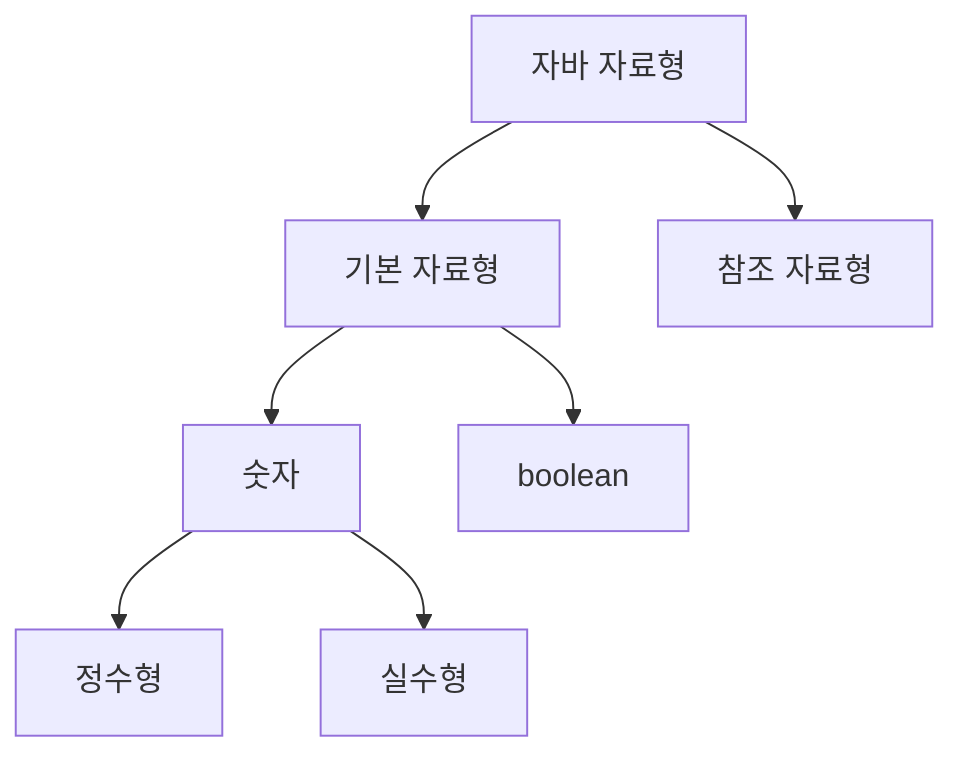

---
cssclasses:
  - cornell-left
  - cornell-livepreview
---
## 1. 변수(Variable)

변수는 값을 저장하기 위해 사용됩니다.  
Java에는 변수의 선언 위치와 역할에 따라 다음 **4가지 변수 종류**가 있습니다.

### 1-1. 변수의 종류

| 구분                          | 설명                                           |
| --------------------------- | -------------------------------------------- |
| 지역 변수 (Local Variable)      | 메소드 또는 블록(`{}`) 내부에 선언된 변수입니다.               |
| 매개 변수 (Parameter Variable)  | 메소드 호출 시 전달받는 변수입니다.                         |
| 인스턴스 변수 (Instance Variable) | 클래스 내부, 메소드 외부에 선언되며 `static` 키워드가 없는 변수입니다. |
| 클래스 변수 (Class Variable)     | 인스턴스 변수 중 `static` 키워드가 붙은 변수입니다.            |

### 1-2. 예제 코드
```java
public class VariableType {
    int instanceVariable;          // 인스턴스 변수
    static int staticVariable;     // 클래스 변수

    public void method(int parameterVariable) { // 매개 변수
        int localVariable;         // 지역 변수
    }
}

```

---

## 2. 변수의 생명주기(Lifecycle)

각 변수는 선언 위치와 특성에 따라 **유효 범위와 생명주기**가 다릅니다.

| 변수 종류   | 생명주기                                             |
| ------- | ------------------------------------------------ |
| 지역 변수   | 선언된 블록(`{}`) 내부에서만 유효합니다.                        |
| 매개 변수   | 메소드 호출 시 생성되며, 메소드 종료 시 소멸합니다.                   |
| 인스턴스 변수 | 객체 생성 시 생성되며, 해당 객체가 더 이상 참조되지 않으면 GC에 의해 소멸됩니다. |
| 클래스 변수  | 클래스가 메모리에 로딩될 때 생성되며, JVM 종료 시 소멸됩니다.            |

---

## 3. 자바의 자료형(Data Type)

자바의 자료형은 크게 **기본 자료형(Primitive Type)** 과
 **참조 자료형(Reference Type)** 으로 나뉩니다.

### 3-1. 기본 자료형과 참조 자료형의 차이

| 구분     | 설명                                         |
| ------ | ------------------------------------------ |
| 기본 자료형 | 자바에서 미리 정의된 타입이며 `new` 키워드를 사용하지 않습니다.     |
| 참조 자료형 | 객체의 주소를 참조하는 타입이며, 일반적으로 `new` 키워드로 생성합니다. |
| 예외     | `String`은 참조 자료형이지만 리터럴로 초기화할 수 있습니다.      |

---

## 4. 기본 자료형의 분류 구조



### 4-1. 기본 자료형 목록

|분류|타입|
|---|---|
|정수형|byte, short, int, long, char|
|실수형|float, double|
|기타|boolean|

---

## 5. 정수형 타입의 범위

정수형은 타입마다 표현할 수 있는 값의 범위가 정해져 있습니다.  
(`byte → short → int → long` 순으로 범위가 커집니다)

---

## 6. Byte 타입

`byte`는 자바의 기본 정수형 중 하나로, **8비트 크기의 정수형 자료형**입니다.  
8비트로 표현할 수 있는 값은 총 256가지이며, 이를 음수와 양수로 나누어 사용합니다.  
이로 인해 `byte`가 표현할 수 있는 값의 범위는 **-128부터 127까지**입니다.

`byte`에서 가장 앞에 위치한 비트(MSB, Most Significant Bit)는 **부호 비트**로 사용됩니다.  
이 비트가 `0`이면 양수를 의미하고, `1`이면 음수를 의미합니다.  
자바에서는 음수를 표현하기 위해 **2의 보수 방식**을 사용합니다.

이 구조로 인해 이진수 `0111_1111`은 10진수로 **127**을 의미하며, 이는 `byte`가 표현할 수 있는 최댓값입니다.  
반대로 `1000_0000`은 **-128**을 의미합니다.  
음수 영역에서는 이 값만 절댓값이 하나 더 크기 때문에, `byte`의 범위가 -128부터 시작하게 됩니다.

`byte` 타입에서는 오버플로우가 발생할 수 있습니다.  
예를 들어 `127`에 `1`을 더하면 값이 범위를 초과하게 되고, 결과적으로 **-128**이 됩니다.  
반대로 `-128`에서 `1`을 빼면 값이 순환되어 **127**이 됩니다.

이러한 특성 때문에 `byte` 타입을 사용할 때에는 값의 범위를 항상 고려해야 합니다.

---

## 7. Long 타입

자바에서 **정수 리터럴은 기본적으로 `int` 타입**으로 인식됩니다.  
따라서 `int`가 표현할 수 있는 범위를 초과하는 정수를 그대로 사용하면 컴파일 에러가 발생합니다.

이러한 경우 해당 리터럴이 `long` 타입임을 명시해야 하며, 이를 위해 숫자 뒤에 **`L` 또는 `l` 접미사**를 붙여야 합니다.  
일반적으로 가독성을 위해 대문자 `L`을 사용하는 것이 권장됩니다.

```java
long a = 2L;                  // 정상
long b = 21131241241244124124;  // 컴파일 에러 (int 범위 초과)
long c = 21131241241244124124L; // 정상
```


---

## 8. Float와 Double 타입

`float`와 `double`은 실수를 표현하기 위한 자료형입니다.  
`float`는 **32비트**, `double`은 **64비트 크기**를 가지며, 두 타입 모두 **IEEE 754 부동소수점 표준**을 따릅니다.

부동소수점 방식은 모든 실수를 정확하게 표현하지 못하고 **근사값**으로 저장합니다.  
이로 인해 표현 범위를 초과하거나 소수 계산을 수행할 경우 **정확도가 보장되지 않을 수 있습니다**.

내부적으로는 부호, 지수, 가수로 나뉘어 값을 표현합니다.  
`double`은 `float`보다 더 많은 비트를 가수에 할당하므로, 더 높은 정밀도를 가집니다.

|타입|구성|
|---|---|
|float|부호(1) + 지수(8) + 가수(23)|
|double|부호(1) + 지수(11) + 가수(52)|

---

## 9. Char와 Boolean

### Char

`char`는 문자 하나를 표현하기 위한 자료형입니다.  
크기는 **2바이트(16비트)**이며, 유니코드 문자를 저장합니다.

`char`는 정수형에 속하지만 **부호가 없는(unsigned) 타입**이기 때문에 음수 값을 가질 수 없습니다.  
따라서 다음과 같은 코드는 컴파일 에러가 발생합니다.

```java
char c = -1; // 컴파일 에러
```

### Boolean

`boolean` 타입은 논리값을 표현하기 위한 자료형입니다.  
가질 수 있는 값은 `true` 또는 `false`뿐이며, 정수형과는 호환되지 않습니다.  
숫자 연산이나 비교 연산에 사용할 수 없습니다.


---

## 10. 기본 자료형의 기본값(Default Value)

자바에서는 **인스턴스 변수와 클래스 변수**를 선언할 때 초기값을 명시하지 않으면 자동으로 기본값이 할당됩니다.  
이 기본값은 자료형에 따라 미리 정해져 있습니다.

반면 **지역 변수는 자동으로 초기화되지 않습니다**.  
메소드 내부에서 선언된 지역 변수는 반드시 개발자가 직접 값을 할당해야 하며, 초기화하지 않은 상태로 사용하려고 하면 컴파일 에러가 발생합니다.

기본 자료형의 기본값은 다음과 같습니다.

| byte    | short      | int | long | float | double | char       | boolean |
| ------- | ---------- | --- | ---- | ----- | ------ | ---------- | ------- |
| 0       | 0          | 0   | 0L   | 0.0f  | 0.0    | `'\u0000'` | false   |


> [!cue] Sample of a Summary


> [!summary] Title for summary

