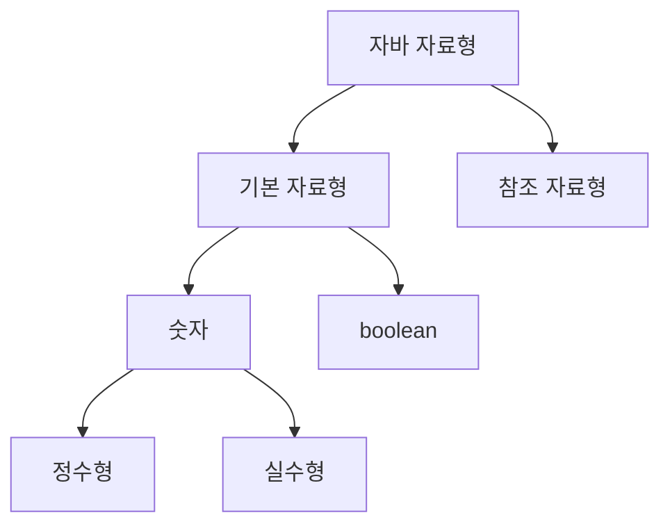

---
cssclasses:
  - cornell-left
  - cornell-livepreview
---
## 1. 변수(Variable)

변수는 값을 저장하기 위해 사용됩니다.  
Java에는 변수의 선언 위치와 역할에 따라 다음 **4가지 변수 종류**가 있습니다.

### 1-1. 변수의 종류

| 구분                          | 설명                                           |
| --------------------------- | -------------------------------------------- |
| 지역 변수 (Local Variable)      | 메소드 또는 블록(`{}`) 내부에 선언된 변수입니다.               |
| 매개 변수 (Parameter Variable)  | 메소드 호출 시 전달받는 변수입니다.                         |
| 인스턴스 변수 (Instance Variable) | 클래스 내부, 메소드 외부에 선언되며 `static` 키워드가 없는 변수입니다. |
| 클래스 변수 (Class Variable)     | 인스턴스 변수 중 `static` 키워드가 붙은 변수입니다.            |

### 1-2. 예제 코드
```java
public class VariableType {
    int instanceVariable;          // 인스턴스 변수
    static int staticVariable;     // 클래스 변수

    public void method(int parameterVariable) { // 매개 변수
        int localVariable;         // 지역 변수
    }
}

```

---

## 2. 변수의 생명주기(Lifecycle)

각 변수는 선언 위치와 특성에 따라 **유효 범위와 생명주기**가 다릅니다.

|변수 종류|생명주기|
|---|---|
|지역 변수|선언된 블록(`{}`) 내부에서만 유효합니다.|
|매개 변수|메소드 호출 시 생성되며, 메소드 종료 시 소멸합니다.|
|인스턴스 변수|객체 생성 시 생성되며, 해당 객체가 더 이상 참조되지 않으면 GC에 의해 소멸됩니다.|
|클래스 변수|클래스가 메모리에 로딩될 때 생성되며, JVM 종료 시 소멸됩니다.|

---

## 3. 자바의 자료형(Data Type)

자바의 자료형은 크게 **기본 자료형(Primitive Type)** 과
 **참조 자료형(Reference Type)** 으로 나뉩니다.

### 3-1. 기본 자료형과 참조 자료형의 차이

| 구분     | 설명                                         |
| ------ | ------------------------------------------ |
| 기본 자료형 | 자바에서 미리 정의된 타입이며 `new` 키워드를 사용하지 않습니다.     |
| 참조 자료형 | 객체의 주소를 참조하는 타입이며, 일반적으로 `new` 키워드로 생성합니다. |
| 예외     | `String`은 참조 자료형이지만 리터럴로 초기화할 수 있습니다.      |

---

## 4. 기본 자료형의 분류 구조



### 4-1. 기본 자료형 목록

|분류|타입|
|---|---|
|정수형|byte, short, int, long, char|
|실수형|float, double|
|기타|boolean|

---

## 5. 정수형 타입의 범위

정수형은 타입마다 표현할 수 있는 값의 범위가 정해져 있습니다.  
(`byte → short → int → long` 순으로 범위가 커집니다)

---

## 6. Byte 타입

`byte`는 **8비트 크기의 정수형 자료형**입니다.  
표현할 수 있는 값의 범위는 **-128부터 127까지**입니다.

`byte`에서 가장 앞에 위치한 비트(MSB, Most Significant Bit)는 **부호 비트**로 사용됩니다. 이 비트가 `0`이면 양수를 의미하고, `1`이면 음수를 의미합니다. 자바에서는 음수를 표현하기 위해 **2의 보수 방식**을 사용합니다.

이러한 구조로 인해 이진수 `0111_1111`은 10진수로 **127**을 의미하며, 이는 `byte`가 표현할 수 있는 최댓값입니다. 반대로 `1000_0000`은 **-128**을 의미합니다. 이는 음수 영역에서 유일하게 절댓값이 하나 더 큰 값으로, `byte`의 표현 범위가 -128부터 127까지가 되는 이유입니다.

또한 `byte` 타입에서는 오버플로우가 발생할 수 있습니다. 예를 들어 `-128`에서 1을 빼면 이진수 값이 `0111_1111`이 되어 결과적으로 **127**이 됩니다. 반대로 `127`에 1을 더하면 이진수 값이 `1000_0000`이 되어 **-128**이 됩니다. 이는 `byte`가 표현할 수 있는 범위를 초과한 연산 결과가 다시 해당 범위 내로 순환되기 때문입니다.


---

## 7. Long 타입

- 정수 리터럴은 기본적으로 `int`로 인식됩니다.
    
- `long` 타입 리터럴을 명시하려면 **`L` 또는 `l` 접미사**를 사용해야 합니다.
    

`long a = 2L;                  // 정상 long b = 21131241241244124124;  // 컴파일 에러 (int 범위 초과) long c = 21131241241244124124L; // 정상`

---

## 8. Float와 Double 타입

- `float`은 **32비트**, `double`은 **64비트 실수형**입니다.
    
- IEEE 754 부동소수점 표준을 따릅니다.
    
- 표현 범위를 초과하거나 소수 계산 시 **정확도가 보장되지 않을 수 있습니다**.
    

### 내부 구조

|타입|구성|
|---|---|
|float|부호(1) + 지수(8) + 가수(23)|
|double|부호(1) + 지수(11) + 가수(52)|

---

## 9. Char와 Boolean

### Char

- `char`는 **부호가 없는 정수형(unsigned)** 입니다.
    
- 크기는 **2바이트(16비트)** 입니다.
    
- 유니코드 문자 하나를 표현합니다.
    
- 음수 값을 가질 수 없습니다.
    

`char c = -1; // 컴파일 에러`

### Boolean

- `boolean`은 `true` 또는 `false`만 가질 수 있습니다.
    
- 정수형과 호환되지 않습니다.
    

---

## 10. 기본 자료형의 기본값(Default Value)

- **인스턴스 변수와 클래스 변수**는 자동으로 기본값이 할당됩니다.
    
- **지역 변수는 기본값이 자동으로 할당되지 않습니다.**
    
    - 반드시 명시적으로 초기화해야 합니다.
        
    - 초기화하지 않고 사용하면 컴파일 에러가 발생합니다.
        

### 기본값 목록

|타입|기본값|
|---|---|
|byte|0|
|short|0|
|int|0|
|long|0L|
|float|0.0f|
|double|0.0|
|char|`'\u0000'`|
|boolean|false|


> [!cue] Sample of a Summary


> [!summary] Title for summary

