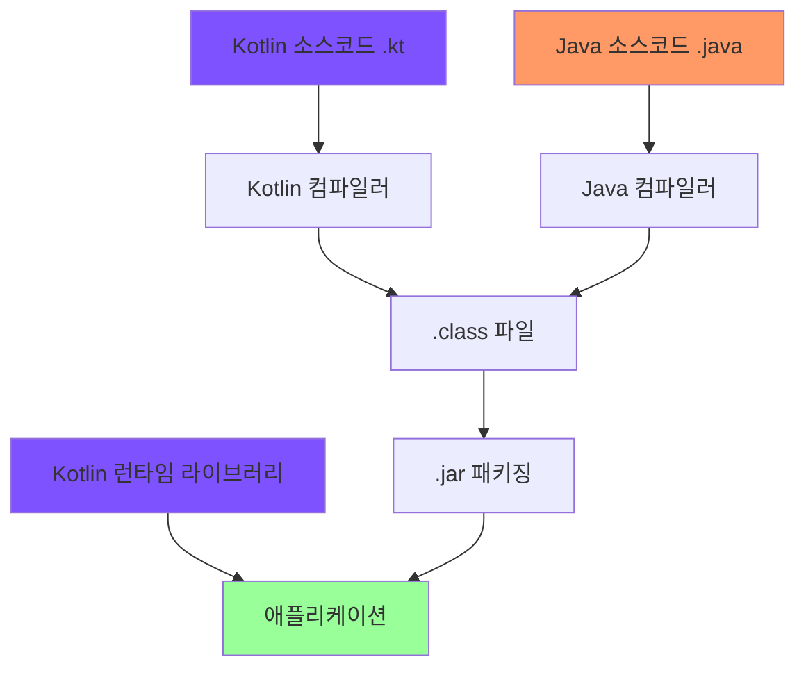

---
cssclasses:
  - cornell-left
  - cornell-livepreview
---

## 1. Kotlin의 주요 특성

Kotlin은 간결하고 실용적이며, Java 코드와의 상호 운용성(interoperability)을 중시합니다. Java가 사용 중인 곳이라면 Kotlin을 사용할 수 있습니다.

### 1-1. 정적 타입 지정 언어

Java와 마찬가지로 Kotlin은 **정적 타입(statically typed)** 지정 언어입니다.

정적 타입 지정 언어란 모든 프로그램 구성 요소의 타입을 컴파일 시점에 알 수 있고, 프로그램 안에서 객체의 필드나 메서드를 사용할 때마다 컴파일러가 타입을 검증해준다는 의미입니다.

#### 정적 타입 vs 동적 타입

| 구분 | 정적 타입 (Static Typing) | 동적 타입 (Dynamic Typing) |
|------|--------------------------|---------------------------|
| 타입 결정 시점 | 컴파일 시점 | 실행 시점 |
| 타입 검증 | 컴파일러가 검증 | 실행 중 검증 |
| 예시 언어 | Java, Kotlin, C++ | JavaScript, Python, Ruby |
| 장점 | 성능, 신뢰성, 유지보수성 | 코드 간결성, 유연성 |
| 단점 | 타입 명시 필요 (타입 추론으로 완화) | 실행 시점 오류 가능성 |

반대로 **동적 타입(dynamically typed)** 지정 언어는 타입과 관계없이 모든 값을 변수에 넣을 수 있고, 메서드나 필드 접근에 대한 검증이 실행 시점에 일어납니다.
- 코드는 더 짧아지고 데이터 구조를 더 유연하게 가져갈 수 있다는 장점이 있습니다
- 하지만 개발자의 실수를 컴파일 시 걸러내지 못해 실행 시점에 오류가 발생할 가능성이 있습니다

#### 정적 타입 지정의 장점

- **성능**: 실행 시점에 어떤 메서드를 호출할지 알아내는 과정이 필요 없어 성능이 더 좋습니다
- **신뢰성**: 프로그램 정확성을 컴파일러가 검증하기에 신뢰성이 높습니다
- **유지보수성**: 코드 속 객체가 어떤 타입인지 지정하기에 유지보수성이 높아집니다
- **도구 지원**: 더 정확한 코드 완성 기능 등 도구 지원이 더 잘 됩니다

#### 타입 추론

Java와 달리 Kotlin은 모든 변수의 타입을 개발자가 직접 명시할 필요가 없습니다. Kotlin 컴파일러가 문맥으로부터 변수 타입을 자동으로 유추해줍니다(타입 추론, type inference).

```kotlin
val x = 1        // Int 타입으로 자동 추론
val name = "Kotlin"  // String 타입으로 자동 추론
```

### 1-2. Nullable 타입 지원

Kotlin은 **Nullable 타입**을 지원합니다.

- 컴파일 시점에 NPE(NullPointerException)가 발생할 수 있는 지점을 검사할 수 있습니다
- 이를 통해 프로그램의 신뢰성이 높아집니다

```kotlin
val nonNull: String = "Hello"      // null 불가
val nullable: String? = null       // null 가능
```

### 1-3. 함수 타입 지원

Kotlin은 **함수 타입(function type)**을 지원합니다. 이를 통해 함수형 프로그래밍(functional programming)을 지원하는 언어입니다.

## 2. 함수형 프로그래밍과 객체 지향 프로그래밍

### 2-1. 함수형 프로그래밍의 핵심 개념

| 개념                                     | 설명                                                                                   | 예시                                |
| -------------------------------------- | ------------------------------------------------------------------------------------ | --------------------------------- |
| **일급 시민 함수**<br>(First-class Function) | 함수를 일반 값처럼 다룰 수 있음<br>• 변수에 저장 가능<br>• 인자로 전달 가능<br>• 반환값으로 사용 가능                    | `val func = { x: Int -> x * 2 }`  |
| **불변성**<br>(Immutability)              | 일단 만들어지면 내부 상태가 절대로 바뀌지 않는 불변 객체를 사용                                                 | `val list = listOf(1, 2, 3)`      |
| **순수 함수**<br>(Pure Function)           | 부수 효과(side effect) 없음<br>• 입력이 같으면 항상 같은 출력<br>• 다른 객체의 상태 변경 없음<br>• 외부 환경과 상호작용 없음 | `fun add(a: Int, b: Int) = a + b` |

### 2-2. 함수형 프로그래밍의 장점

- **간결성**: 함수형 코드는 더 간결하고 우아합니다
- **다중 스레드 안전성(Safe Multithreading)**: 불변 데이터 구조를 사용하고 순수 함수를 적용하면 같은 데이터를 여러 스레드가 변경할 수 없으므로 복잡한 동기화가 필요 없습니다

## 3. Kotlin 코드 컴파일

Kotlin은 `.kt` 확장자를 파일에 붙입니다.

- Kotlin 컴파일러는 Kotlin 소스코드를 분석해서 `.class` 파일을 만들어냅니다
- 만들어진 `.class` 파일은 개발 중인 애플리케이션의 유형에 맞는 표준 패키징 과정을 거쳐 실행됩니다

### 3-1. Kotlin 빌드 과정

Kotlin의 빌드 과정은 아래와 같습니다.



#### Kotlin 런타임 라이브러리

Kotlin 컴파일러로 컴파일한 코드(`.class`)는 **Kotlin 런타임 라이브러리(Kotlin runtime library)**에 의존합니다.

런타임 라이브러리에는 다음이 포함됩니다:
- Kotlin 자체 표준 라이브러리 클래스
- Kotlin에서 Java API의 기능을 확장한 내용

**중요**: Kotlin으로 컴파일한 애플리케이션을 배포할 때에는 런타임 라이브러리도 함께 배포해야 합니다.

> [!cue] Sample of a Summary

> [!summary] Title for summary

