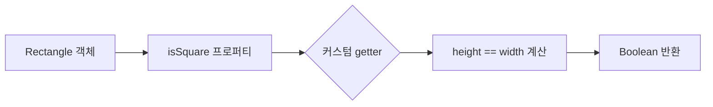
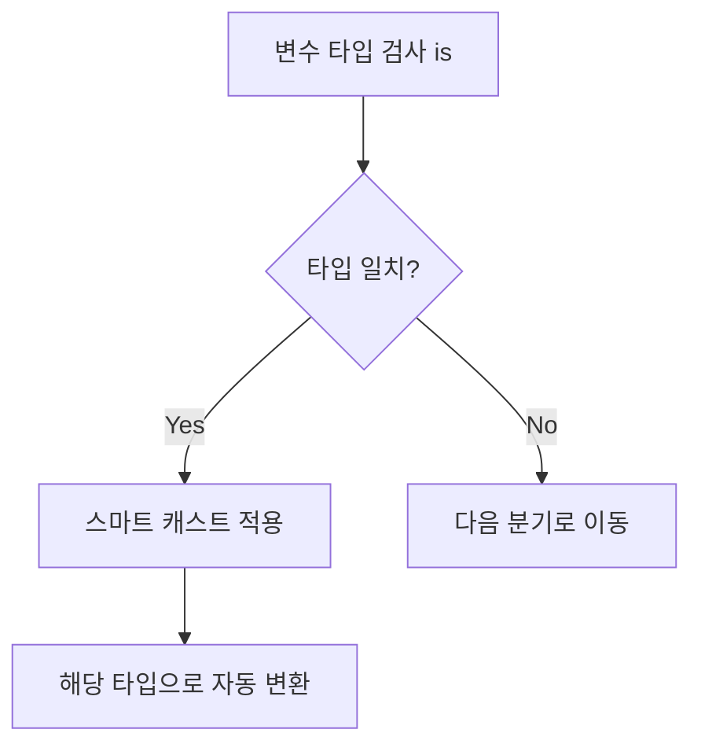
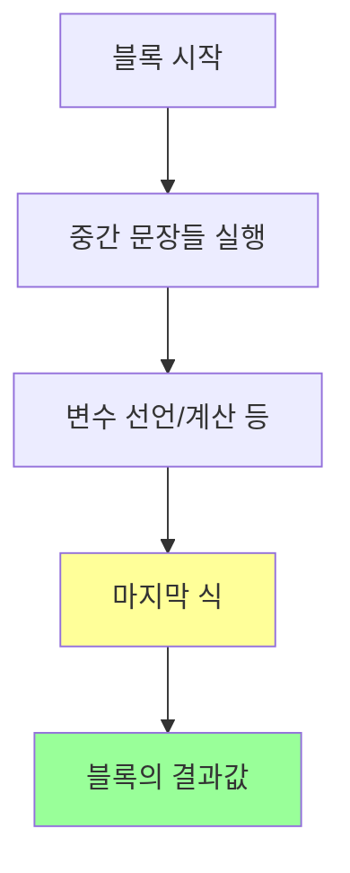

---
cssclasses:
  - cornell-left
  - cornell-livepreview
---

## 1. 클래스 기본 문법

### 1-1. Java와 Kotlin의 클래스 선언 비교

Java에서 Person 클래스를 선언하면 다음과 같습니다.

```java
public class Person {
	private final String name;
	
	public Person(String name) {
		this.name = name;
	}
	
	public String getName() {
		return name;
	}
}
```

기존 Java에서는 필드가 둘 이상으로 늘어나면 생성자 본문에서 필드에 대입하는 대입문도 늘어나게 됩니다.

Kotlin에서는 위 클래스를 아래와 같이 간결하게 표현할 수 있습니다.

```kotlin
class Person(val name: String)
```

| 구분 | Java | Kotlin |
|------|------|--------|
| 기본 가시성 | package-private | `public` |
| 필드 선언 | 클래스 본문 내 명시 | 생성자 파라미터에 직접 선언 가능 |
| Getter/Setter | 명시적 작성 필요 | 자동 생성 |
| 코드 길이 | 상대적으로 김 | 매우 간결 |

`public` 가시성 변경자(visibility modifier)가 사라진 이유는 Kotlin의 기본 가시성이 `public`이기 때문입니다.

## 2. 프로퍼티

### 2-1. 프로퍼티의 개념

클래스라는 개념의 목적은 데이터를 캡슐화하고 캡슐화한 데이터를 다루는 코드를 한 주체 아래 가두는 것입니다.

Java에서는 다음과 같은 방식으로 데이터를 관리합니다:
- 데이터를 필드(field)에 저장합니다
- 멤버 필드의 가시성은 보통 `private`입니다
- 멤버 필드에 접근하기 위해서는 접근자 메서드(accessor method)를 제공하는 것이 일반적입니다
- Java에서는 필드와 접근자를 묶어 **프로퍼티(property)**라고 부릅니다

Kotlin에서는 프로퍼티를 언어 기본 기능으로 제공하며, Kotlin의 프로퍼티는 Java의 필드와 접근자 메서드를 완전히 대체할 수 있습니다.

```kotlin
class Person(
	val name: String,        // 읽기 전용 프로퍼티: private 필드 + public getter
	var isMarried: Boolean   // 변경 가능 프로퍼티: private 필드 + public getter + public setter
)
```

### 2-2. 프로퍼티 접근자

기본적으로 Kotlin이 프로퍼티를 선언하는 방식은 프로퍼티와 관련된 접근자를 선언하는 방식입니다.

| 프로퍼티 종류 | 키워드 | 생성되는 접근자 |
|--------------|--------|----------------|
| 읽기 전용 | `val` | getter만 생성 |
| 변경 가능 | `var` | getter와 setter 모두 생성 |

Kotlin은 값을 저장하기 위한 비공개 필드와 그 필드에 값을 저장하는 setter, 필드의 값을 읽기 위한 getter로 이루어진 기본 접근자 구현을 제공합니다.

#### Java 상호 운용성을 위한 네이밍 규칙

Kotlin으로 생성된 getter와 setter를 Java에서 호출할 때의 네이밍 규칙은 다음과 같습니다.

| Kotlin 프로퍼티 | Java Getter | Java Setter |
|----------------|-------------|-------------|
| `name` | `getName()` | `setName()` |
| `isMarried` | `isMarried()` | `setMarried()` |

- 일반 필드: 필드명에 `get`/`set`을 붙입니다
- `is`로 시작하는 필드: `get`을 별도로 붙이지 않고 필드명 그대로 getter로 사용합니다
- `is`로 시작하는 필드의 setter: `is`를 `set`으로 바꾼 이름을 사용합니다

```kotlin
val person = Person("Bob", true)
println(person.name)       // Kotlin이 자동으로 getName() 호출
println(person.isMarried)  // Kotlin이 자동으로 isMarried() 호출
```

### 2-3. 커스텀 접근자

대부분의 프로퍼티는 그 값을 저장하기 위한 필드(backing field)를 가지고 있습니다. 하지만 필요에 따라 프로퍼티 값을 매번 계산할 수도 있으며, 이는 커스텀 접근자를 활용해서 구현할 수 있습니다.

```kotlin
class Rectangle(val height: Int, val width: Int) {
	val isSquare: Boolean
		get() {  // 커스텀 getter 선언
			return height == width
		}
}
```

블록을 본문으로 하는 구문 외에도 `get() = height == width`와 같은 식 형태도 가능합니다.

Java에서 이 접근자를 사용하려면 `isSquare()` 메서드를 호출하면 됩니다.



## 3. Kotlin 소스코드 구조: 디렉토리와 패키지

### 3-1. 패키지 관리

Java에서는 모든 클래스를 패키지 단위로 관리합니다. Kotlin에서도 비슷한 개념의 패키지가 있습니다.

- 같은 패키지에 속해 있다면 다른 파일에서 정의한 선언일지라도 직접 사용할 수 있습니다
- 다른 패키지에 정의된 선언을 사용하려면 `import`를 통해 선언을 불러와야 합니다
- Java와 마찬가지로 `import`문은 파일의 맨 앞에 오며 `import` 키워드를 사용합니다

### 3-2. Java와 Kotlin의 파일 구조 차이

| 구분 | Java | Kotlin |
|------|------|--------|
| 파일당 클래스 수 | 일반적으로 1개의 public 클래스 | 여러 클래스 가능 |
| 파일명 | 클래스명과 일치해야 함 | 자유롭게 정할 수 있음 |
| 디렉토리 구조 | 패키지 구조와 반드시 일치 | 패키지 구조와 무관하게 배치 가능 |

Java에서는 디렉토리 구조가 패키지 구조를 그대로 따라야 합니다. 반면 Kotlin에서는:
- 여러 클래스를 한 파일에 넣을 수 있습니다
- 파일 이름을 마음대로 정할 수 있습니다
- 디스크상의 어느 디렉토리에 소스코드 파일을 위치시키든 관계없습니다
- 패키지 구조와 디렉토리 구조가 일치하지 않아도 됩니다

## 4. 선택 표현과 처리: enum과 when

Kotlin의 `when`은 Java의 `switch`를 대체하며 훨씬 강력한 기능을 제공합니다.

### 4-1. enum 클래스 정의

#### 기본 enum 선언

```kotlin
enum class Color {
	RED, ORANGE, YELLOW
}
```

| 언어 | 선언 방식 | 특징 |
|------|----------|------|
| Java | `enum Color { ... }` | `enum`만 사용 |
| Kotlin | `enum class Color { ... }` | `enum class` 키워드 사용 |

Kotlin에서 `enum`을 **soft keyword**라고 부릅니다.
- `enum`은 `class` 앞에 있을 때에만 특별한 의미를 지니는 키워드가 됩니다
- 그 외의 경우에는 키워드로 판정되지 않아 네이밍에 사용할 수 있습니다

#### 프로퍼티와 메서드를 가진 enum

Java와 마찬가지로 enum은 단순히 값만 열거하는 것이 아닙니다.

```kotlin
enum class Color(
	val r: Int, val g: Int, val b: Int  // 상수의 프로퍼티 정의
) {
	RED(255, 0, 0), ORANGE(255, 165, 0), YELLOW(255, 255, 0);  // 세미콜론 필수
	
	fun rgb() = (r * 256 + g) * 256 + b  // enum 클래스 안에 메서드 정의 가능
}
```

enum에서도 일반적인 클래스와 마찬가지로 생성자와 프로퍼티를 선언할 수 있습니다.

**주의**: enum 클래스 안에 메서드를 정의하는 경우 반드시 enum 상수 목록과 메서드 정의 사이에 세미콜론(`;`)을 넣어야 합니다.

### 4-2. when으로 enum 클래스 다루기

`if`와 마찬가지로 `when`도 식(expression)입니다. 따라서 식이 본문인 함수에 `when`을 바로 사용할 수 있습니다.

```kotlin
fun getMnemonic(color: Color) =
	when(color) {
		Color.RED -> "RED COLOR"
		Color.ORANGE -> "ORANGE COLOR"
		Color.YELLOW -> "YELLOW COLOR"
	}
```

#### when과 switch의 비교

| 구분 | Java switch | Kotlin when |
|------|-------------|-------------|
| `break` 필요 여부 | 필요 (생략 시 fall-through) | 불필요 |
| 분기 실행 방식 | `break` 전까지 계속 실행 | 매치되는 분기만 실행 |
| 여러 값 매치 | 여러 `case` 작성 | 쉼표(`,`)로 구분 |

Java와 달리 각 분기에 `break`를 넣지 않아도 됩니다. 매치되는 분기를 찾으면 해당 분기만 실행합니다.

한 분기 안에서 여러 값을 매치 패턴으로 사용할 수 있으며, 그럴 경우 콤마(`,`)로 분리합니다.

```kotlin
fun getWarmth(color: Color) = when(color) {
	Color.RED, Color.ORANGE -> "WARM"
	Color.GREEN -> "NEUTRAL"
}
```

### 4-3. when과 임의 객체를 함께 사용하기

Java의 경우 분기 조건에 상수(enum, 숫자 리터럴)만 사용할 수 있지만, Kotlin의 경우 임의의 객체를 허용합니다.

```kotlin
fun mix(c1: Color, c2: Color) = 
	when(setOf(c1, c2)) {
		setOf(RED, YELLOW) -> ORANGE
		setOf(YELLOW, BLUE) -> GREEN
	}
```

### 4-4. 인자 없는 when 사용

인자가 없는 `when`식을 사용하면 불필요한 객체 생성을 막을 수 있습니다.

```kotlin
fun mixOptimized(c1: Color, c2: Color) = 
	when {  // 인자 없이 사용
		(c1 == RED && c2 == YELLOW) -> ORANGE
		(c1 == RED && c2 == BLUE) || (c1 == YELLOW && c2 != GREY) -> INDIGO
		else -> throw Exception("Dirty Color")
	}
```

`when`에 아무 인자 없이 사용하려면 각 분기 조건이 `Boolean`을 반환하는 식이어야 합니다.

## 5. 스마트 캐스트: 타입 검사와 타입 캐스트 조합

### 5-1. 타입 검사 연산자

Kotlin에서는 `is`를 활용해 변수의 타입을 검사합니다. `is`는 Java의 `instanceof`와 비슷합니다.

| 언어 | 타입 검사 | 명시적 캐스팅 |
|------|----------|--------------|
| Java | `instanceof` | `(Type) variable` |
| Kotlin | `is` | `variable as Type` |

### 5-2. 스마트 캐스트의 동작 원리

Java에서는 어떤 변수의 타입을 `instanceof`로 확인했다고 해서 그 변수를 해당 타입으로 바로 사용할 수 없으며, 별도의 캐스팅이 필요합니다.

```java
// Java
if (obj instanceof String) {
    String str = (String) obj;  // 명시적 캐스팅 필요
    System.out.println(str.length());
}
```

Kotlin에서는 `is`를 통해 변수 타입을 검사하고 나면 굳이 캐스팅을 해주지 않아도 컴파일러가 자동으로 캐스팅해줍니다. 이를 **스마트 캐스트(smart cast)**라고 합니다.

```kotlin
// Kotlin
if (obj is String) {
    println(obj.length)  // 자동 캐스팅, 별도 캐스팅 불필요
}
```



### 5-3. 스마트 캐스트 사용 조건

스마트 캐스트는 `is`로 변수에 든 값의 타입을 검사한 다음에 그 값이 바뀔 수 없는 경우에만 작동합니다.

| 조건 | 스마트 캐스트 가능 여부 | 이유 |
|------|---------------------|------|
| `val` 프로퍼티 (기본 접근자) | ✅ 가능 | 값이 변경되지 않음 |
| `var` 프로퍼티 | ❌ 불가능 | 값이 변경될 수 있음 |
| 커스텀 접근자 사용 | ❌ 불가능 | 호출 시마다 다른 값 반환 가능 |

클래스의 프로퍼티에 대한 스마트 캐스트를 사용하려면:
- 그 프로퍼티는 반드시 `val`이어야 합니다
- 커스텀 접근자를 사용한 것이어도 안 됩니다

### 5-4. 명시적 타입 캐스팅

원하는 타입으로 명시적으로 타입 캐스팅을 하려면 `as`를 사용합니다.

```kotlin
val n = e as Num  // e를 Num 타입으로 명시적 캐스팅
```

## 6. if와 when 분기에서 블록 사용

### 6-1. 블록을 값으로 사용하기

`if`나 `when` 분기에서 블록을 사용할 수 있습니다. 블록의 마지막 문장이 블록 전체의 결과가 됩니다.

```kotlin
fun evalWithLogging(e: Expr): Int = 
	when(e) {
		is Num -> {
			println("num : ${e.value}")
			e.value  // 블록의 마지막 식 → 이 값이 반환됨
 		}
 		is Sum -> {
	 		val left = evalWithLogging(e.left)
	 		val right = evalWithLogging(e.right)
	 		println("sum : ${left + right}")
	 		left + right  // 블록의 마지막 식 → left + right의 합이 반환됨
 		}
 		else -> throw IllegalArgumentException()
	}
```

### 6-2. 블록의 결과 규칙

**블록의 마지막 식이 블록의 결과**라는 규칙은 블록이 값을 만들어낼 때 항상 성립합니다.



이는 다음과 같은 경우에 적용됩니다:
- `when` 분기의 블록
- `if` 분기의 블록
- 람다 표현식의 블록
- 함수 본문의 블록

> [!cue] Sample of a Summary

> [!summary] Title for summary

