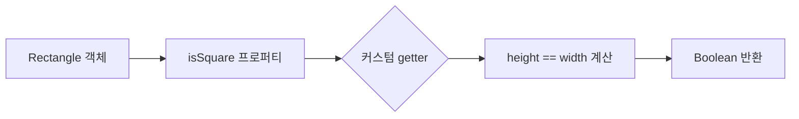

- Kotlin 클래스의 기본 문법과 Java와의 비교
- 프로퍼티의 개념과 접근자 자동 생성
- 커스텀 접근자의 사용법
- Java 상호 운용을 위한 네이밍 규칙
- Kotlin의 패키지와 파일 구조

---

## 클래스 기본 문법

### Java와 Kotlin의 클래스 선언 비교

Java에서 Person 클래스를 선언하면 다음과 같습니다.

```java
public class Person {
	private final String name;

	public Person(String name) {
		this.name = name;
	}

	public String getName() {
		return name;
	}
}
```

기존 Java에서는 필드가 둘 이상으로 늘어나면 생성자 본문에서 필드에 대입하는 대입문도 늘어나게 됩니다.

Kotlin에서는 위 클래스를 아래와 같이 간결하게 표현할 수 있습니다.

```kotlin
class Person(val name: String)
```

| 구분 | Java | Kotlin |
|------|------|--------|
| 기본 가시성 | package-private | `public` |
| 필드 선언 | 클래스 본문 내 명시 | 생성자 파라미터에 직접 선언 가능 |
| Getter/Setter | 명시적 작성 필요 | 자동 생성 |
| 코드 길이 | 상대적으로 김 | 매우 간결 |

`public` 가시성 변경자(visibility modifier)가 사라진 이유는 Kotlin의 기본 가시성이 `public`이기 때문입니다.

---

## 프로퍼티

### 프로퍼티의 개념

클래스라는 개념의 목적은 데이터를 캡슐화하고 캡슐화한 데이터를 다루는 코드를 한 주체 아래 가두는 것입니다.

Java에서는 다음과 같은 방식으로 데이터를 관리합니다:
- 데이터를 필드(field)에 저장합니다
- 멤버 필드의 가시성은 보통 `private`입니다
- 멤버 필드에 접근하기 위해서는 접근자 메서드(accessor method)를 제공하는 것이 일반적입니다
- Java에서는 필드와 접근자를 묶어 **프로퍼티(property)**라고 부릅니다

Kotlin에서는 프로퍼티를 언어 기본 기능으로 제공하며, Kotlin의 프로퍼티는 Java의 필드와 접근자 메서드를 완전히 대체할 수 있습니다.

```kotlin
class Person(
	val name: String,        // 읽기 전용 프로퍼티: private 필드 + public getter
	var isMarried: Boolean   // 변경 가능 프로퍼티: private 필드 + public getter + public setter
)
```

### 프로퍼티 접근자

기본적으로 Kotlin이 프로퍼티를 선언하는 방식은 프로퍼티와 관련된 접근자를 선언하는 방식입니다.

| 프로퍼티 종류 | 키워드 | 생성되는 접근자 |
|--------------|--------|----------------|
| 읽기 전용 | `val` | getter만 생성 |
| 변경 가능 | `var` | getter와 setter 모두 생성 |

Kotlin은 값을 저장하기 위한 비공개 필드와 그 필드에 값을 저장하는 setter, 필드의 값을 읽기 위한 getter로 이루어진 기본 접근자 구현을 제공합니다.

#### Java 상호 운용성을 위한 네이밍 규칙

Kotlin으로 생성된 getter와 setter를 Java에서 호출할 때의 네이밍 규칙은 다음과 같습니다.

| Kotlin 프로퍼티 | Java Getter | Java Setter |
|----------------|-------------|-------------|
| `name` | `getName()` | `setName()` |
| `isMarried` | `isMarried()` | `setMarried()` |

- 일반 필드: 필드명에 `get`/`set`을 붙입니다
- `is`로 시작하는 필드: `get`을 별도로 붙이지 않고 필드명 그대로 getter로 사용합니다
- `is`로 시작하는 필드의 setter: `is`를 `set`으로 바꾼 이름을 사용합니다

```kotlin
val person = Person("Bob", true)
println(person.name)       // Kotlin이 자동으로 getName() 호출
println(person.isMarried)  // Kotlin이 자동으로 isMarried() 호출
```

### 커스텀 접근자

대부분의 프로퍼티는 그 값을 저장하기 위한 필드(backing field)를 가지고 있습니다. 하지만 필요에 따라 프로퍼티 값을 매번 계산할 수도 있으며, 이는 커스텀 접근자를 활용해서 구현할 수 있습니다.

```kotlin
class Rectangle(val height: Int, val width: Int) {
	val isSquare: Boolean
		get() {  // 커스텀 getter 선언
			return height == width
		}
}
```

블록을 본문으로 하는 구문 외에도 `get() = height == width`와 같은 식 형태도 가능합니다.

Java에서 이 접근자를 사용하려면 `isSquare()` 메서드를 호출하면 됩니다.



---

## Kotlin 소스코드 구조: 디렉토리와 패키지

### 패키지 관리

Java에서는 모든 클래스를 패키지 단위로 관리합니다. Kotlin에서도 비슷한 개념의 패키지가 있습니다.

- 같은 패키지에 속해 있다면 다른 파일에서 정의한 선언일지라도 직접 사용할 수 있습니다
- 다른 패키지에 정의된 선언을 사용하려면 `import`를 통해 선언을 불러와야 합니다
- Java와 마찬가지로 `import`문은 파일의 맨 앞에 오며 `import` 키워드를 사용합니다

### Java와 Kotlin의 파일 구조 차이

| 구분 | Java | Kotlin |
|------|------|--------|
| 파일당 클래스 수 | 일반적으로 1개의 public 클래스 | 여러 클래스 가능 |
| 파일명 | 클래스명과 일치해야 함 | 자유롭게 정할 수 있음 |
| 디렉토리 구조 | 패키지 구조와 반드시 일치 | 패키지 구조와 무관하게 배치 가능 |

Java에서는 디렉토리 구조가 패키지 구조를 그대로 따라야 합니다. 반면 Kotlin에서는:
- 여러 클래스를 한 파일에 넣을 수 있습니다
- 파일 이름을 마음대로 정할 수 있습니다
- 디스크상의 어느 디렉토리에 소스코드 파일을 위치시키든 관계없습니다
- 패키지 구조와 디렉토리 구조가 일치하지 않아도 됩니다

---

## 정리

- Kotlin 클래스: 기본 가시성 public, 생성자 파라미터에 프로퍼티 직접 선언
- 프로퍼티: val(getter), var(getter+setter) 자동 생성, Java 필드+접근자 대체
- 네이밍 규칙: 일반 필드 get/set 접두사, is 접두사 필드는 그대로 getter
- 커스텀 접근자: backing field 없이 계산된 값 반환 가능
- 파일 구조: 한 파일에 여러 클래스 가능, 파일명/디렉토리 자유

---

## QnA

