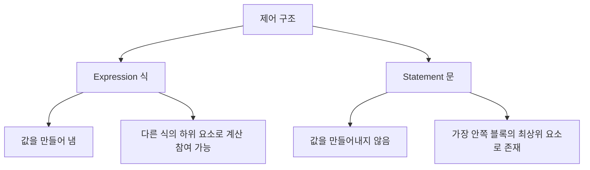

---
cssclasses:
  - cornell-left
  - cornell-livepreview
---

## 1. Hello, World!

```kotlin
fun main(args: Array<String>) {
	println("Hello, world!")
}
```

Kotlin의 기본적인 프로그램 구조는 다음과 같은 특징을 가집니다.

- 함수를 선언할 때 `fun` 키워드를 사용합니다
- 파라미터 이름 뒤에 그 파라미터의 타입을 명시합니다
- 변수를 선언할 때에도 동일한 방식을 사용합니다
- 함수를 최상위 수준에서 정의할 수 있습니다
	- Java의 경우 반드시 클래스 안에 함수가 정의되어야 했습니다
- 배열도 일반적인 클래스와 마찬가지로 취급합니다
	- Java와 달리 배열 처리를 위한 별도의 문법이 존재하지 않습니다
- Kotlin 표준 라이브러리는 Java 표준 라이브러리를 간결하게 사용할 수 있도록 래퍼(wrapper)를 제공합니다
	- 예: `System.out.println` → `println`
- 세미콜론을 붙이지 않아도 됩니다

## 2. 함수

### 2-1. 함수 선언의 기본 구조

```kotlin
fun max(a: Int, b: Int): Int {
	return if(a > b) a else b
}
```

Kotlin에서 함수는 다음과 같은 구조로 선언됩니다.

| 구성요소 | 설명 |
|---------|------|
| `fun` | 함수 선언 시작 키워드 |
| 함수 이름 | `fun` 다음에 위치 |
| 파라미터 목록 | 함수 이름 뒤의 괄호 안에 위치 |
| 반환 타입 | 파라미터 목록의 닫는 괄호 다음에 콜론(`:`)으로 구분하여 명시 |

Kotlin의 `if`문은 값을 만들어내지 못하는 문(statement)가 아닌 값을 만들어내는 식(expression)입니다. 따라서 위 예시처럼 `return`문에 직접 결과를 반환하는 형태로 사용할 수 있습니다.

#### 문(statement)과 식(expression)의 구분



| 구분 | Java | Kotlin |
|------|------|--------|
| 제어 구문 (if, when 등) | Statement (문) | Expression (식) |
| 대입문 | Expression (식) | Statement (문) |

- **식(expression)**: 값을 만들어 내며 다른 식의 하위 요소로 계산에 참여할 수 있습니다
- **문(statement)**: 자신을 둘러싸고 있는 가장 안쪽 블록의 최상위 요소로 존재하며 아무런 값을 만들어내지 않습니다

### 2-2. 식이 본문인 함수

함수의 본문을 식으로 간결하게 표현할 수 있습니다.

```kotlin
fun max(a: Int, b: Int): Int = if(a > b) a else b

// 반환 타입 생략도 가능
fun max(a: Int, b: Int) = if(a > b) a else b
```

함수의 중괄호를 없애고 `return`을 제거하면서 등호(`=`)를 붙여 함수의 본문을 식으로 간결하게 표현할 수 있습니다.

- **블록이 본문인 함수**: 본문이 중괄호로 둘러싸인 함수
- **식이 본문인 함수**: 등호와 식으로 이뤄진 함수

#### 타입 추론 (Type Inference)

식이 본문인 함수의 경우 반환 타입을 생략할 수 있습니다.

- Kotlin은 Java와 마찬가지로 정적 타입 지정 언어이므로 반환 타입이 정해져야 합니다
- 하지만 식이 본문인 함수의 경우 컴파일러가 함수 본문 식을 분석해 식의 결과 타입을 함수 반환 타입으로 정해줍니다
- 컴파일러가 타입을 분석해 프로그램 구성 요소의 타입을 정해주는 기능을 **타입 추론(Type inference)**라고 합니다
- 주의: 식이 본문인 함수의 반환 타입만 생략 가능합니다

## 3. 변수

### 3-1. 변수 선언

Java에서는 변수 선언 시 타입이 맨 앞에 위치하지만, Kotlin에서는 변수 이름 뒤에 타입을 명시하거나 생략할 수 있습니다.

```kotlin
val question = "삶, 우주 그리고 모든 것에 대한 궁극적인 질문"
val answer: Int = 42
```

- 타입을 지정하지 않으면 타입 추론을 통해 컴파일러가 변수 타입을 지정해줍니다
	- 부동소수점(floating point) 상수를 사용한다면 변수 타입은 `Double`이 됩니다
- 초기화 식을 사용하지 않고 변수를 선언하려면 변수 타입을 반드시 명시해야 합니다
	- 초기화 식이 없으면 타입 추론이 불가능하기 때문입니다

```kotlin
val answer : Int
answer = 42
```

### 3-2. 변경 가능한 변수와 변경 불가능한 변수

변수 선언 시 사용하는 키워드는 다음 2개입니다.

| 키워드 | 의미 | 특징 | Java 비교 |
|--------|------|------|-----------|
| `val` | value (값) | 변경 불가능한(immutable) 참조를 저장하는 변수 | `final` 변수 |
| `var` | variable (변수) | 변경 가능한(mutable) 참조 | 일반 변수 |

기본적으로 `val` 키워드를 사용하는 것을 권장합니다.

#### val 변수의 특성

`val` 변수는 블록을 실행할 때 정확히 한 번만 초기화되어야 합니다. 단, 어떤 블록이 실행될 때 오직 한 초기화 문장만 실행됨이 보장된다면, `val` 값을 여러 값으로 초기화할 수 있습니다.

```kotlin
val message: String
if(canPerformOperation()) {
	message = "Success"
} else {
	message = "Failed"
}
```

`val` 참조 자체는 불변이지만 참조가 가리키는 내부 객체의 값은 변경 가능합니다.

```kotlin
val languages = arrayListOf("Java")
languages.add("Kotlin")  // 가능: 리스트 내용 변경
```

#### var 변수의 특성

`var` 키워드를 사용하면 변수의 값은 변경할 수 있지만, 변수의 타입은 변경할 수 없습니다.

```kotlin
var answer = 42
answer = "no answer"  // Error: type mismatch - 컴파일 에러 발생
```

어떤 타입의 변수에 다른 타입의 값을 저장하고 싶다면, 변환 함수를 사용해 타입을 변환하거나 값을 변수에 대입할 수 있는 타입으로 강제 형 변환(coerce)해야 합니다.

## 4. 문자열 템플릿

Kotlin에서 변수를 문자열 안에 사용하고 싶다면 `$`를 사용합니다.

```kotlin
val name = "Kotlin"
println("Hello, $name!")  // 출력: Hello, Kotlin!

val x = 10
val y = 20
println("$x + $y = ${x + y}")  // 출력: 10 + 20 = 30
```

문자열 템플릿의 특징은 다음과 같습니다.

- Java의 문자열 접합 연산(`+`)과 동일한 기능이지만 더 간결합니다
- 컴파일러가 각 식을 정적으로 검사하기 때문에 존재하지 않는 변수를 문자열 템플릿 안에 사용하면 컴파일 오류가 발생합니다
- `${}`를 통해 식(expression)도 문자열 템플릿 안에 넣을 수 있습니다

| 사용법 | 설명 | 예시 |
|--------|------|------|
| `$변수명` | 변수 값 삽입 | `"Hello, $name"` |
| `${식}` | 식의 결과 값 삽입 | `"합계: ${a + b}"` |

> [!cue] Sample of a Summary

> [!summary] Title for summary

